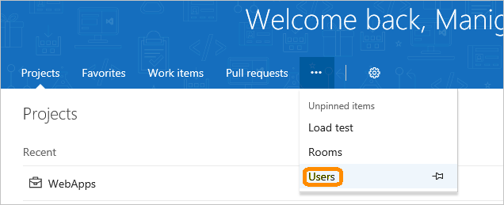
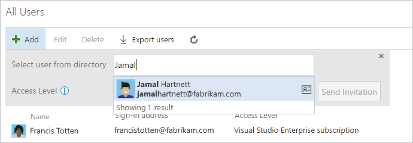

#	Manage users and access in VSTS (if you turned off User Hub)

**VSTS**

Add users to your VSTS account so you can specify 
the level of features that they can use: Basic or Stakeholder. 
These users can join your VSTS account for free:

*	5 users who get [Basic features](https://www.visualstudio.com/team-services/compare-features/), 
like version control, tools for Agile, Java, build, release management, and more
*	Unlimited users who get [Stakeholder features](https://www.visualstudio.com/team-services/compare-features/) 
like working with your backlog, work items, and queries
*	Unlimited [Visual Studio subscribers](https://www.visualstudio.com/team-services/compare-features/) 
who also get Basic features, and in some cases, additional features with specific extensions, like 
[Test Manager](https://marketplace.visualstudio.com/items?itemName=ms.vss-testmanager-web) 

## Need more users with Basic features or Visual Studio subscriptions?  

When your account stays within the free limits, 
you don't have to pay for users to join your account.
You only have to pay if you have more than 5 users 
who need Basic features, and they don't have Visual Studio subscriptions.
You can [pay for additional users in the Visual Studio Marketplace](../billing/buy-basic-access-add-users.md), 
return to your VSTS account, add these users, and assign them Basic access. 
This lets you pay monthly for their access, and you can cancel anytime.

Visual Studio subscriptions give you flexible ways to access VSTS 
and to license the Visual Studio IDE and other Microsoft software for dev and test. 
Learn [how to buy Visual Studio subscriptions](../billing/vs-subscriptions/buy-vs-subscriptions.md) 
from the [Visual Studio Marketplace](https://marketplace.visualstudio.com/subscriptions). 

Or learn [how to manage purchased Visual Studio subscriptions](../billing/vs-subscriptions/buy-vs-subscriptions.md#manage-subscriptions) 
in the [Visual Studio Subscriptions Administration portal](https://manage.visualstudio.com/_apis/Home/redirect?RedirectSource=Commerce). 
Make sure to sign in with the ID that you used to purchase your subscriptions.

> You can add people to team projects, 
> rather than to your account. VSTS automatically assigns them 
> [Basic features](https://www.visualstudio.com/team-services/compare-features/), 
> if your account has seats available, 
> or [Stakeholder features](https://www.visualstudio.com/team-services/compare-features/), 
> if not. Learn [how to add members to team projects](add-team-members-vs.md).

## How does access differ from permissions? 

Access levels control which features are available to users, 
while permissions control their access to account resources. 
[Can't access some features?](faq-add-delete-users.md#feature-access) 
For TFS, learn [how to change access levels](../security/change-access-levels.md) 
or [buy more access to TFS or the Test hub](../billing/buy-access-tfs-test-hub.md). 

To control access to account resources instead, 
learn [how to add permissions](../security/add-users-team-project.md) or 
[restrict permissions](restrict-access-tfs.md).
To change how many users can access 
paid extensions in your VSTS account, 
learn [how to change paid extension users](../billing/change-number-paid-extension-users.md).


## Required permissions

You'll need [VSTS project collection administrator or account owner permissions](faq-add-delete-users.md#find-owner). 

##	Add users to your VSTS account

0.	Sign in to your VSTS account 
(```https://{youraccount}.visualstudio.com```). 

	[Why am I asked to choose between my "work or school account" and my "personal account"?](faq-add-delete-users.md#ChooseOrgAcctMSAcct)

0.  Go to **Users** where you can view and assign access levels for all account users.

	Why can't I access the Users hub?  You must have [VSTS project collection administrator permissions or account owner permissions](faq-add-delete-users.md#find-owner) to access the Users hub.

 > [!NOTE]
 > If have an Azure Active Directory (Azure AD) backed VSTS account, and you need to add users who are 
 > in a different organization (regardless of whether that organization uses Azure AD) to your Azure AD, you can use  
 > [business-to-business (B2B) collaboration](https://docs.microsoft.com/en-us/azure/active-directory/active-directory-b2b-what-is-azure-ad-b2b) to 
 > [add these users](https://docs.microsoft.com/en-us/azure/active-directory/active-directory-create-users#add-a-user) to 
  > your Azure AD.  Be sure on the **Tell us about this user page**, under **Type of user**, to choose **User with an 
 > existing Microsoft account**.  After completing those steps, follow the steps below to add the B2B 
 > user to VSTS.

    
	
    

0.	Add the user's email address. 
Select their access level, based on the features they need. 

	<p><a data-toggle="collapse" href="#expando-what-sign-in-address">Which email addresses can I add? &#x25BC;</a></p>
	<div class="collapse" id="expando-what-sign-in-address">
	<p>You must add email addresses for 
	["personal" Microsoft accounts](https://www.microsoft.com/account) 
	unless your VSTS account 
	authenticates users and control account access through 
	[Azure Active Directory (Azure AD)](https://azure.microsoft.com/en-us/documentation/articles/active-directory-whatis/). 
	[Learn if your VSTS account uses your organization's directory](faq-add-delete-users.md#ConnectedDirectory). 
	If your users don't have Microsoft accounts, 
	have them [sign up](https://signup.live.com/).

 	<p>If your VSTS account is connected to your organization's directory, 
	all users must be members in that directory. If they're not members, 
	have a directory administrator add them to that directory. 
	You can then find them in that directory when you add them to your 
	account by searching for their email addresses or display names.
	<p>
	
	<p>
	</div>

	<p><a data-toggle="collapse" href="#expando-what-access-level">Can I get more info about access levels? &#x25BC;</a></p>
	<div class="collapse" id="expando-what-access-level">
	<p>You can add these users for free:
	<ul>
	<li>**[Basic](https://www.visualstudio.com/team-services/compare-features/)**: 5 users who get Basic features
	<p>
	<p>If you have more users who need Basic features, 
	and they don't have Visual Studio subscriptions, 
	you can [pay for these users](../billing/buy-basic-access-add-users.md), 
	return to your VSTS account, add these users, and assign them Basic access.
	<p>
	<li>**[Stakeholder](https://www.visualstudio.com/team-services/compare-features/)**: Unlimited users who get Stakeholder features 
	<p>
	<p>For users who just need features like working with your backlog, work items, and queries. 
	Learn about [working as a stakeholder](../security/get-started-stakeholder.md). 
	<p>
	<li>**[Visual Studio/MSDN Subscriber](https://www.visualstudio.com/team-services/compare-features/)**: 
	Unlimited users whose [Visual Studio subscriptions include VSTS as a benefit](https://azure.microsoft.com/en-us/pricing/details/visual-studio-team-services/). 
	See [full benefits](https://www.visualstudio.com/subscriptions/). 
	<p>	
	</ul>
	</div>

	For example, to add another Visual Studio subscriber:

	
          
	VSTS automatically recognizes and validates Visual Studio subscribers, 
	and assigns access levels that match their subscriptions, no matter which access levels you give them.
	   
	

	[Why won't my subscription validate when I sign in?](faq-add-delete-users.md#ValidateMSDNSubscription)

	And here's what a team might look like after 
	adding Visual Studio subscribers, some free users who get Basic features, 
	a Stakeholder, and paying for more users with get Basic features:

	

	Your user summary shows only the number of users with access levels assigned to them.

0.	To finish inviting and adding a user to your account, 
click **Send Invitation**.

	Each user gets an invitation email that 
	has a link to your VSTS account. 

	> To sign in to your account, they can use the invitation link, 
	> or go directly to your account at ```https://{youraccount}.visualstudio.com```.
	>
	> First-time users  might be asked for extra details when they sign in to personalize their experience.
	
0.	After adding users to your account, 
you can [add them to team projects](add-team-members-vs.md).

    [Why don't users appear or disappear promptly in VSTS after I add or delete them in the Users hub?](faq-add-delete-users.md#users-delay)


##	Next

*	Add code to Git or Team Foundation version control

	*	Git with [Eclipse](https://java.visualstudio.com/Docs/tools/eclipse), 
	[Xcode](../git/share-your-code-in-git-xcode.md), 
	[Visual Studio](../user-guide/connect-team-projects.md), 
	[Android Studio](http://java.visualstudio.com/Docs/tools/androidstudio), 
	[IntelliJ](http://java.visualstudio.com/Docs/tools/intelliJ), 
	or [Visual Studio Code](https://code.visualstudio.com/docs/editor/versioncontrol)

	*	TFVC using [Eclipse](https://java.visualstudio.com/Docs/tools/eclipse), 
	[Xcode](../tfvc/share-your-code-in-tfvc-xcode.md), 
	[Visual Studio](../user-guide/connect-team-projects.md), or 
	[Visual Studio Code](https://code.visualstudio.com/docs/editor/versioncontrol)

*	[Create a backlog](../work/backlogs/create-your-backlog.md) 
to plan, organize, and track your work, 
[manage your process](../work/customize/process/manage-process.md), 
or [customize your process](../work/customize/process/customize-process.md)

*	[Grow and scale your teams](../work/scale/multiple-teams.md)


