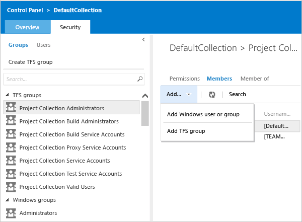
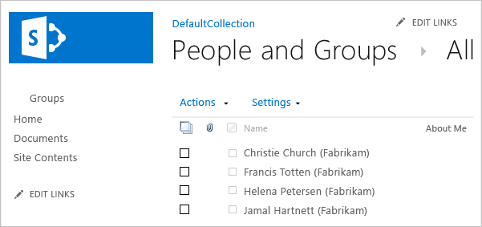

# Add administrators to Team Services and TFS

**Team Services**

PLACEHOLDER TOPIC

## Project collection

In TFS and Team Services, each team project collection is its own grouping
of projects that can share reports, work items, and other items, all stored in a single database.
Project collection administrators maintain the collection and administer permissions and security
for other roles at the collection level.

1.  Open the web portal and switch to administration mode by choosing the gear icon .

2.  Navigate to security at the collection level, and add a member to **Project Collection Administrators**.

    

### SharePoint

If your deployment is integrated with SharePoint Products,
add team project collection administrators to the site collection administrators group in SharePoint Products.

1.  Open SharePoint Central Administration.

2.  Grant permissions that are appropriate for this user at the farm or the Web application level, depending on your security needs.

    For optimum interoperability, consider adding users of the **Project Collection Administrators** group to the **Site Collection Administrators** group in SharePoint Products.

    

### Reporting Services

If your deployment is integrated with Reporting Services,
add team project collection administrators to the Team Foundation Content Manager group
in SQL Server Reporting Services.

1.  Open Internet Explorer running as an administrator.

2.  In the Address bar, specify the following URL, where *ReportServer* is the name of the server that is running Reporting Services: **http://***ReportServer***/Reports/Pages/Folder.aspx**

    >**Important:**
    >  If you are using a named instance, you must include its name in the path of the reports. You use the following syntax, where *ReportServer* is the name of the report server for Team Foundation and *InstanceName* is the name of the instance of SQL Server: **http://***ReportServer***/Reports_***InstanceName***/Pages/Folder.aspx**

3.  On the **Home** page, choose **Folder Settings**, and add the user by granting them the Team Foundation Content Manager role as a new role assignment.

    

### Q & A

#### Q: When do I need to add someone to the team project collection administrator role in TFS?

**A:** It varies. For most organizations that use TFS, project collection administrators manage the collections that members of the Team Foundation Administrators group create, but members of the **Project Collection Administrators** group do not create the collections themselves. Project collection administrators also perform any operations that are required to maintain the collection, such as creating team projects, adding users to groups, or modifying the settings for the collection.

#### Q: What are the optimal permissions needed to administer a team project collection across all its components and dependencies?

**A:** A team project collection administrator for TFS must be a member of the following groups or have the following permissions:

-   Team Foundation Server: **Project Collection Administrators** or the appropriate [collection-level permissions](../security/permissions.md#collection) set to **Allow**.

-   SharePoint Products: If the collection is configured with a site collection resource, **Site Collection Administrators**.

-   Reporting Services: If the collection is configured with reporting resources, **Team Foundation Content Manager**

#### Q: I'm an admin, but I don't seem to have all the permissions I need to add a team project collection administrator. What might I need?

**A: These are the required permissions:**

-   In TFS, you must belong to the **Project Collection Administrators **group, or your **View Server-Level Information** and **Edit Server-Level Information** permissions must be set to **Allow**.

-   To add permissions for SharePoint Products, you must be a member of the **Site Collection Administrators** group or the **Farm Administrators** group for SharePoint Products.

-   To add permissions for Reporting Services, you must be a member of the **Content Managers** group or the **Team Foundation Content Managers** group for Reporting Services.

>**Important:**
>  To perform administrative tasks such as creating team project collections, your user account requires administrative permissions, and the service account that the Team Foundation Background Job Agent uses also must have certain permissions granted to it. For more information, see [Service accounts and dependencies in Team Foundation Server](../setup-admin/tfs/admin/service-accounts-dependencies-tfs.md) and [Team Foundation Background Job Agent](../setup-admin/tfs/architecture/background-job-agent.md).

#### Q: Where can I find information about each individual permission? 

**A:** You can find detailed information about individual permissions and their relationship to default groups in TFS in the [Permission reference for Team Foundation Server](../security/permissions.md).

## Team project

0. From the team page, click the  to go to the team administraton page.

0. Add the user to the **Project Administrators** group.

0. If you use SharePoint with TFS, go to the team project portal and choose **Share** to give the user **Full Control**.

    

