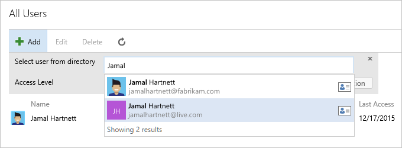
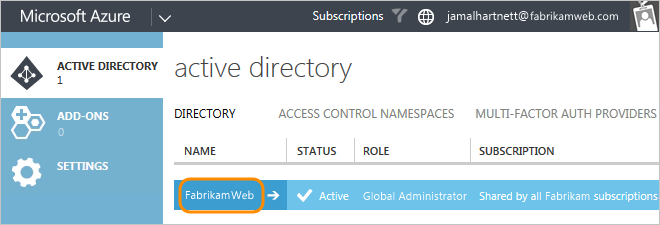
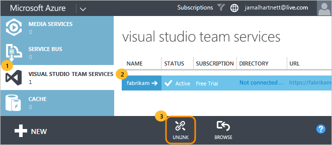
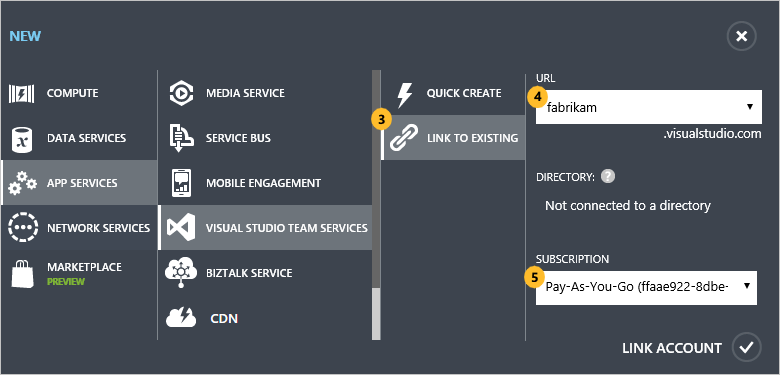
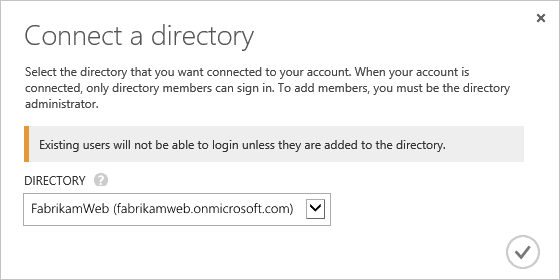

#	Change Azure Active Directory (Azure AD) tenant

**VSTS**

To move your VSTS account 
between directories (tenants) in Azure AD, 
disconnect your account from its current directory, 
then reconnect your account to the directory that you want.

<a name="permissions"></a>

You'll need:

*	VSTS account owner permissions. Only account 
owners can manage directory connections. 
[How do I find the account owner?](faq-change-app-access.md#find-owner)

*	At least Basic access, not Stakeholder

*	Global administrator permissions 
for your source and target Azure AD directories (tenants). 
Learn [how to manage Azure AD administrators](https://azure.microsoft.com/en-us/documentation/articles/active-directory-assign-admin-roles/).

*	Co-administrator permissions for the Azure subscriptions 
associated with your source and target directories. 
Learn [how to manage Azure subscription administrators](../billing/add-backup-billing-managers.md).

*	A temporary Microsoft account, like @outlook.com, 
to move your VSTS account between directories. 
This Microsoft account will need these permissions, 
which you'll set up below:

	*	Source directory global administrator
	*	(if adding users to target directory) Target directory user administrator
	*	Azure subscription Co-administrator for both directories
	*	VSTS account owner. Only account owners can change directory connections.

##	What happens to current users?

Your work in VSTS is associated with your sign-in address. 
During directory migration, all VSTS account users need
Microsoft accounts to sign in. They'll continue working seamlessly 
if their Microsoft accounts share the same sign-in addresses that they use now. 
Otherwise, they'll lose access until you finish the migration or 
unless you add them as new users to your VSTS account.

After migration, users must be members of the target directory 
to get access to your VSTS account. They'll continue 
working seamlessly if they use the same sign-in addresses that they use now. 
Otherwise, you'll have to add them as new users to your VSTS account. 
Your organization might have policies about adding external users to the directory, 
so find out more first.

##	Prepare your source directory

You'll now set up source directory permissions and VSTS account owner permissions
so you can perform the migration.

###	Set up your Microsoft account as Azure subscription co-administrator

[See steps here](https://docs.microsoft.com/en-us/azure/billing/billing-add-change-azure-subscription-administrator).


[Why am I asked to choose between my work or school account and my personal account?](faq-azure-access.md#ChooseOrgAcctMSAcct)


###	Set up your Microsoft account as global administrator in your source directory

[Add your account to the directory](https://docs.microsoft.com/en-us/azure/active-directory/active-directory-create-users), and in the **Tell us about this user** step, choose **User with an existing Microsoft account**.  In the **user profile** step, choose **Global Admin**.


###	Set up your Microsoft account as your VSTS account owner

0.	Sign in to your VSTS account (```http://{youraccount}.visualstudio.com```) as the account owner. 

	[Why am I asked to choose between my work or school account and my personal account?](faq-azure-access.md#ChooseOrgAcctMSAcct)

0.	View your VSTS account users.

	

0.	Add your Microsoft account to your VSTS account as a user.

	

	Your Microsoft account appears in this list 
	because you added this user to the source directory.

0.	Sign in to your VSTS account with your Microsoft account,
so that VSTS can validate this user. Otherwise, 
your Microsoft account won't appear in the possible account owners list.

0.	Sign back in to your VSTS account as the account owner. 
Now change the VSTS account owner to your Microsoft account. 
Learn [how to change VSTS account owners](change-account-ownership-vs.md).

	**Important**: Before you disconnect your VSTS account,
	make sure that this Microsoft account is the VSTS account owner. 

##	Prepare your target directory

Now you'll set up target directory permissions for your Microsoft account 
to continue performing the migration. You'll also add your VSTS 
account users to the target directory, if they're not members already, 
so they can get VSTS account access as directory members.

###	Set up your Microsoft account as Azure subscription Co-administrator

[See steps here](https://docs.microsoft.com/en-us/azure/billing/billing-add-change-azure-subscription-administrator).

[Why am I asked to choose between my work or school account and my personal account?](faq-azure-access.md#ChooseOrgAcctMSAcct)


###	Set up your Microsoft account as a user administrator in the target directory

0.	Find and select the directory that you want connected to your VSTS account.

	

0.	[Add your account to the directory](https://docs.microsoft.com/en-us/azure/active-directory/active-directory-create-users), and in the **Tell us about this user** step, choose **User with an existing Microsoft account**.  In the **user profile** step, choose the user administrator role.


##	Migrate your VSTS account between directories

###	Disconnect your VSTS account from the source directory

0.	Sign in to the [Azure classic portal](https://manage.windowsazure.com) 
with the Microsoft account that you're using for the migration.

0.	Select your VSTS account.

	

0.	Configure your account.

	

0.	Disconnect your account from the source directory.

	

	

	After you save your changes, your VSTS account is disconnected. 
	Now, only users with Microsoft accounts can sign in to your VSTS account. 
	This is why we previously set up your Microsoft account as a VSTS account user.

	

0.	Unlink your VSTS account from the source Azure subscription.

	

	Your VSTS account is removed from the Azure classic portal. 
	You can now link your account to another Azure subscription and directory.

###	Connect your VSTS account to the target directory

0.	Link your VSTS account to the target Azure subscription.

	

	

0.	Configure your account.

	

0.	Connect your account to the target directory. Save your changes when you're done.

	

	

0.	To check that you finished this task successfully, invite a user from the target directory 
to your VSTS account. Confirm that they can sign in. Learn how to 
[add users and assign access](add-account-users-assign-access-levels.md).

0.	Add the remaining users from the target directory to your VSTS account.

0.	If you use tools that run outside a web browser, like the Git command line tool, 
then your alternate credentials for those tools won't work anymore. 
You must [set up your credentials](http://support.microsoft.com/kb/2991274/en-us)
again for the VSTS account that you connected.

###	Reassign VSTS account ownership to a directory member

0.	Sign in to your VSTS account (```https://{youraccount}.visualstudio.com```) 
with the Microsoft account that you used for the migration.

0.	Reassign ownership for your VSTS account to a directory member.
Learn [how to change VSTS account owners](change-account-ownership-vs.md).

0.	Remove the Microsoft account that you used for the migration
from your source and target Azure subscriptions and directories.
