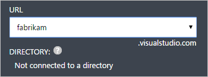

#	Connect Team Services account to Azure Active Directory (Azure AD)

**Team Services**

If your Team Services account was created with a Microsoft account, 
you can connect your Team Services account to your 
organization's directory (tenant) in 
[Azure Active Directory (Azure AD)](https://azure.microsoft.com/en-us/documentation/articles/active-directory-whatis/). 
You can then sign in to Team Services with the same username 
and password that you use with these Microsoft services. 
You can also enforce policies for accessing 
your team's critical resources and key assets.

For more information, see the [conceptual overview](access-with-azure-ad.md) for using Azure AD with VSTS.

##  Connect your Team Services account to your directory

0.  [Sign in to the Azure classic portal](https://manage.windowsazure.com/) 
with your personal Microsoft account as the Team Services account owner.

	> [!NOTE]
	> You can connect your Team Services account 
	> and your directory only through the Azure classic portal.

	[Why am I asked to choose between a "work or school account" and a "personal account"?](#ChooseOrgAcctMSAcct)

0.  If you haven't already, 
[link your Team Services account](../billing/set-up-billing-for-your-account-vs.md) 
to the Azure subscription associated with your directory.

  Why don't I see a directory when I link my account?  **Directory** shows a directory only when the selected 
  Team Services account is already connected to that directory.  You'll actually connect your account to a directory 
  elsewhere and later in Azure.

  

  [What if my account is already linked to an Azure subscription?](#subscription-linked-already)

  **Important** Want to use your Azure subscription to bill Team Services purchases?  You can use your linked Azure 
  subscription to bill purchases for your Team Services account, but if your subscription has a 
	[spending limit](https://azure.microsoft.com/en-us/pricing/spending-limits/), you must first remove this 
	spending limit **indefinitely**. Learn [how and why you must remove this spending limit](#remove-spending-limit).

0.	Go to **Visual Studio Team Services**. 
Select your Team Services account.

    

0.	Choose **Configure** > **Connect**.

    

    

0.	From the list of directories associated with the Azure subscription 
that's linked to your Team Services account, 
select the directory that you want to connect. 
Save your changes when you're done.

	

	*	[Why don't I see the directory that I want?](#why-not-my-directory)
	*	[My account's already connected to a directory. What do I do?](#AlreadyConnected)

	

	Your account is now connected to your organization's directory.

0.	To check that users can access your Team Services account, 
invite a user from your directory to your Team Services account 
and confirm that they can sign in.

0.  If you use alternate credentials with tools that run outside a web browser, 
like the Git command line tool, those tools won't work anymore. 
You must [set up your credentials](http://support.microsoft.com/kb/2991274/en-us) 
again for the Team Services account that you connected.

0.	If you used a Microsoft account to sign up for a 
[Visual Studio with MSDN subscription](https://www.visualstudio.com/vs/pricing/) 
that includes Team Services as a benefit, 
you can add a work or school account that's 
managed by Azure Active Directory to your subscription. 
Learn [how to link work or school accounts to Visual Studio with MSDN subscriptions](../billing/link-msdn-subscription-to-organizational-account-vs.md).

	[More questions about connecting?](#faq-connect)

**Next:**

*   [Manage users and access](add-account-users-assign-access-levels.md)
*   [Manage access with Azure AD groups](manage-azure-active-directory-groups-vsts.md)

[Troubleshooting Q&A](faq-azure-access.md)

