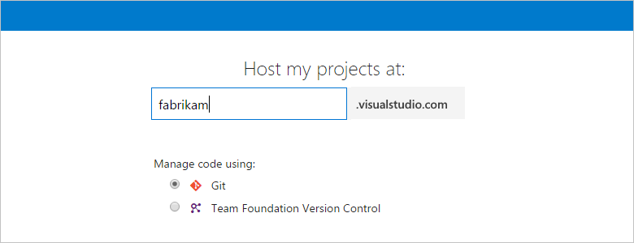

#	Create your VSTS account with a personal Microsoft account

**VSTS**

Sign up for a [Visual Studio Team Services](https://www.visualstudio.com/products/visual-studio-team-services-vs) 
account to upload and share code in free unlimited private 
Git repositories or Team Foundation Version Control. 
Then connect your favorite development tool like Eclipse, Xcode, 
Visual Studio, IntelliJ, or Android Studio to work on apps anytime, anywhere. 
Visual Studio Team Services offers integrated, enterprise Agile tools for DevOps, 
so your team can build often, test early, and ship faster.

> Want to set up an on-premises server? 
> [Get Team Foundation Server here](https://www.visualstudio.com/products/tfs-overview-vs), 
> or learn [how to install and set up Team Foundation Server](../tfs-server/install/get-started.md). 


[What users can join for free?  What do they get in Visual Studio Team Services?](#free-users)


<a name="how-sign-up"></a>
##	What do I need to sign up for a Visual Studio Team Services account?

*	To get started quickly and use only Microsoft accounts 
	with your VSTS account, see below. 

	Don't have a Microsoft account? 
	You can create a Microsoft account 
	when you sign up for Visual Studio Team Services.

*	To authenticate users and control account access through your 
	organization's directory (tenant) in Azure Active Directory (Azure AD), 
	[sign up with your organization's "work or school account"](create-account-with-work-school.md). 

Use your Microsoft account if you don't need to authenticate users 
for an organization with [Azure Active Directory (Azure AD)](https://azure.microsoft.com/en-us/documentation/articles/active-directory-whatis/). 
All users must sign in with Microsoft accounts to your VSTS account.

Use your work or school account to **automatically connect** your VSTS account to your organization's directory. 
All users must be members in that directory to get access to your VSTS account.


<a name="MicrosoftAccount"></a>
##	Sign up for Visual Studio Team Services with a personal Microsoft account

0.	Go to [Visual Studio Team Services](https://go.microsoft.com/fwlink/?LinkId=307137&clcid=0x409). 
Enter your email address for your Microsoft account. 

	If you're a Visual Studio subscriber 
	and get Visual Studio Team Services as a benefit, 
	use the Microsoft account associated with your subscription. 

	

	Got [browser problems?](#browser-problems)

0.	On the Microsoft account sign-in page, 
enter your email address for your Microsoft account. 
Then enter your password, and finish signing in.

	

	If you don't have a Microsoft account, 
	you can create a Microsoft account at this time. 

	[Why am I asked to choose between my work or school account and my personal account?](#ChooseOrgAcctMSAcct)

0.	Name your Visual Studio Team Services account. 
To manage your code, choose Git or Team Foundation Version Control.

	

	Learn which version control ([Git](../git/overview.md) 
	or [Team Foundation Version Control](../tfvc/overview.md)) 
	works best for you.

0.	Confirm your account's location. 

	
	
	VSTS will create your first team project as "MyFirstProject" 
	and will use Agile as your default work item process to organize your work. 
	Choose **Change details** to 
	[rename your team project, change the account location, or select another process, like Scrum](#account-location).

	> [!IMPORTANT]
	> After you create your account, only members of the directory shown here can get access to your VSTS
	> account. If you belong to multiple directories, check that you want to connect this directory to your VSTS account.
	> Otherwise, change the directory now. This is easier than [changing the directory later](#ChangeDirectory).

0.	After Visual Studio Team Services creates your account and team project, 
add your code, work items, or more users.

	

	Congratulations, you're now a Visual Studio Team Services account owner! 

	To sign in to your VSTS account at any time, go to ```https://{youraccount}.visualstudio.com```.

	> [!NOTE]
	> If you activated your Visual Studio subscription with a Microsoft account, and your subscription includes VSTS
	> as a benefit, learn [how to add your work or school account](../billing/link-msdn-subscription-to-organizational-account-vs.md) to your
	> subscription so you can use your subscriber benefits in VSTS.


## Next steps  

*	[Manage users and access](add-account-users-assign-access-levels.md)

*	Add code to Git or Team Foundation version control

	*	Git with [Eclipse](connect-to-vsts.md#eclipse), 
	[Xcode](../git/share-your-code-in-git-xcode.md), 
	[Android Studio](http://java.visualstudio.com/Docs/tools/androidstudio), 
	[IntelliJ](http://java.visualstudio.com/Docs/tools/intelliJ), 
	[Visual Studio](connect-to-vsts.md#vs), or 
	[Visual Studio Code](https://code.visualstudio.com/docs/editor/versioncontrol)

	*	TFVC using [Eclipse](connect-to-vsts.md#eclipse), 
	[Xcode](../tfvc/share-your-code-in-tfvc-xcode.md), 
	[Visual Studio](connect-to-vsts.md#vs), or 
	[Visual Studio Code](https://code.visualstudio.com/docs/editor/versioncontrol)

*	[Create your backlog](../work/backlogs/create-your-backlog.md), 
	[manage your process](../work/process/manage-process.md), 
	or [customize your process](../work/process/customize-process.md)


## Troubleshooting

[Troubleshooting](faq-create-account.md)
