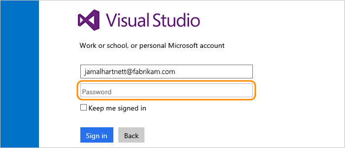

#	Create your VSTS account with a work or school account

**VSTS**

Sign up for a [Visual Studio Team Services](https://www.visualstudio.com/products/visual-studio-team-services-vs) 
account to upload and share code in free unlimited private 
Git repositories or Team Foundation Version Control. 
Then connect your favorite development tool like Eclipse, Xcode, 
Visual Studio, IntelliJ, or Android Studio to work on apps anytime, anywhere. 
Visual Studio Team Services offers integrated, enterprise Agile tools for DevOps, 
so your team can build often, test early, and ship faster.

> Want to set up an on-premises server? 
> [Get Team Foundation Server here](https://www.visualstudio.com/products/tfs-overview-vs), 
> or learn [how to install and set up Team Foundation Server](../tfs-server/install/get-started.md). 


[What users can join for free?  What do they get in Visual Studio Team Services?](#free-users)


<a name="how-sign-up"></a>
##	What do I need to sign up for a Visual Studio Team Services account?

*	To get started quickly and use only Microsoft accounts 
	with your VSTS account, [sign up with a "personal" Microsoft account](create-account-with-personal-msa.md). 

	Don't have a Microsoft account? 
	You can create a Microsoft account 
	when you sign up for Visual Studio Team Services.

*	To authenticate users and control account access through your 
	organization's directory (tenant) in Azure Active Directory (Azure AD), see below.

Use your Microsoft account if you don't need to authenticate users 
for an organization with [Azure Active Directory (Azure AD)](https://azure.microsoft.com/en-us/documentation/articles/active-directory-whatis/). 
All users must sign in with Microsoft accounts to your VSTS account.

Use your work or school account to **automatically connect** your VSTS account to your organization's directory. 
All users must be members in that directory to get access to your VSTS account.


##	Sign up for Visual Studio Team Services with a work or school account

Want to authenticate users and control access to your VSTS account 
the same way that you can with Microsoft services like Office 365 and Azure? 
When you sign up with a "work or school account" that's managed by your 
organization's directory (tenant) in [Azure Active Directory (Azure AD)](https://azure.microsoft.com/en-us/documentation/articles/active-directory-whatis/), 
your VSTS account is **automatically connected** to your organization's directory. 
You can then sign in to VSTS with the same username and password that you use with 
other Microsoft services. You can also enforce policies for accessing your team's critical 
resources and key assets. 

###  How does Azure AD control access to Visual Studio Team Services?

Visual Studio Team Services authenticates users through your organization's directory 
so that only users who are members in that directory can get access to your VSTS account. 
When users are removed from that directory, for example, because they've moved elsewhere, 
they can't access your account anymore. Only specific 
[Azure AD administrators](https://azure.microsoft.com/en-us/documentation/articles/active-directory-assign-admin-roles/) 
can manage users in your directory, so they control who can get 
access to your Visual Studio Team Services account.

Without Azure AD, you're solely responsible for controlling 
VSTS account access. And all users must sign in with Microsoft accounts. 
[What are other differences?](#SignInAccountDifferences)

###	What do I need to sign up for Visual Studio Team Services with a work or school account?

You'll need a work or school account that's managed by your organization's directory. 
If you use Azure or Office 365, you might have this already. If you don't, learn how to 
[sign up for Azure as an organization](https://azure.microsoft.com/en-us/documentation/articles/sign-up-organization/).

To use existing on-premises identities with Visual Studio Team Services, learn how to 
[use Azure AD Connect for integrating on-premises directories with Azure AD](https://azure.microsoft.com/en-us/documentation/articles/active-directory-aadconnect/).

<a name="SignIn"></a>

0.	Go to [Visual Studio Team Services](https://go.microsoft.com/fwlink/?LinkId=307137).
Enter the email address for your work or school account.

	

	Your sign-in page might look different, 
	based on the work or school account that you used.

	Got [browser problems?](#browser-problems)

0.	Enter your password for your work or school account.

	

	[Why am I asked to choose between my work or school account and my personal account?](#ChooseOrgAcctMSAcct)

0.	Name your Visual Studio Team Services account. 
To manage your code, choose Git or Team Foundation Version Control.

	

	Learn which 
	version control ([Git](../git/overview.md) 
	or [Team Foundation Version Control](../tfvc/overview.md)) 
	works best for you.

0.	Confirm your account's location and the **directory** 
that you're connecting to your VSTS account. 

	

	> [!IMPORTANT]
	> VSTS will create your first team project as "MyFirstProject" and will use Agile as the default work item
	> process to organize your work. Choose **Change details** to [rename your team project, change the account location, change the
	> directory, or select another process, like Scrum](#account-location). 
	> After you create your account, only members of
	> the directory shown here can get access to your VSTS account. If you belong to multiple directories, check that you want
	> to connect this directory to your VSTS account. Otherwise, change the directory now. This is easier than [changing the
	> directory later](#ChangeDirectory).

0.	After Visual Studio Team Services creates your account and team project, 
add code, work items, or more users. 

	

	Congratulations, you're now a Visual Studio Team Services account owner! 

	To sign in to your VSTS account at any time, 
	go to ```https://{youraccount}.visualstudio.com```.

	> [!NOTE]
	> If you activated your Visual Studio subscription with a Microsoft account, and your subscription includes VSTS
	> as a benefit, learn [how to add your work or school account](../billing/link-msdn-subscription-to-organizational-account-vs.md) to your
	> subscription so you can use your subscriber benefits in VSTS.

## Next steps 

*	[Manage users and access](add-account-users-assign-access-levels.md)

*	Add code to Git or Team Foundation version control

	*	Git with [Eclipse](https://java.visualstudio.com/Docs/tools/eclipse), 
	[Xcode](../git/share-your-code-in-git-xcode.md), 
	[Android Studio](http://java.visualstudio.com/Docs/tools/androidstudio), 
	[IntelliJ](http://java.visualstudio.com/Docs/tools/intelliJ), 
	[Visual Studio](../git/share-your-code-in-git-vs-2017.md), or 
	[Visual Studio Code](https://code.visualstudio.com/docs/editor/versioncontrol)

	*	TFVC using [Eclipse](https://java.visualstudio.com/Docs/tools/eclipse), 
	[Xcode](../tfvc/share-your-code-in-tfvc-xcode.md), 
	[Visual Studio](../tfvc/use-visual-studio-git.md), or 
	[Visual Studio Code](https://code.visualstudio.com/docs/editor/versioncontrol)

*	[Create your backlog](../work/backlogs/create-your-backlog.md), 
	[manage your process](../work/process/manage-process.md), 
	or [customize your process](../work/process/customize-process.md)


