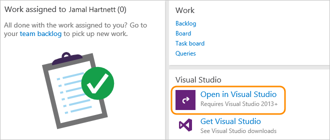
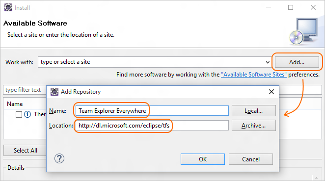
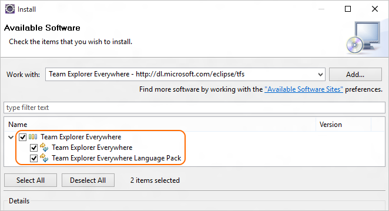
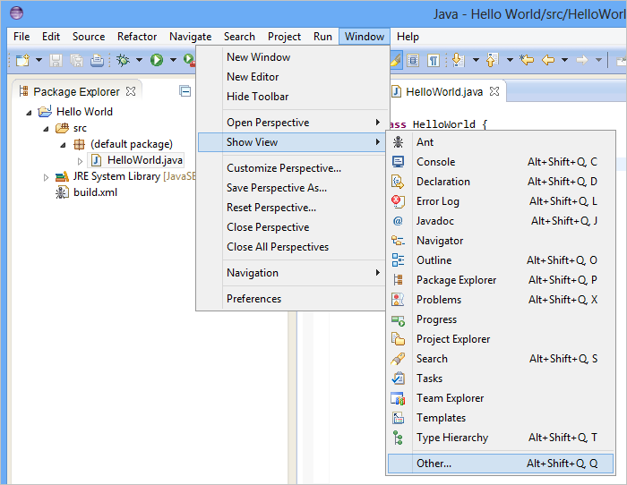
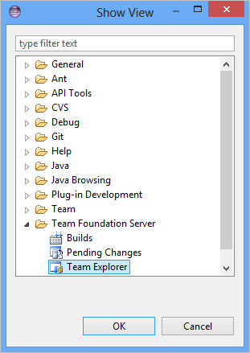
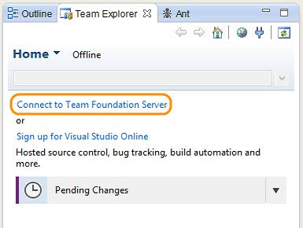
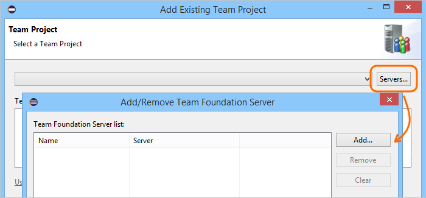
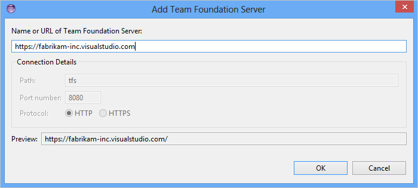

# Connect to Visual Studio Team Services from Eclipse, Xcode, Visual Studio, and more

**Team Services**

To upload and share code after creating your Visual Studio Team Services account, 
connect to your private Git repositories or Team Foundation version control from tools like:

*	[Eclipse](#eclipse)
*	[Xcode](#xcode)
*	[Visual Studio](#vs)
*	[Android Studio](http://java.visualstudio.com/Docs/tools/androidstudio)
*	[IntelliJ](http://java.visualstudio.com/Docs/tools/intelliJ)
*	[Visual Studio Code](https://code.visualstudio.com/docs/editor/versioncontrol)

Don't have a [Visual Studio Team Services](https://www.visualstudio.com/products/visual-studio-team-services-vs) 
account? [Create your account and your team project first](sign-up-for-visual-studio-team-services.md). 
You'll use your team project to store code, 
builds, tests, work items, and other assets. 

If you created your Team Services account 
but didn't create a team project for any reason, 
Team Services prompts to finish creating your 
team project after you sign in.

<a name="createteamproject"></a>
##	Create your team project in Visual Studio Team Services

0. Sign in to your Visual Studio Team Services account 
(```https://{youraccount}.visualstudio.com```). 

	*	[Browser problems?](#browser-problems)
	*	[Why am I asked to choose between my work or school account and my personal account?](#ChooseOrgAcctMSAcct)

0. Name your team project. 
To manage your code, select Git or Team Foundation Version Control. 
To manage your work, select Agile or another work item process template. 

	

	Not sure which to choose? Learn which version control 
	or [work item process template](../work/guidance/choose-process.md) 
	works best for you:

	*	[**Git**](../git/overview.md): 
	Work in a decentralized version 
	control system that provides lightweight 
	branches and a good experience when working offline.

	*	[**Team Foundation Version Control**](../tfvc/overview.md): 
	Work in a centralized version control system that 
	provides a good experience, even with a massive codebase.

0.	[Add users to your account](../accounts/team-services/add-account-users-assign-access-levels-team-services.md), 
or [add users to your team project](add-team-members-vs.md). 

0. Connect and share your code from:

	* [Visual Studio](#vs)
	* [Xcode](#xcode)
	* [Eclipse](#eclipse)
	* [Android Studio](http://java.visualstudio.com/Docs/tools/androidstudio)
	* [IntelliJ](http://java.visualstudio.com/Docs/tools/intelliJ)
	* [Visual Studio Code](https://code.visualstudio.com/docs/editor/versioncontrol)


## Connect Visual Studio to Team Services from Team Services

0.	If you haven't already, install 
[Visual Studio 2017](https://go.microsoft.com/fwlink/?LinkId=309297&clcid=0x409&slcid=0x409).

	[Which other versions of Visual Studio can I use with Visual Studio Team Services?](#vs-versions)

0.  Sign in to your Visual Studio Team Services account 
(```https://{youraccount}.visualstudio.com```). 

	*	[Browser problems?](#browser-problems) 
	*	[Why am I asked to choose between my work or school account and my personal account?](#ChooseOrgAcctMSAcct)

0.	On the account landing page (which is your projects page, ```https://{youraccount}.visualstudio.com/_projects```), 
find and select your team project.

	

0.  From your team project page, choose the **Dashboards** item in the top navigation bar, and then **Open in Visual Studio**.

	


<a name="vs"></a>
## Connect to Team Services from Visual Studio

0. If you haven't already, install [Visual Studio 2017](https://go.microsoft.com/fwlink/?LinkId=309297&clcid=0x409&slcid=0x409).

 [Which other versions of Visual Studio can I use with Visual Studio Team Services?](#vs-versions)

0. Choose your next step based on the version control you selected:

 * [Share code in Git using Visual Studio](../git/share-your-code-in-git-vs.md)

 * [Share code in TFVC using Visual Studio](../tfvc/share-your-code-in-tfvc-vs.md#workspace)

Learn about [connecting to team projects](../connect/connect-team-projects.md#visual-studio).


## Connect from Visual Studio Code

Set up [VS Code](https://code.visualstudio.com/docs/editor/versioncontrol) with Git and Team Services.


<a name="xcode"></a>
## Connect and share code from Xcode

Choose your next step based on the version control you selected:

 * [Share code in Git using Xcode](../git/share-your-code-in-git-xcode.md)

 * [Share code in TFVC using Xcode](../tfvc/share-your-code-in-tfvc-xcode.md)

<a name="eclipse"></a>
## Connect and share code from Eclipse

<a name="TEEInstall"></a>
### Install the Team Explorer Everywhere plug-in for Eclipse

0.	If you haven't already, [install Eclipse](http://go.microsoft.com/fwlink/?LinkID=247298).

0.	Open Eclipse and on the Help menu, select Install New Software. 

0.	Add a repository for Team Explorer Everywhere.

	

0.	Select the "Team Explorer Everywhere" features.

	

5.	Accept the license agreement and restart Eclipse when prompted.

<a name="TEEConnect"></a>
### Connect to your team project

0. Show Team Explorer.

	

	

0. Connect to Team Foundation Server.

	

0. Add the server. 

	

0.	Enter your Visual Studio Team Services account (```https://{youraccount}.visualstudio.com```).

	
 
	**Q:**	I don't remember my account URL. Where can I find it? 
 
	**A:**	[Sign in to your Visual Studio profile](https://go.microsoft.com/fwlink/?LinkID=309329) 
	to find your account list.

0. Connect to your team project.

	

### Share your code

Choose your next step based on the version control you selected:

 * [Share code in Git using Eclipse](../git/share-your-code-in-git-eclipse.md)

 * [Share code in TFVC using Eclipse](../tfvc/share-your-code-in-tfvc-eclipse.md)

## Q&A

<!-- BEGINSECTION class="md-qanda" -->

<a name="browser-problems"></a>

[!INCLUDE [browser-problems](../_shared/qa-browser-problems.md)]

[!INCLUDE [vs-launch-fail](../_shared/qa-vs-launch-fail.md)]

<a name="vs-versions"></a>

[!INCLUDE [visual-studio-versions](../_shared/qa-visual-studio-versions.md)]

<a name="another-team-project"></a>

[!INCLUDE [another-team-project](../_shared/qa-another-team-project.md)]

[!INCLUDE [delete-team-project](../_shared/qa-delete-team-project.md)]

#### Q: Where can I learn more about Team Explorer Everywhere for Eclipse?

A: [Team Foundation Server plug-in for Eclipse](http://msdn.microsoft.com/library/gg413285.aspx)

<a name="EditWelcomePortal"></a>
####Q:	Can I edit the Welcome portal for my team project?

A:	Yes, the Welcome portal is authored in a Markdown file. 
You can edit the Markdown file directly from your team 
project's Welcome portal page. For details on writing 
Markdown, look at 
[John Gruber's Markdown site](http://daringfireball.net/projects/markdown/).

<a name="ChooseOrgAcctMSAcct"></a>

[!INCLUDE [choose-msa-azuread-account](../_shared/qa-choose-msa-azuread-account.md)]

[!INCLUDE [choose-msa-azuread-account2](../_shared/qa-choose-msa-azuread-account2.md)]

[!INCLUDE [why-cant-sign-in-msa-azuread-account](../_shared/qa-why-cant-sign-in-msa-azuread-account.md)]

<a name="get-support"></a>

[!INCLUDE [get-team-services-support](../_shared/qa-get-team-services-support.md)]

<!-- ENDSECTION --> 


 

