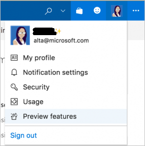
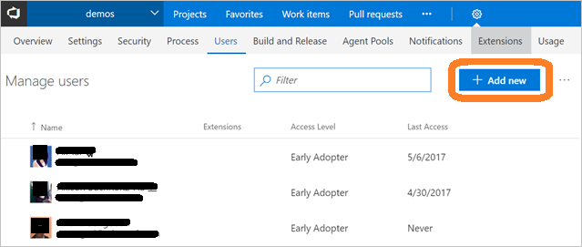
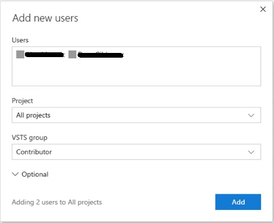
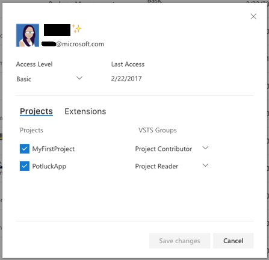

#	Manage users and access in user hub for Visual Studio Team Services

**Team Services Streamlined User Management Preview**

If you are a Project Collection Administrator, you can now navigate to the new Users page by turning on "Streamlined User Management" under "Preview features".
 


Add users to your Team Services account and specify the level of features they can use, such as Basic or Stakeholder.  
These kinds of users can join your Team Services account for free:

*	5 users who get [Basic features](https://www.visualstudio.com/team-services/compare-features/), 
such as version control, tools for Agile, Java, build, release management, and more
*	Unlimited users who get [Stakeholder features](https://www.visualstudio.com/team-services/compare-features/), 
such as working with your backlog, work items, and queries
*	Unlimited [Visual Studio subscribers](https://www.visualstudio.com/team-services/compare-features/) 
who also get Basic features, and in some cases, additional features with specific extensions, such as 
[Test Manager](https://marketplace.visualstudio.com/items?itemName=ms.vss-testmanager-web) 

[Need more users with Basic features or Visual Studio subscriptions?](#add-more-basic-users)


> You can add people to team projects, 
> rather than to your account. Team Services automatically assigns them 
> [Basic features](https://www.visualstudio.com/team-services/compare-features/), 
> if your account has seats available, 
> or [Stakeholder features](https://www.visualstudio.com/team-services/compare-features/), 
> if not. Learn [how to add members to team projects](add-team-members-vs.md).
>
> When people don't need access to your Team Services account anymore, [delete them](#delete-user) from your account. 


## How does *access* differ from *permissions*?

Access levels control which features are available to users, while permissions control their access to account resources. 
[Can't access some features?](#feature-access) 
For TFS, learn [how to change access levels](../security/change-access-levels.md) 
or [buy more access to TFS or the Test hub](buy-access-tfs-test-hub.md). 

To control access to account resources instead, learn [how to add permissions](add-users.md) or 
[restrict permissions](restrict-access-tfs.md).  To change how many users can access paid extensions in your 
Team Services account, 
learn [how to change paid extension users](../marketplace/get-vsts-extensions.md#change-extension-quantity).


## Before you get started

You'll need [Team Services project collection administrator or account owner permissions](#find-owner). 

##	Add users to your Visual Studio Team Services account

Administrators can now add users to an account, grant access to appropriate tooling extensions and service access level, 
and add users to groups all in one view. You can add up to 50 users at once.  You can add more than 50 users by repeatedly 
using this Users view.  When you add users, each receives a notification email with a 
link to the account page.

 > [!NOTE]
 > If have an Azure Active Directory (Azure AD) backed Team Services account, and you need to add users who are 
 > external to your Azure AD, first 
 > [add those users as foreign principals](https://docs.microsoft.com/en-us/azure/active-directory/active-directory-create-users#add-a-user) to 
 > your Azure AD.  Be sure on the **Tell us about this user page**, under **Type of user**, to choose **User with an 
 > existing Microsoft account**.  After completing those steps, follow the steps below to add the foreign Azure AD 
 > user to Team Services.






####	Next

*	Add code to Git or Team Foundation version control

	*	Git with [Eclipse](connect-to-visual-studio-team-services.md#eclipse), 
	[Xcode](../git/share-your-code-in-git-xcode.md), 
	[Visual Studio](connect-to-visual-studio-team-services.md#vs), 
	[Android Studio](http://java.visualstudio.com/Docs/tools/androidstudio), 
	[IntelliJ](http://java.visualstudio.com/Docs/tools/intelliJ), 
	or [Visual Studio Code](https://code.visualstudio.com/docs/editor/versioncontrol)

	*	TFVC using [Eclipse](connect-to-visual-studio-team-services.md#eclipse), 
	[Xcode](../tfvc/share-your-code-in-tfvc-xcode.md), 
	[Visual Studio](connect-to-visual-studio-team-services.md#vs), or 
	[Visual Studio Code](https://code.visualstudio.com/docs/editor/versioncontrol)

*	[Create a backlog](../work/backlogs/create-your-backlog.md) 
to plan, organize, and track your work, 
[manage your process](../work/process/manage-process.md), 
or [customize your process](../work/process/customize-process.md)

*	[Grow and scale your teams](../work/scale/multiple-teams.md)


##	Manage users in table view

The Users view shows key information per user in a table. You can see and modify assigned service extensions and 
access levels.  You can multi-select users and bulk edit their extensions and access.  You can filter by searching for 
partial user names, access level, or extension names.  You can see the last access date for each user to help you choose 
from whom you might remove access or lower access to stay within your license limits.

Go to the User Hub:


Choose a user in the table and then choose the **...** in the name column to see the context menu.  The menu supports **Change access level**, **Manage project**, **Manage extension** (if there are extensions), and **Remove from account** (deletes user).


##	Detailed view of individual users

Using the detailed user view, you can change the access level, service extensions, and project group memberships that 
a user has. The same operations from the table's context menu are available in this dialog.



<a name="delete-user"></a>
##  Delete users from your Visual Studio Team Services account

Before you start, you'll need 
[Team Services project collection administrator or account owner permissions](#find-owner).

0. Sign in to your Visual Studio Team Services account (```https://{youraccount}.visualstudio.com```).

 [Why am I asked to choose between my "work or school account" and my "personal account"?](#ChooseOrgAcctMSAcct)

0. Go to the users hub. Select the user, choose **...** in the name column, then choose **Remove**.

 

0. To make sure that you've removed the user completely, make sure they are not in any of your [security groups](add-users.md). 

 [Why don't users appear or disappear promptly in Team Services after I add or delete them in the Users hub?](#users-delay)

0. If you deleted paid users who had Basic features, and you don't want to pay for these users, you must also 
[reduce these users in the Visual Studio Marketplace](buy-basic-access-add-team-services-users.md), 
so you're not charged in your next Azure billing cycle.

 > To reduce or cancel these users for the next month, you must make updates before the last day of the current month. 
 > Your bill won't show these change until the next month because paid users are monthly purchases. 


<a name="add-more-basic-users"></a>
## Add more users with Basic features or Visual Studio subscriptions

When your account stays within the free limits, you don't have to pay for users to join your account.
You only have to pay if you have more than 5 users who need Basic features, and they don't have Visual Studio subscriptions.
You can [pay for additional users in the Visual Studio Marketplace](buy-basic-access-add-team-services-users.md), 
return to your Team Services account, add these users, and assign them Basic access. 
You pay monthly for their access and cancel the access anytime.

Visual Studio subscriptions give you flexible ways to access Team Services 
and to license the Visual Studio IDE and other Microsoft software for dev and test. 
Learn [how to buy Visual Studio subscriptions](../marketplace/vs-subscriptions/buy-vs-subscriptions.md) 
from the [Visual Studio Marketplace](https://marketplace.visualstudio.com/subscriptions). 

Learn [how to manage purchased Visual Studio subscriptions](../marketplace/vs-subscriptions/buy-vs-subscriptions.md#manage-subscriptions) 
in the [Visual Studio Subscriptions Administration portal](https://manage.visualstudio.com/_apis/Home/redirect?RedirectSource=Commerce). 
Make sure to sign in with the ID that you used to purchase your subscriptions.


## Q & A

### Permissions 

#### Q: Why can't I manage users?

A:  To access the Users hub and manage users, you must have 
[Team Services project collection administrator or account owner permissions](#find-owner).


<a name="find-owner"></a>

[!INCLUDE [find-project-collection-administrator](../_shared/qa-find-project-collection-administrator.md)]

[!INCLUDE [find-account-owner](../_shared/qa-find-account-owner.md)]


<a name="users-delay"></a>

[!INCLUDE [user-delay](../_shared/qa-user-delay.md)]


### Visual Studio subscriptions

<a name="MSDNSubscriber"></a>

#### Q: When do I select "Visual Studio/MSDN Subscriber"?

A: Assign this access level to users who have active and valid 
[Visual Studio subscriptions](#EligibleMSDNSubscriptions). 
You'll need the email address that's associated with this subscription.
Team Services automatically recognizes and validates Visual Studio 
subscribers who have Team Services as a benefit.

For example, if you select "Visual Studio/MSDN Subscriber", 
but you don't have a valid and active Visual Studio subscription, you can only 
[work as a stakeholder](../quickstart/get-started-stakeholder.md).

<a name="EligibleMSDNSubscriptions"></a>

#### Q: Which Visual Studio subscriptions can I use with Team Services?

A:  These subscriptions include Team Services at no extra charge 
([check here for the current list](https://azure.microsoft.com/en-us/pricing/details/visual-studio-team-services/)):

*	Visual Studio Enterprise - monthly
*	Visual Studio Enterprise - annual
*	Visual Studio Enterprise with MSDN, 
including subscriptions offered through BizSpark and Microsoft Partner Network (MPN)
*	Visual Studio Professional - monthly
*	Visual Studio Professional - annual
*	Visual Studio Professional with MSDN
*	Visual Studio Test Professional with MSDN
*	MSDN Platforms

Not eligible:

*	MSDN Operating Systems
*	MSDN Essentials
*	Visual Studio Professional (MPN)

Learn more about [Visual Studio subscriptions](https://www.visualstudio.com/vs/pricing/).

<a name="enterprise-professional"></a>

#### Q: Which specific subscriptions do "Visual Studio Enterprise subscription" and "Visual Studio Professional subscription" include? 

A: "Visual Studio Enterprise subscription" can describe:

*	Visual Studio Enterprise - monthly
*	Visual Studio Enterprise - annual
*   Visual Studio Enterprise with MSDN

"Visual Studio Professional subscription" can describe:

*	Visual Studio Professional - monthly
*	Visual Studio Professional - annual
*   Visual Studio Professional with MSDN

<a name="ValidateMSDNSubscription"></a>

#### Q: Why won't my Visual Studio subscription validate?

A: This might happen for different reasons: 

*	Make sure that you have an active, valid, and 
[eligible Visual Studio subscription](#EligibleMSDNSubscriptions) 
that you can use with Team Services. 

*	You might experience a delay if your subscription is new.

*	If you used a Microsoft account to activate your Visual Studio subscription, 
and you're using an Azure "work or school account" with Team Services, 
learn [how to add your "work or school account" to your subscription](link-msdn-subscription-to-organizational-account-vs.md).

Still having problems? Try these 
[troubleshooting tips](http://blogs.msdn.com/b/visualstudioalm/archive/2014/03/19/visual-studio-online-best-practices-troubleshooting-issues-with-the-quot-eligible-msdn-subscriber-license-type.aspx). 
If you need more help, contact [Support](https://www.visualstudio.com/support/).

<a name="why-access-changed"></a>
#### Q: Why do Visual Studio subscribers' access levels change after they sign in?

A: Team Services recognizes Visual Studio subscribers 
and will automatically assign them access based on their subscription, 
no matter the current access level that's assigned to them.

<a name="subscription-expired"></a>

#### Q: What happens if a user's subscription expires?

A: If no other access levels are available, they'll 
[work as stakeholders](../quickstart/get-started-stakeholder.md). 
To restore access, they must renew their subscription.

<a name="extension-transition"></a>

#### Q: What happened to Visual Studio Online Professional?

A: On December 1, 2015, we replaced Visual Studio Online Professional with the 
[Visual Studio Professional monthly subscription](https://marketplace.visualstudio.com/items/ms.vs-professional-monthly) 
and will transition users automatically. While Visual Studio Online Professional 
purchases now appear as Visual Studio Professional monthly subscriptions on your monthly invoice, 
we haven't determined when users will be transitioned systematically. 
This transition provides an upgrade by offering access to unlimited 
Team Services accounts, not just one account, like Visual Studio Online Professional. 
The rest stays the same - monthly access to the Visual Studio Professional IDE, 
and pricing remains at $45 per user, per month.
Learn more about [Visual Studio subscriptions](https://www.visualstudio.com/products/how-to-buy-vs).

If you're buying Professional users for a specific Team Services account,
which is possible only if you bought before November 2015,
and want to upgrade, do this:
	
0. Before the last day of the calendar month, 
sign in to the [Azure portal](https://manage.windowsazure.com), 
and reduce the number of paid Visual Studio Online Professional 
users to 0. 

	This change will take effect on the 1st day of next month. 
	This means that in the next calendar month, 
	you won't be billed for Visual Studio Online Professional users at all.

0. On the 1st day of the next calendar month, 
[go to the Marketplace](https://marketplace.visualstudio.com/items/ms.vs-professional-monthly) 
and buy Visual Studio Professional monthly subscriptions for the same users. 
Learn [how to buy Visual Studio subscriptions](../marketplace/vs-subscriptions/buy-vs-subscriptions.md).

	**Note** If you want to use your monthly Azure credits as a Visual Studio subscriber to pay for users, 
	make sure to remove your subscription's default spending limit indefinitely. 
	[Learn more](set-up-billing-for-your-account-vs.md#AzureMSDNSubscription).


### User access

#### Q: What does *Last Access* mean in the All Users view?

Last Access is the last date a user accessed any VSTS resources or services. Accessing VSTS includes using 
*accountname*.visualstudio.com directly as well as using resources or services indirectly, such as using the Package Management 
service from a build definition or pushing code to Team Services from a git command line or from an IDE.

<a name="paid-basic-access-join-other-accounts"></a>

[!INCLUDE [can-paid-Basic-users-join-other-accounts](../_shared/qa-can-paid-basic-users-join-other-accounts.md)]

<a name="feature-access"></a>

[!INCLUDE [no-access-existing-features](../_shared/qa-no-access-existing-features.md)]

<a name="stopped-features"></a>

#### Q: Why did I or my team member lose access to certain features?

A: This might happen for different reasons, 
but meanwhile, you or your team member can continue 
[working as a stakeholder](../quickstart/get-started-stakeholder.md):

*	Your or your team member's Visual Studio subscription has expired. 
Meanwhile, they'll [work as stakeholders](../quickstart/get-started-stakeholder.md), 
or you can give them Basic access until they renew their subscriptions.
After they sign in, Team Services will restore their access automatically.

*	The Azure subscription used for billing is no longer active. 
This affects all purchases made with this subscription, 
including Visual Studio subscriptions. 
To fix this problem, visit the [Azure account portal](https://account.windowsazure.com/subscriptions).

*	The Azure subscription used for billing was 
unlinked from your Team Services account. 
Learn more about [linking your account](set-up-billing-for-your-account-vs.md).

*	Your Team Services account has more users with Basic access 
than the number of users that you're paying for in Azure. 
Your account includes 5 free users with Basic access, 
but if you need to add more users with Basic access, 
you can [pay for these users](buy-basic-access-add-team-services-users.md). 
Otherwise, on the 1st day of the calendar month, users who haven't 
signed into your account the longest will lose access first. 
If your account has users who don't need access anymore, 
[remove them from your account](#delete-user).

*	You no longer have access to 
[features that are available only as extensions](https://www.visualstudio.com/team-services/compare-features/). 
This might happen for different reasons.

	*	Your access level no longer meets your extension's requirements. 
	Most extensions require at least Basic access, not Stakeholder. 
	For more details, see the extension's description 
	in the [Visual Studio Marketplace](https://marketplace.visualstudio.com).

	*	The extension was uninstalled. You can reinstall the extension by 
	visiting the extension page in the [Visual Studio Marketplace](https://marketplace.visualstudio.com).

	*	If you're using a paid extension, 
	the Azure subscription used for billing might 
	be unlinked from your Team Services account 
	or might no longer be active. Learn more about 
	[linking your Team Services account](set-up-billing-for-your-account-vs.md), 
	or visit the [Azure account portal](https://account.windowsazure.com/subscriptions) 
	to check your payment details.


###	Azure Active Directory (Azure AD) and your account

<a name="AddUserDirectory"></a>

#### Q: Why do I have to add users to a directory?

A: Your Team Services account authenticates users and controls access 
through Azure Active Directory (Azure AD). All users must be directory members to get access.

If you're a directory administrator, you can 
[add users to the directory](https://msdn.microsoft.com/library/azure/hh967632.aspx). 
If you're not, work with your directory administrator to add users. 
Learn more about [controlling access with a directory](manage-organization-access-for-your-account-vs.md).

<a name="ConnectedDirectory"></a>

[!INCLUDE [does-account-use-azuread](../_shared/qa-does-account-use-azuread.md)]

<a name="DeleteFromDirectory"></a>

#### Q: My account controls access with Azure Active Directory (Azure AD). Can I just delete users from the directory?

A: Yes, but this removes their access to all Team Services accounts and other 
assets associated with that directory.  You must have Azure AD global administrator permissions to  
[delete a user from your Azure AD](manage-organization-access-for-your-account-vs.md#delete-directory-members).

<a name="ChooseOrgAcctMSAcct"></a>

[!INCLUDE [choose-msa-azuread-account](../_shared/qa-choose-msa-azuread-account.md)]

[!INCLUDE [choose-msa-azuread-account2](../_shared/qa-choose-msa-azuread-account2.md)]

[!INCLUDE [why-cant-sign-in-msa-azuread-account](../_shared/qa-why-cant-sign-in-msa-azuread-account.md)]


###	More support

[!INCLUDE [get-team-services-support](../_shared/qa-get-team-services-support.md)]

