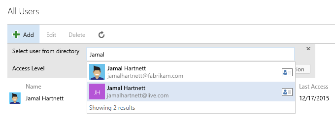
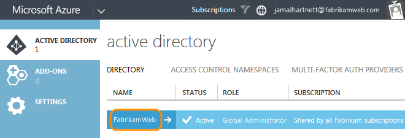
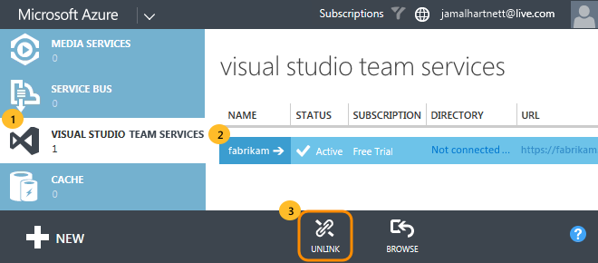
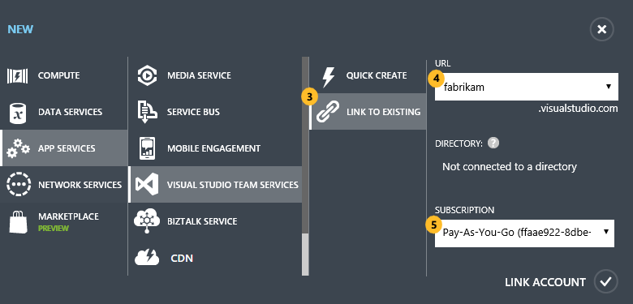
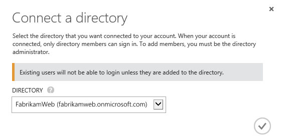

#	Team Services: Change Azure Active Directory (Azure AD) tenant

**Team Services**

To move your Visual Studio Team Services account 
between directories (tenants) in Azure AD, 
disconnect your account from its current directory, 
then reconnect your account to the directory that you want.

<a name="permissions"></a>

You'll need:

*	Team Services account owner permissions. Only account 
owners can manage directory connections. 
[How do I find the account owner?](#find-owner)

*	At least Basic access, not Stakeholder

*	Global administrator permissions 
for your source and target Azure AD directories (tenants). 
Learn [how to manage Azure AD administrators](https://azure.microsoft.com/en-us/documentation/articles/active-directory-assign-admin-roles/).

*	Co-administrator permissions for the Azure subscriptions 
associated with your source and target directories. 
Learn [how to manage Azure subscription administrators](set-up-billing-for-your-account-vs.md#AddAzureAdmin).

*	A temporary Microsoft account, like @outlook.com, 
to move your Team Services account between directories. 
This Microsoft account will need these permissions, 
which you'll set up below:

	*	Source directory global administrator
	*	(if adding users to target directory) Target directory user administrator
	*	Azure subscription Co-administrator for both directories
	*	Team Services account owner. Only account owners can change directory connections.

##	What happens to current users?

Your work in Team Services is associated with your sign-in address. 
During directory migration, all Team Services account users need
Microsoft accounts to sign in. They'll continue working seamlessly 
if their Microsoft accounts share the same sign-in addresses that they use now. 
Otherwise, they'll lose access until you finish the migration or 
unless you add them as new users to your Team Services account.

After migration, users must be members of the target directory 
to get access to your Team Services account. They'll continue 
working seamlessly if they use the same sign-in addresses that they use now. 
Otherwise, you'll have to add them as new users to your Team Services account. 
Your organization might have policies about adding external users to the directory, 
so find out more first.

##	Prepare your source directory

You'll now set up source directory permissions and Team Services account owner permissions
so you can perform the migration.

###	Set up your Microsoft account as Azure subscription co-administrator

[See steps here](https://docs.microsoft.com/en-us/azure/billing/billing-add-change-azure-subscription-administrator).


[Why am I asked to choose between my work or school account and my personal account?](#ChooseOrgAcctMSAcct)


###	Set up your Microsoft account as global administrator in your source directory

[Add your account to the directory](https://docs.microsoft.com/en-us/azure/active-directory/active-directory-create-users), and in the **Tell us about this user** step, choose **User with an existing Microsoft account**.  In the **user profile** step, choose **Global Admin**.


###	Set up your Microsoft account as your Team Services account owner

0.	Sign in to your Team Services account (```http://{youraccount}.visualstudio.com```) as the account owner. 

	[Why am I asked to choose between my work or school account and my personal account?](#ChooseOrgAcctMSAcct)

0.	View your Team Services account users.

	

0.	Add your Microsoft account to your Team Services account as a user.

	

	Your Microsoft account appears in this list 
	because you added this user to the source directory.

0.	Sign in to your Team Services account with your Microsoft account,
so that Team Services can validate this user. Otherwise, 
your Microsoft account won't appear in the possible account owners list.

0.	Sign back in to your Team Services account as the account owner. 
Now change the Team Services account owner to your Microsoft account. 
Learn [how to change Team Services account owners](change-account-ownership-vs.md).

	**Important**: Before you disconnect your Team Services account,
	make sure that this Microsoft account is the Team Services account owner. 

##	Prepare your target directory

Now you'll set up target directory permissions for your Microsoft account 
to continue performing the migration. You'll also add your Team Services 
account users to the target directory, if they're not members already, 
so they can get Team Services account access as directory members.

###	Set up your Microsoft account as Azure subscription Co-administrator

[See steps here](https://docs.microsoft.com/en-us/azure/billing/billing-add-change-azure-subscription-administrator).

[Why am I asked to choose between my work or school account and my personal account?](#ChooseOrgAcctMSAcct)


###	Set up your Microsoft account as a user administrator in the target directory

0.	Find and select the directory that you want connected to your Team Services account.

	

0.	[Add your account to the directory](https://docs.microsoft.com/en-us/azure/active-directory/active-directory-create-users), and in the **Tell us about this user** step, choose **User with an existing Microsoft account**.  In the **user profile** step, choose the user administrator role.


##	Migrate your Team Services account between directories

###	Disconnect your Team Services account from the source directory

0.	Sign in to the [Azure classic portal](https://manage.windowsazure.com) 
with the Microsoft account that you're using for the migration.

0.	Select your Team Services account.

	

0.	Configure your account.

	

0.	Disconnect your account from the source directory.

	

	

	After you save your changes, your Team Services account is disconnected. 
	Now, only users with Microsoft accounts can sign in to your Team Services account. 
	This is why we previously set up your Microsoft account as a Team Services account user.

	

0.	Unlink your Team Services account from the source Azure subscription.

	

	Your Team Services account is removed from the Azure classic portal. 
	You can now link your account to another Azure subscription and directory.

###	Connect your Team Services account to the target directory

0.	Link your Team Services account to the target Azure subscription.

	

	

0.	Configure your account.

	

0.	Connect your account to the target directory. Save your changes when you're done.

	

	

0.	To check that you finished this task successfully, invite a user from the target directory 
to your Team Services account. Confirm that they can sign in. Learn how to 
[add users and assign access](add-account-users-assign-access-levels-team-services.md).

0.	Add the remaining users from the target directory to your Team Services account.

0.	If you use tools that run outside a web browser, like the Git command line tool, 
then your alternate credentials for those tools won't work anymore. 
You must [set up your credentials](http://support.microsoft.com/kb/2991274/en-us)
again for the Team Services account that you connected.

###	Reassign Team Services account ownership to a directory member

0.	Sign in to your Team Services account (```https://{youraccount}.visualstudio.com```) 
with the Microsoft account that you used for the migration.

0.	Reassign ownership for your Team Services account to a directory member.
Learn [how to change Team Services account owners](change-account-ownership-vs.md).

0.	Remove the Microsoft account that you used for the migration
from your source and target Azure subscriptions and directories.

## Q&A

<!-- BEGINSECTION class="md-qanda" -->

####Q:	Why don't I see the directory that I want to connect? What do I do?

A:	This might happen because:

*	You don't have [administrator permissions](#permissions) 
to manage directory connections.

*	You don't have a 
[valid "full" Azure subscription](https://azure.microsoft.com/en-us/pricing/purchase-options/), 
like a "Pay-As-You-Go" subscription, associated with the directory 
that you want to use. This typically happens with Office 365 Azure AD.

*	Your Team Services account isn't linked to the Azure subscription 
associated with your directory.

Learn [how to resolve why you can't see your directory](manage-organization-access-for-your-account-vs.md#why-not-my-directory).

<a name="find-owner"></a>

[!INCLUDE [find-account-owner](../../_shared/qa-find-account-owner.md)]

[!INCLUDE [why-no-owned-accounts](../../_shared/qa-why-no-owned-accounts.md)]

<a name="ChooseOrgAcctMSAcct"></a>

[!INCLUDE [choose-msa-azuread-account](../../_shared/qa-choose-msa-azuread-account.md)]

[!INCLUDE [choose-msa-azuread-account2](../../_shared/qa-choose-msa-azuread-account2.md)]

[!INCLUDE [why-cant-sign-in-msa-azuread-account](../../_shared/qa-why-cant-sign-in-msa-azuread-account.md)]

<a name="get-support"></a>

[!INCLUDE [get-team-services-support](../../_shared/qa-get-team-services-support.md)]

<!-- ENDSECTION --> 
