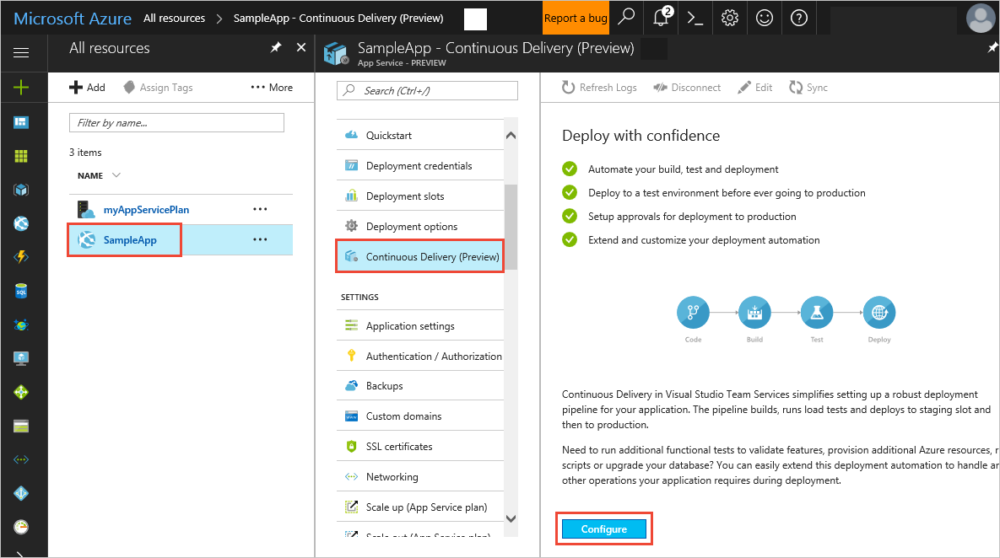
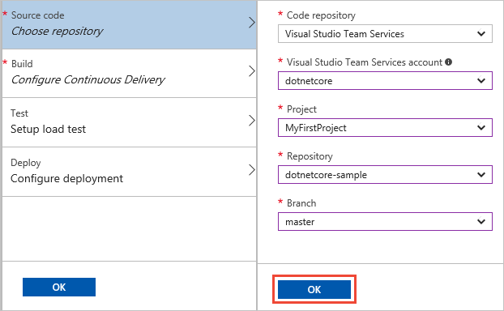
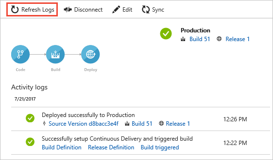

# Deploy your ASP.NET Core app to an Azure web app

Visual Studio Team Services (VSTS) provides a highly customizable continuous integration (CI) and continuous deployment (CD) pipeline to automatically deploy your ASP.NET Core web app to Azure App Services.
In this quickstart you will use the Azure portal to configure a basic CI/CD pipeline, and then see it build and deploy your app.

With your CI/CD processes in place, you'll push a change into your team's Git repo and the results will automatically show up on your site.

[!INCLUDE [prerequisites](_shared/prerequisites.md)]
* An Azure subscription. If you don't have an Azure subscription, you can [create one for free](https://azure.microsoft.com/free/?WT.mc_id=A261C142F).

[!INCLUDE [import-code-aspnet-core](_shared/import-code-aspnet-core.md)]

[!INCLUDE [create-azure-web-app-portal](_shared/create-azure-web-app-portal.md)]

## Configure continuous delivery

1. In the Azure portal, open your web app's blade. Choose **Continuous Delivery** and then choose **Configure**.

   

1. Select **Choose repository** and select **Visual Studio Team Services** for the code repository. Select the project, repository, and branch into which your imported the sample code. When you're done, choose **OK**.

   

1. Select **Configure Continuous Delivery** and choose **ASP.NET Core**. When you're done, choose **OK**.

   

1. Skip the other two steps - **Test** and **Deploy** - and choose **OK** to complete the configuration of continuous delivery. You'll see how to use the test and deployment options in other tutorials.

   

1. When you choose **OK**, Azure Continuous Delivery configures and kicks off a build and deployment in VSTS.
   When the build completes, the deployment is automatically initiated.
   After a while, the deployment is completed. Choose **Refresh Logs** to see this in the **Activity Log**.

   

1. Open a new browser window and navigate to your new web at **http://**_your-app-name_**.azurewebsites.net**.

[!INCLUDE [change-aspnet-core-code](_shared/change-aspnet-core-code.md)]

It takes several minutes for the build and deployment to execute.
Wait until the deployment is done, then verify that your changes are live in your web browser: **http://**_your-app-name_**.azurewebsites.net**.

You're now ready to collaborate with a team on an ASP.NET Core app with a CI/CD process that automatically deploys your latest work to your web site.

## Next steps

When you configured your CI/CD process in this quickstart, a build and release definition were automatically created in your VSTS project. You can modify these build and release definitions to meet the needs of your team. To learn more see one of these tutorials:

* [Customize CD process](../tutorials/customize-cd-process.md)

* [Manage infrastructure as code](../tutorials/infra-as-code.md)

[//]: # (TODO MAYBE [!INCLUDE [include](_shared/quickstart-next-steps.md)
