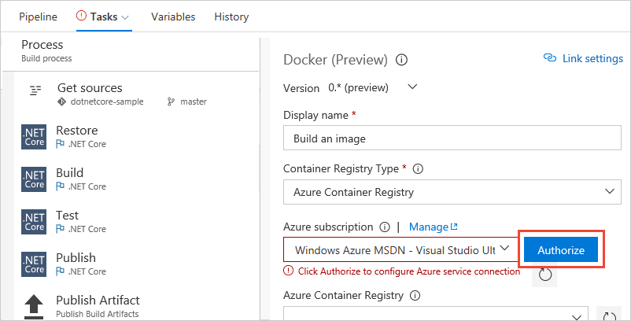

# Build your ASP.NET Core Container app

**VSTS**

In this quickstart you learn how to define CI process for your Docker-enabled ASP.NET Core application using VSTS. The CI process will publish a new container image to Azure Container Registry every time a change is pushed to the application code.

## Prerequisites

[!INCLUDE [include](../../_shared/ci-cd-prerequisites-vsts.md)]

* An Azure subscription. If you don't have one, you can [create one for free](https://azure.microsoft.com/free/?WT.mc_id=A261C142F).

[!INCLUDE [create-azure-container-registry](../_shared/create-azure-container-registry.md)]

## Get the sample app code

[!INCLUDE [include](../_shared/get-sample-code-intro.md)]

```URL
https://github.com/adventworks/dotnetcore-docker-sample
```

# [VSTS or TFS repo](#tab/vsts)

[!INCLUDE [include](../_shared/get-sample-code-vsts-tfs-2017-update-2.md)]

# [GitHub repo](#tab/github)

[!INCLUDE [include](../_shared/get-sample-code-github.md)]

---

The sample app in this repository is a simple ASP.NET Core application with a Dockerfile that defines a [multi-stage build](https://docs.docker.com/engine/userguide/eng-image/multistage-build/). The first stage defines how to build the application and the second stage packages the application as a container image that can be published to a container registry. ASP.NET Core 2.0 is used for this application, although these instructions work for ASP.NET Core 1.1 as well.

## Set up continuous integration

[!INCLUDE [include](../../_shared/ci-quickstart-intro.md)]

[//]: # (TODO: Restore use of includes when we get support for using them in a list.)

1. Create a new build definition.

 # [VSTS or TFS repo](#tab/vsts)

 Navigate to the **Files** tab of the **Code** hub, and then click **Set up build**.

 

 You are taken to the **Build & Release** hub and asked to **Select a template** for the new build definition.

 # [GitHub repo](#tab/github)

 Navigate to the **Builds** tab of the **Build and Release** hub in VSTS or TFS, and then click **+ New**. You are asked to **Select a template** for the new build definition.

 ---

1. In the right panel, click **Start with an Empty Process**.

1. For the **Default agent queue**, select _Hosted Linux_. This is how you can use our pool of agents that have the software you need to build your app.

1. Click **Get sources** and then:

  # [VSTS or TFS repo](#tab/vsts)

  Observe that the new build definition is automatically linked to your repository.

  # [GitHub repo](#tab/github)

  Select your version control repository. You'll need to authorize access to your repo.

  > [!TIP]
  > To learn more about GitHub CI builds, see [Define CI build process for your Git repo](../../actions/ci-build-git.md).

  ---

1. Select **+ Add Task** to add another task to the build definition. From the displayed task catalog, select **Docker** task. Change the parameters for this task as follows:

   * **Azure subscription:** Select a connection from the list under **Available Azure Service Connections** or create a more restricted permissions connection to your Azure subscription. If you are using VSTS and if you see an **Authorize** button next to the input, click on it to authorize VSTS to connect to your Azure subscription. If you are using TFS or if you do not see
     the desired Azure subscription in the list of subscriptions, see [Azure Resource Manager service endpoint](../../concepts/library/service-endpoints.md#sep-azure-rm) to manually set up the connection.

     

   * **Azure Container Registry:** Select the Azure container registry that you created above.

   * **Action:** Build an image.

1. Select **+ Add Task** to add another **Docker** task to the build definition.
   Make sure that the task is inserted _after_ the previous **Docker** task. Change the parameters for this task as follows:

   * **Azure subscription:** Same as in previous task.

   * **Azure Container Registry:** Same as in previous task.

   * **Action:** Push an image.

1. Click the **Triggers** tab in the build definition. Enable the **Continuous Integration** trigger. This will ensure that the build process is automatically triggered every time you commit a change to your repository.

1. Click **Save and queue** to kick off your first build. On the **Queue build** dialog box, click **Queue**.

1. A new build is started. You'll see a link to the new build on the top of the page. Click the link to watch the new build as it happens.

## View the build summary

[!INCLUDE [include](../_shared/view-build-summary.md)]

## Next step

> [!div class="nextstepaction"]
> [Deploy to Azure Web App for Containers](../cd/deploy-docker-webapp.md)
