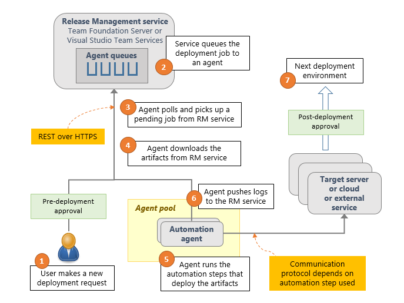

# What is Release Management?

**VSTS | TFS 2017 | TFS 2015**

**Release Management** is a service in Visual Studio Team Services (VSTS)
and Team Foundation Server (TFS, Update 2 and later) and an essential
element of DevOps that helps your team **continuously deliver** software
to your customers at a faster pace and with lower risk.
You can **fully automate** the testing and delivery of your software
in multiple environments all the way to production, or set up
semi-automated processes with **approvals** and **on-demand deployments**.

1. **[Watch this video](https://www.youtube.com/embed/zSPuRXTeZW8)** - see Release Management in action.

   <iframe width="640" height="360" src="https://www.youtube.com/embed/zSPuRXTeZW8" frameborder="0" allowfullscreen="true"></iframe>

1. **[Decide if it suits your scenarios](#isitforyou)** - use the simple checklist.

1. **[See how it works](#howrmworks)** - get a basic understanding of the process.

1. **[Get started now](#getstartednow)** - follow the steps to deploy your apps.

## Is Release Management for you?

Consider using Release Management if:

* **You develop applications and need to deploy them regularly to any platform,**
  public or private cloud services, or App stores. Release Management
  has many out-of-the-box tasks to deploy a variety of applications. If
  you cannot find an out-of-the-box task to deploy your application
  using Release Management, consider this: if you can script the
  deployment of your application using Shell scripts or PowerShell scripts,
  utilities such as Ant or Maven, batch files or EXE utilities, then
  you can deploy it using Release Management. Release
  Management also integrates with third party deployment systems
  such as Chef and Docker.

* **You use a continuous integration (CI) system**
  and are looking for a fully-fledged continuous delivery or release
  management system. Whether you use Team Build from VSTS or TFS, or
  Jenkins as your CI system, you can set up Release Management to
  automatically deploy new builds to multiple environments. Even if
  we do not yet support integration with your favorite CI system or artifact
  repository, you can still write custom tasks to download and
  deploy artifacts from it.

* **You need to track the progress of releases.**
  If you use several environments for your tests, Release Management
  helps you monitor whether a release has been deployed and tested on each
  of these environments. Release Management also tracks whether an issue fixed
  by a developer, or a product backlog item completed by your team, has
  been deployed to a specific environment.

* **You need control of the deployments.**
  Release Management lets you specify which users can change the
  configuration of an environment, or approve the release to be
  deployed into a particular environment. If there is a problem with
  your deployment, Release Management helps you roll back to a previous
  deployment, and provide all the logs in one place to help you debug the
  problem.

* **You need audit history for all releases and their deployments.**
  Release Management provides a history of all changes to the definitions,
  configurations, and deployments. It also provides a history of all the
  activity performed during each deployment. Each release is accompanied
  by a listing of new features and developer commits that went into that
  release.

## How does Release Management work?

The Release Management service stores the data about your release definitions,
environments, tasks, releases, and deployments in VSTS or TFS.

Release Management runs the following steps as part of every deployment:

1. **Pre-deployment approval:** When a new deployment request is triggered,
   Release Management checks whether a pre-deployment approval is required
   before deploying a release to an environment. If it is required, it sends
   out email notifications to the appropriate approvers.

1. **Queue deployment job:** Release Management schedules the deployment job on
   an available [automation agent](../../../concepts/agents/agents.md). An agent is a piece
   of software that is capable of running tasks in the deployment.

1. **Agent selection**: An automation agent picks up the job.
   The agents for Release Management are exactly the same as those that run your
   Builds in VSTS and TFS. A release definition can
   contain settings to select an appropriate agent at runtime.

1. **Download artifacts**: The agent downloads all the artifacts specified
   in that release (provided you have not opted to skip the download). The
   agent currently understands two types of artifacts: Team Build artifacts
   and Jenkins artifacts.

1. **Run the deployment tasks**: The agent then runs all the tasks in the
   deployment job to deploy the app to the target servers for an environment.

1. **Generate progress logs**: The agent creates detailed logs for each
   step while running the deployment, and pushes these logs back to VSTS
   or TFS.

1. **Post-deployment approval:** When deployment to an environment is complete,
   Release Management checks if there is a post-deployment approval required
   for that environment. If no approval is required, or upon completion of
   a required approval, Release Management proceeds to trigger deployment to
   the next environment.

## Get started now!

Simply follow these steps:

1. **[Create a release definition](../../../actions/work-with-release-definitions.md)** that defines the deployment processes and targets.  

1. **[Create and deploy releases](../../../actions/create-deploy-releases.md)** based on your release definition.

1. **[View and manage your releases](../../../actions/view-manage-releases.md)** using the comprehensive UI and tools.

1. **[Monitor and debug your releases](../../../actions/debug-deployment-issues.md)** during and after the deployments. 

## Related topics

* [Download Team Foundation Server](https://www.visualstudio.com/products/tfs-overview-vs)
* [Install and configure Team Foundation Server](../../../../tfs-server/install/get-started.md)
* [Sign up for Visual Studio Team Services](https://www.visualstudio.com/products/visual-studio-team-services-vs)

[!INCLUDE [rm-help-support-shared](../../../_shared/rm-help-support-shared.md)]

