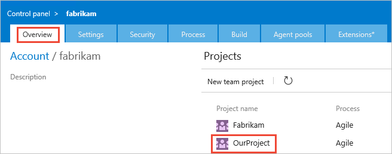
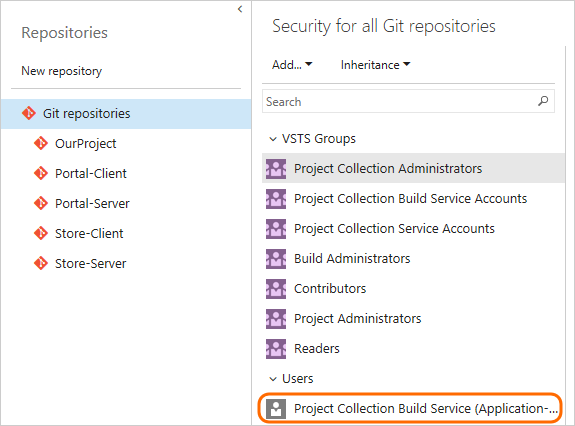

# Run Git commands in a script

[!INCLUDE [temp](../_shared/version.md)]

For some workflows you need your build process to run Git commands. For example, after a CI build on a feature branch is done, the team might want to merge the branch to master.  

Git.exe is available on [hosted agents](../concepts/agents/hosted.md) and on [on-premises agents](../concepts/agents/agents.md).


<a name="enable"></a>
## Enable scripts to run Git commands

### Grant version control permissions to the build service

Go to the <a data-toggle="collapse" href="#expando-version-control-permissions">Version Control control panel tab &#x25BC;</a>

<div class="collapse" id="expando-version-control-permissions">

<ul>
<li>VSTS: <code>https:&#x2F;&#x2F;{your-account}.visualstudio.com/DefaultCollection/{your-team-project}/_admin/_versioncontrol</code></li>

<li>On-premises: <code>https:&#x2F;&#x2F;{your-server}:8080/tfs/DefaultCollection/{your-team-project}/_admin/_versioncontrol</code></li>
</ul>

<p></p>

<p>If you see this page, select the repo, and then click the link:</p>

<p></p>

<p></p>

</div>

On the **Version Control** tab, select the repository in which you want to run Git commands, and then select **Project Collection Build Service**.



Grant permissions needed for the Git commands you want to run. Typically you'll want to grant:

* **Branch creation:**  Allow
* **Contribute:**  Allow
* **Read:**  Inherited allow
* **Tag creation:**  Inherited allow

When you're done granting the permissions, make sure to click **Save changes**.


### Enable your build definition to run Git.exe

On the [variables tab](../concepts/definitions/build/variables.md) set this variable:

| Name | Value |
|---|---|
| ```system.prefergit``` | ```true``` |

On the [options tab](../concepts/definitions/build/options.md) select **Allow scripts to access OAuth token**.

## Make sure to clean up the local repo

Certain kinds of changes to the local repository are not automatically cleaned up by the build process. So make sure to:

* Delete local branches you create.
* Undo git config changes.

If you run into problems using an on-premises agent, to make sure the repo is clean:

* On the [repository tab](../concepts/definitions/build/repository.md) set **Clean** to true.

* On the [variables tab](../concepts/definitions/build/variables.md) create or modify the ```Build.Clean``` variable and set it to ```source```

## Examples


### List the files in your repo

Make sure to follow the above steps to [enable Git.exe](#enable).

On the [build tab](../steps/index.md) add this step:

| Task | Arguments |
| ---- | --------- |
| <br/>[Utility: Command Line](../steps/utility/command-line.md)<br />List the files in the Git repo. | **Tool**: `git`<br /><br />**Arguments**: `ls-files` |

### Merge a feature branch to master

You want a CI build to merge to master if the build succeeds.

Make sure to follow the above steps to [enable Git.exe](#enable).

On the [Triggers tab](../concepts/definitions/build/triggers.md) select **Continuous integration (CI)** and include the branches you want to build.

Create ```merge.bat``` at the root of your repo:

```bat
@echo off
ECHO SOURCE BRANCH IS %BUILD_SOURCEBRANCH%
IF %BUILD_SOURCEBRANCH% == refs/heads/master (
   ECHO Building master branch so no merge is needed.
   EXIT
)
SET sourceBranch=origin/%BUILD_SOURCEBRANCH:refs/heads/=%
ECHO GIT CHECKOUT MASTER
git checkout master
ECHO GIT STATUS
git status
ECHO GIT MERGE
git merge %sourceBranch% -m "Merge to master"
ECHO GIT STATUS
git status
ECHO GIT PUSH
git push origin
ECHO GIT STATUS
git status
```

On the [build tab](../steps/index.md) add this as the last step:

| Task | Arguments |
| ---- | --------- |
| <br/>[Utility: Batch Script](../steps/utility/batch-script.md)<br />Run merge.bat. | **Path**: `merge.bat` |

## Q&A

<!-- BEGINSECTION class="md-qanda" -->


### Can I run Git commands if my remote repo is in GitHub or an external Git service such as Bitbucket?

Yes


### Which steps can I use to run Git commands?

[Batch Script](../steps/utility/batch-script.md)

[Command Line](../steps/utility/command-line.md)

[PowerShell](../steps/utility/powershell.md)

[Shell Script](../steps/utility/shell-script.md)


### How do I avoid triggering a CI build when the script pushes?

Add ```***NO_CI***``` to your commit message. For example, ```git merge origin/features/hello-world -m "Merge to master ***NO_CI***"```


### How does enabling scripts to run Git commands affect how the build process gets build sources?

When you set ```system.prefergit``` to ```true```, the build process uses Git.exe instead of LibGit2Sharp to clone or fetch the source files.

[!INCLUDE [temp](../_shared/qa-agents.md)]

[!INCLUDE [temp](../_shared/qa-versions.md)]

<!-- ENDSECTION -->
