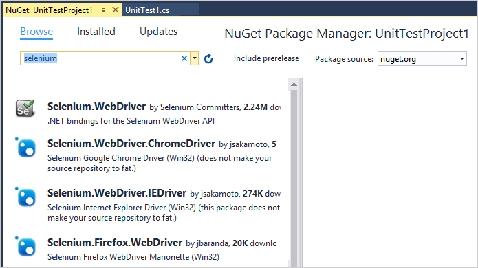
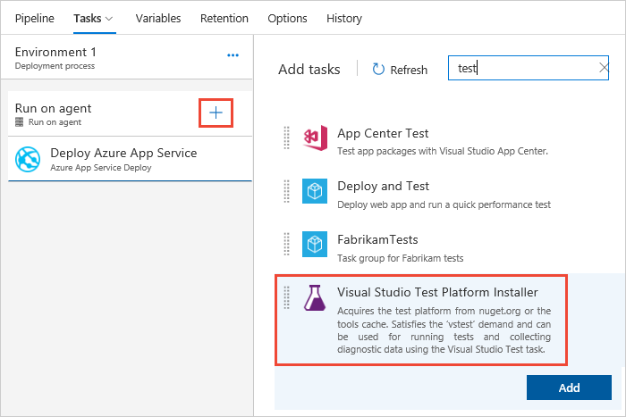
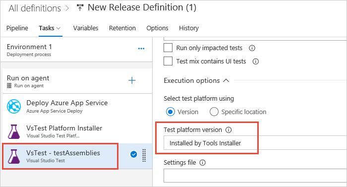

# Get started with Selenium testing in a CI pipeline

[!INCLUDE [version-header-vs-vsts-tfs](_shared/version-header-vs-vsts-tfs.md)]

Performing user interface testing as part of the
build process is a great way of detecting
unexpected changes and need not be difficult. This
topic describes using Selenium to test your website
in a continuous integration build.

For more information about Selenium browser automation, see:

* [Selenium HQ](http://docs.seleniumhq.org/)
* [Selenium documentation](http://www.seleniumhq.org/docs/01_introducing_selenium.jsp)

<a name="create-project"></a>
## Create the test project

As there is no template for Selenium testing, the
easiest way to get started is to use the Unit Test
template. This automatically adds the test framework
references and enables you run and view the results
from Visual Studio Test Explorer.

1. In Visual Studio, open the **File** menu and choose **New Project**,
   then choose **Test** and select **Unit Test Project**. Alternatively,
   open the shortcut menu for the solution and choose
   **Add** then **New Project** and then
   **Unit Test Project**. 

   For more details, see: [Get started with unit testing](https://docs.microsoft.com/visualstudio/test/getting-started-with-unit-testing).

1. After the project is created, you must add the Selenium and
   browser driver references used by the browser to
   execute the tests. Open the shortcut menu for the
   Unit Test project and choose **Manage NuGet
   Packages**. Add the following packages to your project:

   * Selenium.WebDriver
   * Selenium.WebDriver.ChromeDriver
   * Selenium.WebDriver.IEDriver
   * Selenium.Firefox.WebDriver
   * Selenium.WebDriver.PhantomJS.Xplatform<p />

   

1. The Unit Test project creates a default class
   named **UnitTest1.cs**. To author a Selenium Test,
   replace the contents of the file with the following
   code.

   ```csharp
   namespace Partsunlimited.UITests
   {
     using Microsoft.VisualStudio.TestTools.UnitTesting;
     using OpenQA.Selenium;
     using OpenQA.Selenium.Chrome;
     using OpenQA.Selenium.Firefox;
     using OpenQA.Selenium.IE;
     using OpenQA.Selenium.Remote;
     using OpenQA.Selenium.PhantomJS;
     using System;

     [TestClass]
     public class ChucksClass1
     {
       private string baseURL = "http://your-website.azurewebsites.net/";
       private RemoteWebDriver driver;
       private string browser;
       public TestContext TestContext { get; set; }

       [TestMethod]
       [TestCategory("Selenium")]
       [Priority(1)]
       [Owner("FireFox")]

       public void TireSearch_Any()
       {
         driver = new FirefoxDriver();
         driver.Manage().Window.Maximize();
         driver.Manage().Timeouts().ImplicitlyWait(TimeSpan.FromSeconds(30));
         driver.Navigate().GoToUrl(this.baseURL);
         driver.FindElementById("search - box").Clear();
         driver.FindElementById("search - box").SendKeys("tire");
         //do other Selenium things here!
       }

       [TestCleanup()]
       public void MyTestCleanup()
       {
         driver.Quit();
       }

       [TestInitialize()]
       public void MyTestInitialize()
       {
       }
     }
   }
   ```
   
   

1. Run the Selenium test locally using Test Explorer.

   

<a name="include-test"></a>
## Include the test in a CI build

To include the Selenium test as part of a build,
the source code must be in version control.


1. In your Visual Studio Team Services (VSTS) account where
   you checked in the test code, open the **Build &amp; Release** hub and select the **Builds** tab.

1. Create a new build definition using the **.NET Desktop**
   build template.

1. In the new build definition, select the **Default** agent queue in which you have installed an agent.
   If you have not installed an agent in the **Default** queue, choose the
   **manage queues** link and do that now. For information, see
   [Deploy a Windows build agent](../actions/agents/v2-windows.md).
   You might decide to [create an Azure VM](https://docs.microsoft.com/azure/virtual-machines/windows/quick-create-portal)
   to install your agent, or use a [deployment group](../concepts/definitions/release/deployment-groups/index.md)
   and [install an agent there](../concepts/definitions/release/deployment-groups/howto-provision-deployment-group-agents.md). 

   >Selenium tests will generally be run interactively, 
   which would fail on the **Hosted** build controller.

1. In the **Get sources** step, ensure that the repository and branch where you checked in your 
     code is selected.

1. Select the **Triggers** tab and turn on the **Continuous integration...** trigger so that
     your solution builds after each check-in using continuous integration.
  
1. Delete the **Test Assemblies** (Visual Studio Test) task step from the build definition, then
   add a **Visual Studio Test Agent Deployment**, **Windows Machine File Copy**, and **Run Functional Tests**
   task from the **Test** and **Deploy** tabs of the task catalog. Drag and drop then in
   that order immediately after the **Publish symbols path** task step.

   

1. Configure the tasks as shown here:

    [Package: Nuget Installer](../tasks/package/nuget-installer.md) - Install and update NuGet package dependencies.
   
   - **Path to solution or packages.config**: Select your app solution (.sln) file.
   
   - **Installation type**: `Restore`<p />
   
    [Build: Visual Studio Build](../tasks/build/visual-studio-build.md) - Build with MSBuild and set the Visual Studio version property.
   
   - **Solution**:  Select your app solution (.sln) file.
   
   - **Platform**: `$(BuildPlatform)`
   
   - **Configuration**: `$(BuildConfiguration)`
   
   - **Visual Studio Version**: Select the version used to create your app.<p />
   
    [Test: Index Sources &amp; Publish Symbols](../tasks/build/index-sources-publish-symbols.md) - Index the source code and optionally publish symbols to a SymStore file share.
   
   - **Search pattern**: `**\bin\**\*.pdb`<p />
   
    [Test: Visual Studio Test Agent Deployment](../tasks/test/visual-studio-test-agent-deployment.md) - Deploy and configure the test agent to run tests on a set of machines.
   
   - **Machines**: Comma-delimited list of machine names, or a variable containing the list.
   
   - **Admin Login**: Username for target server or a variable containing it.
   
   - **Admin Password**: Password for target server or a variable containing it.
   
   - **Protocol**: `HTTP`
   
   - **Select Machines By**: `Machine Names`
   
   - **Agent Configuration - Username**: Agent username or a variable containing it.
   
   - **Agent Configuration - Password**: Agent password or a variable containing it.
   
   - **Agent Configuration - Interactive Process**: Checked<p />
   
    [Deploy: Windows Machine File Copy](../tasks/deploy/windows-machine-file-copy.md) - Copy files to remote machines.
   
   - **Source**: `$(Build.Repository.LocalPath)`
   
   - **Machines**: Comma-delimited list of machine names, or a variable containing the list.
   
   - **Admin Login**: Username for target server or a variable containing it.
   
   - **Password**: Password for target server or a variable containing it.
   
   - **Destination Folder**: `C:\Deploy` or another folder on the target server.<p />
   
    [Test: Run Functional Tests](../tasks/test/run-functional-tests.md) - Run Coded UI tests, Selenium tests, and functional tests on a set of machines using the test agent.
   
   - **Machines**: Comma-delimited list of machine names, or a variable containing the list.
   
   - **Test Drop Location**: `C:\Deploy` or the folder where you copied the files if different.
   
   - **Execution Options - Test Selection**: `Test Assembly`
   
   - **Execution Options - Test Assembly**: `**\*Test*.dll`<p />
   
    [Test: Copy Files](../tasks/utility/copy-files.md) - Copy files from a source folder to a target folder using match patterns.
   
   - **Source Folder**: `$(build.sourcesdirectory)`
   
   - **Contents**: `**\bin\$(BuildConfiguration)\**`
   
   - **Target Folder**: `$(build.artifactstagingdirectory)`<p />
   
    [Test: Publish Build Artifacts](../tasks/utility/publish-build-artifacts.md) - Publish Build artifacts to the server or a file share.
   
   - **Path to Publish**: Select your Azure subscription.
   
   - **Artifact Name**: `drop`
   
   - **Artifact Type**: `Server`<p />

   >It's generally advisable to use custom variables for parameter values, especially
   where the same value is used in the parameters of more than one task. You can also 
   secure and hide values by using custom variables. See [Build Variables](../concepts/definitions/build/variables.md). 

1. Save the build definition and queue a new build.

<a name="view-results"></a>
## View the test results

1. To view the test results from a build, open
   the build summary from the **Builds** tab.

   

   The build summary includes a snapshot of the test
   results. There is also a **Tests** results page that
   highlights the build-on-build changes, including
   errors, stack traces, and the ability to easily
   create a bug that contains this information.

   

## Next steps

> [!div class="nextstepaction"]
> [Review your test results](review-continuous-test-results-after-build.md) 
