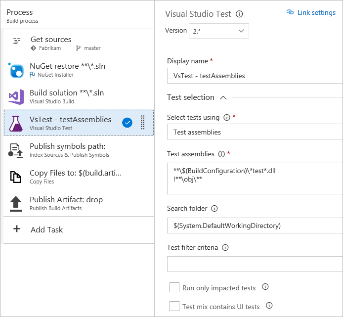
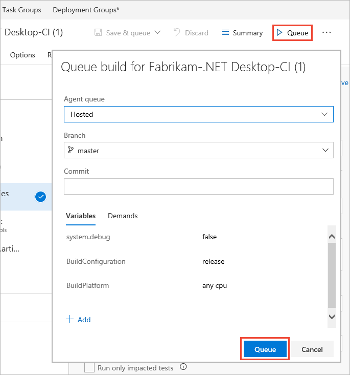

# Run tests with your builds

[!INCLUDE [version-header-vs-vsts-tfs](_shared/version-header-vs-vsts-tfs.md)]

Make sure that your app still works after every 
check-in and build using Visual Studio Team Services (VSTS) or Team Foundation Server (TFS). 
Find problems earlier by running tests 
automatically with each build. When your build is 
done, review your test results to start resolving 
the problems that you find.

## Before you start

This overview shows how to run unit tests with your build
for .NET and ASP.NET apps. It uses the [Visual Studio Test](https://github.com/Microsoft/vsts-tasks/blob/releases/m109/Tasks/VsTest/README.md) task. 

1. [Check in your solution](../../tfvc/overview.md) 
   to VSTS. Include your test projects.

1. [Create a build definition](../overview.md) 
   that builds your solution after each check-in, 
   using continuous integration.

When you're ready to 
[run other continuous tests](#runothertests), such as 
system tests, under more realistic conditions, 
create environments from physical or virtual 
machines that you've already set up. Then set up 
your build to run your app and tests in the 
environments that you created.

## Create a build definition

Your build definition must include a test task that runs unit tests. 
For example, if you're building a Visual Studio solution in VSTS,
your build definition should include a **Visual Studio Test** task. After your 
build starts, this task automatically runs all the unit tests in your 
solution - on the same build machine. 

1. If your build definition does not contain a test task, add one to it.

   

1. Edit the Visual Studio Test task. You can add filter criteria to run specific tests, enable code coverage, 
   run tests from [other unit test frameworks](reference-qa.md), and so on.
   For information about the option settings of the Visual Studio Test task, see
   [Run Tests using Visual Studio task](https://github.com/Microsoft/vsts-tasks/blob/master/Tasks/VsTest/README.md).

   

   > The Visual Studio Test task version 2 supports Test Impact Analysis (TIA). See [these blog posts](https://blogs.msdn.microsoft.com/devops/?s=test+impact).

1. When you're done, save your build definition.

   

## Start the build

1. Start the build by adding it to the build queue.

    

1. After the build finishes, you can review the test results to resolve any problems that happened. Go to the build to open the build summary.

   

## Review the results

1. Open the test run results summary and compare your test results
   between this build and the last build. Here you'll find changes in new, failed, and passed tests, 
   how long these tests took to run, how long these tests have been failing, and more.
   Organize your test results and open bugs directly for failed tests.

   

1. To start debugging a failed test, open the test and review the resulting error and stack trace.

   
 

## Next step

> [!div class="nextstepaction"]
> [Review your test results](review-continuous-test-results-after-build.md) 
