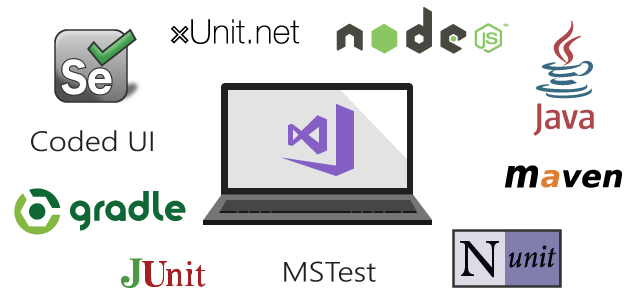
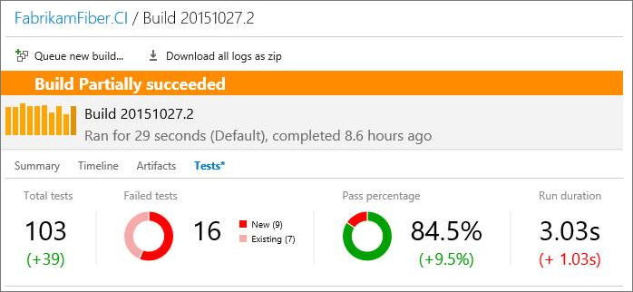

# Continuous testing scenarios and capabilities

**VSTS | TFS 2017 | TFS 2015 | [Previous version](https://msdn.microsoft.com/library/ee702477%28v=vs.120%29.aspx)**

Whether your app is on-premises or in the cloud, 
you can automate build-deploy-test workflows and 
choose the technologies and frameworks, then test 
your changes continuously in a fast, scalable, and 
efficient manner. 

## Maintain quality and find problems as you develop

Continuous testing with Visual Studio Team Services (VSTS)
or Team Foundation Server (TFS) ensures your app still 
works after every check-in and build, enabling you 
to find problems earlier by running tests 
automatically with each build.

<iframe width="640" height="360" src="//channel9.msdn.com/Series/Test-Tools-in-Visual-Studio/Unit-Testing-from-a-CI-Build-with-Visual-Studio-Team-Services/player" frameborder="0" allowfullscreen="true"></iframe>

* [Get started with continuous testing](getting-started-with-continuous-testing.md)
* [Testing in Continuous Integration and Continuous Deployment Workflows](https://blogs.msdn.microsoft.com/visualstudioalm/2015/05/29/testing-in-continuous-integration-and-continuous-deployment-workflows/)
* [Learn more about test task steps](../tasks/index.md#test)
* [An end-to-end example of continuous testing](example-continuous-testing.md)
* [Run automated tests from test plans in the Test hub](run-automated-tests-from-test-hub.md)

## Any test type and any test framework

Choose the test technologies and frameworks you
prefer to use.
 
<iframe width="640" height="360" src="//channel9.msdn.com/Series/Test-Tools-in-Visual-Studio/Testing-Java-Applications-with-Visual-Studio-Team-Services/player" frameborder="0" allowfullscreen="true"></iframe>

* [Get started with Java testing](continuous-test-java.md).
* [Get started with Selenium testing](continuous-test-selenium.md).
* [Use Maven to build your Java app](../tasks/build/maven.md)
* [Unit testing framework plug-ins for Visual Studio](http://go.microsoft.com/fwlink/?LinkID=246630) 

## Rich analytics and reporting

When your build is done, review your test results 
to start resolving the problems you find.
Rich and actionable build-on-build reports 
let you instantly see if your builds are getting 
healthier. But it's not just about speed - detailed and 
customizable test results measure the quality of 
your app.

* [Review continuous test results after a build](review-continuous-test-results-after-build.md).
* [Get started with continuous testing](getting-started-with-continuous-testing.md)

## Advanced DevOps practices

If you are already using advanced continuous 
testing practices in DevOps workflows, or just 
using continuous testing and looking for advanced 
content, check out 
[Test automation, planning, and management concepts](https://vsartestreleaseguide.codeplex.com/)
from the DevOps Rangers.

> See also [Manual and exploratory testing](../../manual-test/index.md), [Load and performance testing](../../load-test/index.md), [Unit testing](https://docs.microsoft.com/visualstudio/test/developer-testing-scenarios).

[!INCLUDE [help-and-support-footer](_shared/help-and-support-footer.md)] 
