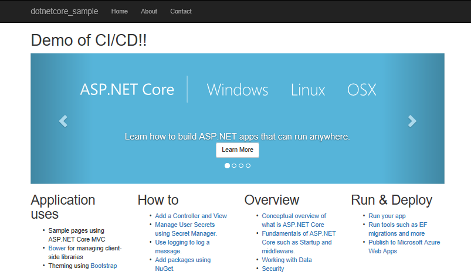

# Implement CI/CD to build and deploy your ASP.NET Core app to an Azure Windows VM

Visual Studio Team Services (VSTS) provides a highly customizable continuous integration (CI) and continuous deployment (CD) pipeline for your ASP.NET Core apps. This quickstart shows how to set up CI and CD to deploy an ASP.NET Core application to a Windows virtual machine (VM) in Azure. You'll create a VM using Azure Powershell, and then you'll set up CI/CD in VSTS. In the CI process, you'll build the app using MSBuild and run tests using VSTest.

_TODO: work with artist to adapt diagram to this scenario_


With your CI/CD processes in place, you'll push a change into your team's git repo and the results will automatically show up on your site.



[!INCLUDE [include](_shared/prerequisites.md)]

## Create the VM

_TODO harvest intro info from https://docs.microsoft.com/en-us/azure/virtual-machines/scripts/virtual-machines-windows-powershell-sample-create-vm_


```ps
# Variables for common values
$resourceGroup = "MyWindowsVMResourceGroup"
$location = "East US"
$vmName = "WindowsVMForSampleApp"

# Create user object
$cred = Get-Credential -Message "Enter a username and password for the virtual machine."

# Create a resource group
New-AzureRmResourceGroup -Name $resourceGroup -Location $location

# Create a subnet configuration
$subnetConfig = New-AzureRmVirtualNetworkSubnetConfig -Name mySubnet -AddressPrefix 192.168.1.0/24

# Create a virtual network
$vnet = New-AzureRmVirtualNetwork -ResourceGroupName $resourceGroup -Location $location `
  -Name MYvNET -AddressPrefix 192.168.0.0/16 -Subnet $subnetConfig

# Create a public IP address and specify a DNS name
$pip = New-AzureRmPublicIpAddress -ResourceGroupName $resourceGroup -Location $location `
  -Name "mypublicdns$(Get-Random)" -AllocationMethod Static -IdleTimeoutInMinutes 4

# Create an inbound network security group rule for port 3389
$nsgRuleRDP = New-AzureRmNetworkSecurityRuleConfig -Name myNetworkSecurityGroupRuleRDP  -Protocol Tcp `
  -Direction Inbound -Priority 1000 -SourceAddressPrefix * -SourcePortRange * -DestinationAddressPrefix * `
  -DestinationPortRange 3389 -Access Allow

# Create a network security group
$nsg = New-AzureRmNetworkSecurityGroup -ResourceGroupName $resourceGroup -Location $location `
  -Name myNetworkSecurityGroup -SecurityRules $nsgRuleRDP

# Create a virtual network card and associate with public IP address and NSG
$nic = New-AzureRmNetworkInterface -Name myNic -ResourceGroupName $resourceGroup -Location $location `
  -SubnetId $vnet.Subnets[0].Id -PublicIpAddressId $pip.Id -NetworkSecurityGroupId $nsg.Id

# Create a virtual machine configuration
$vmConfig = New-AzureRmVMConfig -VMName $vmName -VMSize Standard_D1 | `
Set-AzureRmVMOperatingSystem -Windows -ComputerName $vmName -Credential $cred | `
Set-AzureRmVMSourceImage -PublisherName MicrosoftWindowsServer -Offer WindowsServer -Skus 2016-Datacenter -Version latest | `
Add-AzureRmVMNetworkInterface -Id $nic.Id

# Create a virtual machine
New-AzureRmVM -ResourceGroupName $resourceGroup -Location $location -VM $vmConfig
```


```ps
Get-AzureRmNetworkSecurityGroup `
  -ResourceGroupName $resourceGroup `
  -Name "myNetworkSecurityGroup" | `
Add-AzureRmNetworkSecurityRuleConfig `
  -Name "myNetworkSecurityGroupRuleWeb" `
  -Protocol "Tcp" `
  -Direction "Inbound" `
  -Priority "1001" `
  -SourceAddressPrefix "*" `
  -SourcePortRange "*" `
  -DestinationAddressPrefix "*" `
  -DestinationPortRange "80" `
  -Access "Allow" | `
Set-AzureRmNetworkSecurityGroup
```

## Install the .NET Core Windows Server Hosting bundle

https://docs.microsoft.com/en-us/aspnet/core/publishing/iis#install-the-net-core-windows-server-hosting-bundle

[!INCLUDE [temp](_shared/import-code-aspnet-core.md)]

## Clean up deployment 

Run the following command to remove the resource group, VM, and all related resources.

```powershell
Remove-AzureRmResourceGroup -Name MyWindowsVMResourceGroup
```