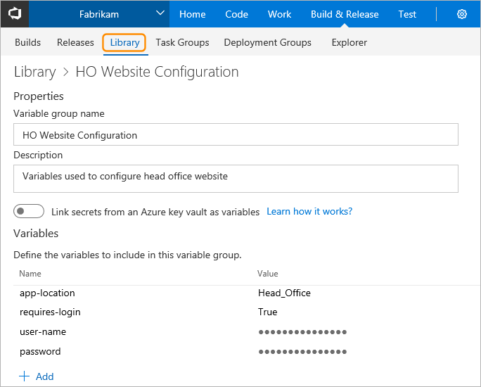
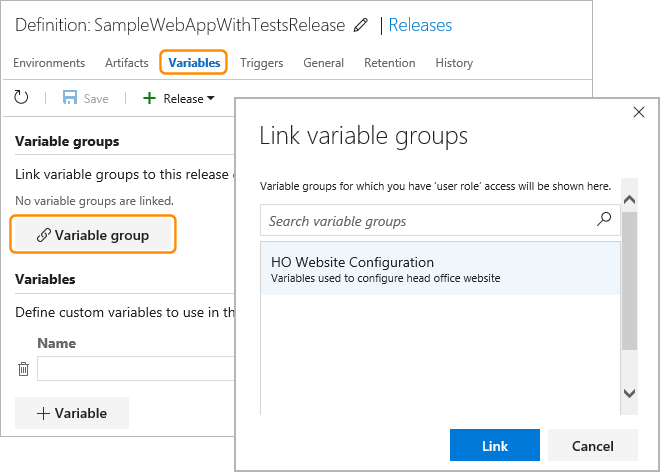
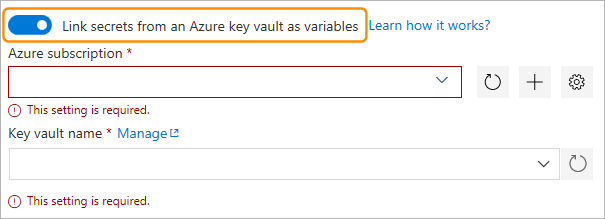

# Variable groups

**TFS 2017 | Team Services**

Use a variable group to store values that you want to make available across
multiple release definitions. Variable groups are defined and managed in the **Library** tab of the
**Build &amp; Release** hub.

> Variable groups can only be used in release definitions in TFS 2017 and Team Services at present. They cannot yet be used in build definitions.

## Use a variable group

To use a variable group in a release definition, open the definition, select the **Variables**
tab, and then choose **Link variable group(s)**. When a variable group is linked to a release definition,
all the variables in the group are available for use in all environments of that definition.

> You cannot link a variable group to a specific environment in a release definition at present.

Any changes made centrally to a variable group, such as a change in the value of a variable or the addition of new variables,
will automatically be made available to all the release definitions in which the variable group is used.

Variable groups follow the [library security model](index.md#security).

## Link secrets from an Azure Key vault as variables

Link an existing Azure key Vault to a variable group and map selective vault secrets to the variable group.

1. Choose **Link secrets from an Azure key vault as variables**, and specify your Azure subscription end point
   and the name of the vault containing your secrets.

   

1. Ensure the Azure endpoint has at least **Get** and **List** permissions
   on the vault. You can set these permissions in the [Azure portal](https://portal.azure.com):

   - Open the **Settings** blade for the vault, choose **Access policies**, then **Add new**.

   - In the **Add access policy** blade, choose **Select principal** and select the service principal for your client account.

   - In the **Add access policy** blade, choose **Secret permissions** and ensure that **Get** and **List** are checked (ticked).

   - Choose **OK** to save the changes.

1. In the **Variable groups** page, choose **+ Add** to select specific secrets from your vault that will be mapped to this variable group. 

**Notes**:

* Only the secret *names* are mapped to the variable group, not the secret values. The latest version of the value of each secret
  is fetched from the vault and used in the release definition linked to the variable group during the release.

* Any changes made to *existing* secrets in the key vault, such as a change in the value of a secret, will be made available
  automatically to all the release definitions in which the variable group is used.

* When *new* secrets are added to the vault, they are **not** made available automatically to all the release definitions. 
  New secrets must be explicitly added to the variable group in order to make them available to release definitions
  in which the variable group is used. 

[!INCLUDE [rm-help-support-shared](../../_shared/rm-help-support-shared.md)]
