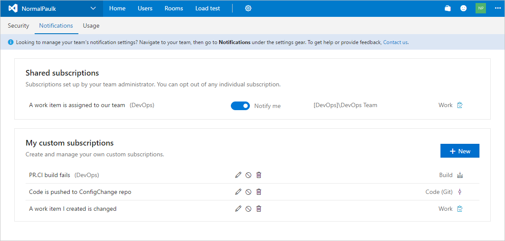

# Manage your notifications

<b>Team Services | TFS 2017.1 | [Previous versions](../work/track/alerts-and-notifications.md)</b> 

>[!NOTE]  
>**Feature availability**: This topic applies to Team Services and to TFS 2017.1 and later versions. If you work from an on-premises TFS 2017 or ealier versions, see [Set alerts, get notified when changes occur](../work/track/alerts-and-notifications.md). For on-premises TFS, [you must configure an SMTP sever](../tfs-server/admin/setup-customize-alerts.md) in order for team members to see the Notifications option from their account menu and to  receive notifications. 
 
Notifications help you and your team stay informed about activity in your Team Services projects. With notifications, you are notified when changes occur to work items, code reviews, pull requests, source control files, and builds, you can be notified via email. For example, you can get notified whenever a bug that you opened is resolved or a work item is assigned to you. 

To manage your notification settings, select the Notifications option under the profile menu:
	

This view shows all subscriptions that you have created or that have been created by an administrator. Subscriptions let you control what you are notified about. A subscription can be just for you, or if you are a team admin, can be shared by everyone in the team. Learn more about [team subscriptions](./manage-team-notifications.md).

From this view, you can create, edit, disable, or delete custom subscriptions that you have created for yourself. You can also see shared team subscriptions.

## Create a subscription

1. From your Notifications, click **New**.
	
3. Select the type of activity you want to be notified about.
	
	

4. Provide a description to help you identify the subscription later. Also choose an email address for notifications to be delivered to. By default, your preferred email address is used.

	

5. Choose whether you want to receive notifications about activity in all projects or only a specific project.

	

6. Optionally configure additional filter criteria.

	

7. Click **Finish** to save the new subscription.

## Opt out of a team subscription

You can choose to not receive notifications for certain team subscriptions by opt'ing out of the subscription.

1. Open your notifications settings from the profile menu.
	
	

2. Find the team subscription in the shared subscriptions section.

	

3. Click the toggle to opt out of receiving notifications for this subscription.

    

>[!NOTE]  
>Whether you are an administrator or not, toggling a shared team subscription from your notification settings only impacts you and not other team members.

## Limitations

* Support for creating new SOAP and plain text email subscriptions is no longer provided in the UI.

## Related topics

- [Follow a specific work item](../collaborate/follow-work-items.md)  
- [Manage notifications for a team](./manage-team-notifications.md)  
- [Account preferences, include setting a preferred email address](../accounts/account-preferences.md)  
