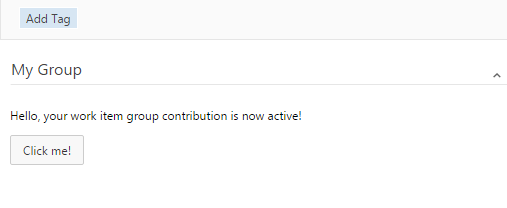
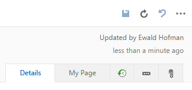
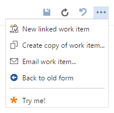

# Extend the work item form

You can now customize how the work item form is presented to users via contributions made through an extension:

* [Add a group to the main page](#addagroup)
* [Add a page (tab)](#addapage) 
* [Add an action to the context menu](#addmenuaction)
* [Add a custom control](./custom-control.md)
* [Listen for events on the form](#listenforevents)
* [Configure contributions in work item form](#showcontributions)

If you are just getting started and haven't created an extension, refer to the [Create your first extension with Visual Studio](../get-started/visual-studio.md). 

See [Work Item Form Service](../reference/client/api/TFS/WorkItemTracking/Services/WorkItemFormService.md) for the complete details about the service apis used in below samples.

See the **UI** example in the [Team Services Extension Samples](https://github.com/Microsoft/vso-extension-samples/tree/master/ui) on GitHub for the full source.

<a name="addagroup"></a>
## Add a group



To add a group to the main page, add a contribution to your extension manifest. The type of this contribution should be `ms.vss-work-web.work-item-form-group` and it should target the `ms.vss-work-web.work-item-form` contribution. 

 ```json
"contributions": [
    {  
        "id": "sample-work-item-form-group",
        "type": "ms.vss-work-web.work-item-form-group",
        "description": "Custom work item form group",
        "targets": [
            "ms.vss-work-web.work-item-form"
        ],
        "properties": {
            "name": "My Group",
            "uri": "workItemGroup.html",
            "height": 600
        }
    }
]
```
### Properties

| Property     | Description           |
|--------------|-----------------------|
| ```name```         | Text that will appear on the group.   |
| ```uri```         | URI to a page that hosts the html that shows on the work item form and its scripts.
| ```height```       | (Optional) Defines the height of the group. When omitted, it is 100%.

###  JavaScript sample

This sample shows how to register an object that is called when various events happen on the work item form that may impact your contributed group.

```js   
    VSS.require(["TFS/WorkItemTracking/Services"], function (_WorkItemServices) {
        // Get the WorkItemFormService.  This service allows you to get/set fields/links on the 'active' work item (the work item
        // that currently is displayed in the UI).
        function getWorkItemFormService()
        {
            return _WorkItemServices.WorkItemFormService.getService();
        }
    
        // Register a listener for the work item group contribution.
        VSS.register(VSS.getContribution().id, function () {
            return {
                // Called when the active work item is modified
                onFieldChanged: function(args) {
                    $(".events").append($("<div/>").text("onFieldChanged - " + JSON.stringify(args)));
                },
                
                // Called when a new work item is being loaded in the UI
                onLoaded: function (args) {
        
                    getWorkItemFormService().then(function(service) {            
                        // Get the current values for a few of the common fields
                        service.getFieldValues(["System.Id", "System.Title", "System.State", "System.CreatedDate"]).then(
                            function (value) {
                                $(".events").append($("<div/>").text("onLoaded - " + JSON.stringify(value)));
                            });
                    });
                },
                
                // Called when the active work item is being unloaded in the UI
                onUnloaded: function (args) {
                    $(".events").empty();
                    $(".events").append($("<div/>").text("onUnloaded - " + JSON.stringify(args)));
                },
                
                // Called after the work item has been saved
                onSaved: function (args) {
                    $(".events").append($("<div/>").text("onSaved - " + JSON.stringify(args)));
                },
                
                // Called when the work item is reset to its unmodified state (undo)
                onReset: function (args) {
                    $(".events").append($("<div/>").text("onReset - " + JSON.stringify(args)));
                },
                
                // Called when the work item has been refreshed from the server
                onRefreshed: function (args) {
                    $(".events").append($("<div/>").text("onRefreshed - " + JSON.stringify(args)));
                }
            }
        });            
    });
```     

[!INCLUDE [Events](../_shared/add-workitem-extension-sharedevents.md)]

<a name="addapage"></a>
## Add a page

A new page is rendered as a tab on the work item form. New pages appear next to the Details tab.



To add a page to the work item form, add a contribution to your extension manifest. The type of this contribution should be `ms.vss-work-web.work-item-form-page` and it should target the `ms.vss-work-web.work-item-form` contribution. 

```json
"contributions": [
    {  
        "id": "sample-work-item-form-page",
        "type": "ms.vss-work-web.work-item-form-page",
        "description": "Custom work item form page",
        "targets": [
            "ms.vss-work-web.work-item-form"
        ],
        "properties": {
            "name": "My Page",
            "uri": "workItemPage.html"
        } 
    }
]
```

### Properties

| Property     | Description           |
|--------------|-----------------------|
| name         | Text that will appear on the tab page.   |
| uri          | URI to a page that hosts the html that shows on the work item form and its scripts. |

###  JavaScript sample

See the JavaScript sample in the form group section. The name of the registered object should match the `id` of the contribution.

[!INCLUDE [Events](../_shared/add-workitem-extension-sharedevents.md)]

<a name="showcontributions"></a>
## Configure contributions in work item form
In VSTS, by default the group extensions will appear in the end of the second column of the form and page contributions will appear after all the work item form pages as a tab. Control contributions are not shown in the form by default so users will have to manually add them to the form. In TFS, to show/hide or move the control, group and page contributions in work item form, see  [Configure work item form extensions in TFS](./configure-workitemform-extensions.md).

<a name="addmenuaction"></a>
## Add menu action



To add an item to the work item toolbar, add this contribution to your extension manifest. The item will appear in the ... dropdown in the top right of the work item form.

 ```json
"contributions": [
    {  
       "id": "sample-work-item-menu",  
       "type": "ms.vss-web.action",  
       "description": "Sample toolbar item which updates the title of a work item",  
       "targets": [  
           "ms.vss-work-web.work-item-context-menu"  
       ],  
       "properties": {  
           "text": "Try me!",  
           "title": "Updates the title of the work item from the extension",  
           "toolbarText": "Try me!",  
           "icon": "images/show-properties.png",  
           "uri": "menu-workItemToolbarButton.html"  
       }  
    }
]
```


### Properties
| Property     | Description           |
|--------------|-----------------------|
| text         | Text that will appear on the toolbar item. |
| title        | Tooltip text that will appear on the menu item. |
| toolbarText  | Text that will appear when the item is being hovered over. |
| uri          | URI to a page that registers the toolbar action handler. |
| icon         | URL to an icon that will appear on the menu item. Relative URLs are resolved using baseUri. |
| group        | Determines where this menu item will appear in relation to the others. Toolbar items with the same group name will be grouped together divided by a separator from the rest of the items.
| registeredObjectId | (Optional) Name of the registered menu action handler. Defaults to the contribution id.

<a name="listenforevents"></a>   
## Listen for events

To add a observer to the work item which listens to the work item events, add this contribution to your extension manifest. There will be no visualization for observers on the work item form.

 ```json
"contributions": [
    {  
        "id": "sample-work-item-form-observer",
        "type": "ms.vss-work-web.work-item-notifications",
        "description": "Gets events about the current work item form for the 'Try Me!' toolbar button",
        "targets": [
            "ms.vss-work-web.work-item-form"
        ],
        "properties": {
            "uri": "myformobserver.html"
        }
    }
]
```

### Properties

| Property     | Description           |
|--------------|-----------------------|
| uri          | URI to a page that hosts the scripts listening to events |

[!INCLUDE [Events](../_shared/add-workitem-extension-sharedevents.md)]

### HTML/JavaScript sample

```html
<!DOCTYPE html>
<html lang="en">

<head>
    <meta charset="UTF-8">
    <title>Work item extension page sample</title>
</head>

<body>
    <script src="sdk/scripts/VSS.SDK.js"></script>

    <script>
        VSS.init({
            usePlatformScripts: true
        });
        
        VSS.ready(function () {
             // Register a listener for the work item page contribution.
            VSS.register(VSS.getContribution().id, function () {
                return {
                    // Called when the active work item is modified
                    onFieldChanged: function(args) {
                        
                    },
                    
                    // Called when a new work item is being loaded in the UI
                    onLoaded: function (args) {
            
                    },
                    
                    // Called when the active work item is being unloaded in the UI
                    onUnloaded: function (args) {
            
                    },
                    
                    // Called after the work item has been saved
                    onSaved: function (args) {
            
                    },
                    
                    // Called when the work item is reset to its unmodified state (undo)
                    onReset: function (args) {
            
                    },
                    
                    // Called when the work item has been refreshed from the server
                    onRefreshed: function (args) {
            
                    }
                }
            });    
        });
     </script>
</body>
</html>    
```
