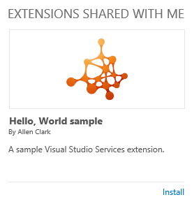
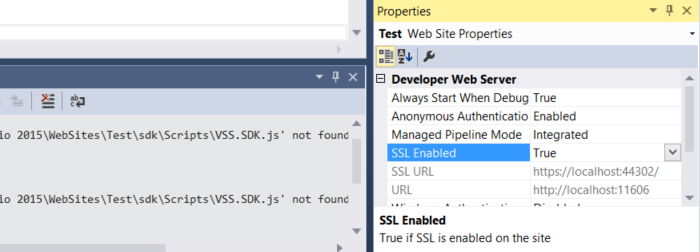
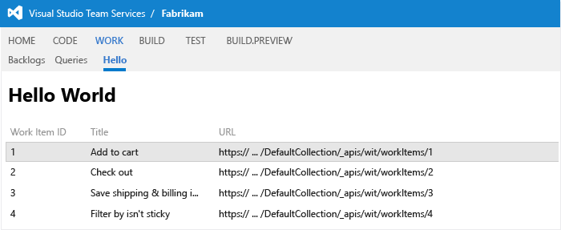

# Create your first extension with Visual Studio

[!INCLUDE [preview](../_data/private-preview.md)]

Extensions enable you to create first-class integration experiences within Visual Studio Team Services.
An extension can be a simple context menu or toolbar action
or it can be a complex and powerful custom UI experience that light up within the account, collection, or project hubs.

Get started now by creating your own hub that displays the results a query,
and an action on the queries context menu to launch your hub.


**In this page:**
- [Create a hub](#hub)
	- [Create the web app](#app)
	- [Create the extension manifest](#manifest)
	- [Install your extension](#install)
	- [Add a grid control](#control)
	- [Call a REST API](#rest)
- [Add an action](#action)
- [Deploy your extension static web content to Microsoft Azure](#deploy)

<a id="hub"></a>
## Create a hub

Use a hub to surface your web app in an iframe in Visual Studio Team Services.
The one we're creating here will show up in the team project's **Work** hub group.


<a id="app"></a>
### Create the web app

Start by creating the web app with the page that will be your hub.

[!INCLUDE [Webapp](../_shared/procedures/create-hub-app-asp4.md)]

1. If you like, you can add a square image in the ```images``` folder that identifies your extension.
We'll display it when someone installs your extension.

	

	You don't need to do this, though for your extension to work.

<a id="manifest"></a>
### Create the extension manifest

The extension manifest tells VSTS about your extension.

[!INCLUDE [Extension_manifest](../_shared/procedures/create-base-manifest.md)]

[!INCLUDE [Contribuion_manifest](../_shared/procedures/create-hub-manifest.md)]

<a id="package"></a>
### Package and publish your extension

[Packaging and publishing](../publish/overview.md)

<a id="install"></a>
### Install your extension

[!INCLUDE [Install](../_shared/procedures/install.md)]

[!INCLUDE [ExtensionsTab](../_shared/extensions-tab.md)]

### Try out your extension

1. Enable https for your web app.

	

1. Start your app in Visual Studio so that VSTS can access it.

1. Go to your hub in the **Work** hub group.

	

<a id="control"></a>
### Add a grid control

Now add a grid control to display some data in ```hello-world.html```.

[!INCLUDE [Control](../_shared/procedures/use-a-control-js.md)]

<a id="rest"></a>
### Call a REST API

Call a REST API and display the results in the grid control.

1. Get the `client service`. In this case, we're getting the work item tracking client.

	Change this:
	```javascript
    // Load VSTS controls
	VSS.require(["VSS/Controls", "VSS/Controls/Grids"],
		function (Controls, Grids) {
	```

	to this:

	```javascript
    // Load VSTS controls and REST client
    VSS.require(["VSS/Controls", "VSS/Controls/Grids",
        "VSS/Service", "TFS/WorkItemTracking/RestClient"],
        function (Controls, Grids, VSS_Service, TFS_Wit_WebApi) {

        // Get a WIT client to make REST calls to VSTS
        var witClient = VSS_Service.getCollectionClient(TFS_Wit_WebApi.WorkItemTrackingHttpClient);
	```

1. Call the API (```getWorkItems```) using the client service (```witClient```),
with a callback that loads the grid control with the results.

	Change this:

	```javascript
	// Initialize the grid control with two colums, "key" and "value"
    var dataSource = [];
    dataSource.push({key: "key", value: "value"});

    Controls.create(Grids.Grid, $("#grid-container"), {
        height: "1000px", // Explicit height is required for a Grid control
        columns: [
            // text is the column header text. 
            // index is the key into the source object to find the data for this column
            // width is the width of the column, in pixels
            { text: "Property key", index: "key", width: 150 },
            { text: "Property value", index: "value", width: 600 }
        ],
        // This data source is rendered into the Grid columns defined above
        source: dataSource
    });
	```

	to this:

	```javascript
    // Call the "queryById" REST endpoint, giving a query ID
    witClient.getWorkItems(/* some work item IDs */ [1,2,3,4], ["System.Title"]).then(function(workItems) {

        // Create a Grid control to display the Work Items
        Controls.create(Grids.Grid, $("#grid-container"), {
            height: "1000px", // Explicit height is required for a Grid control
            columns: [
                // text is the column header text. 
                // index is the key into the source object to find the data for this column
                // width is the width of the column, in pixels
                { text: "Work Item ID", index: "id", width: 150 },

                // getColumnValue provides a mechanism for the grid to get the data for a cell
                // (at the given row number) if it is not directly keyed off the source object.
                { text: "Title", width: 150, getColumnValue: function(dataIndex) { 
                    // The Work Item's Title is at source[row].fields["System.Title"].
                    // this.getRowData(n) returns the nth item from the source object, so we 
                    // can return the "System.Title" property under fields.
                    return this.getRowData(dataIndex).fields["System.Title"]; 
                } },
                { text: "URL", index: "url", width: 600 }
            ],
            // This data source is rendered into the Grid columns defined above
            source: workItems
        }); 
    });
	```

	This code assumes you have at least four work items in your team project. If you don't create them before you try the action.

1. Refresh the page to see the data from your REST API call displayed in the grid.

	

<a id="action"></a>
## Add an action

You can add actions to the VSTS user interface that call your extension. 
In this case, you'll add an action to the context menu for queries and folders in the work hub
that launches the Hello hub and send it a query to run.

See the [contributions reference](../reference/targets/overview.md) to see other places where you can contribute actions.

[!INCLUDE [Action](../_shared/procedures/create-action-js.md)]

1. Update the ```execute:``` block to open your Hello hub.

	```javascript
	execute: function (actionContext) {

		// Get the Web Context to create the uri
		var VSTSContext = VSS.getWebContext();

		// Navigate to the new View Assoicated Work Items hub.
		// Fabrikam is the extension's namespace and Fabrikam.HelloWorld is the hub's id.
		window.parent.location.href = VSTSContext.host.uri +
			vstsContext.project.name + "/_apps/hub/" +
			VSS.getExtensionContext().namespace + "/Fabrikam.HelloWorld";
	}
	```

	Refresh the page and try it again. It opens the Hello hub.

1. Update your action again to pass the selected item to your hub.

	```javascript
	window.parent.location.href = VSTSContext.host.uri +
		vstsContext.project.name + "/_apps/hub/" +
		VSS.getExtensionContext().namespace + "/Fabrikam.HelloWorld?queryId=" +
		actionContext.queryId;
	```

1. Update ```hello-world.html``` to run the query from the action context instead of getting a hardcoded set of work items.

	```javascript
    // Load VSTS controls and REST client
    VSS.require(["VSS/Controls", "VSS/Controls/Grids",
		"VSS/Service", "TFS/WorkItemTracking/RestClient"],
		function (Controls, Grids, VSS_Service, TFS_Wit_RestClient) {
        
        // Get a WIT client to make REST calls to VSTS
        var witClient = VSS_Service.getCollectionClient(TFS_Wit_RestClient.WorkItemTrackingHttpClient);

        // Call the "queryById" REST endpoint, giving a query ID
        witClient.queryById(location.search.substr("?queryId=".length)).then(function(queryResult) {

            // The query result returns a lit of shallow references to Work Items, so next we make
            // a REST call to get actual Work Items.
            var workItemIds = queryResult.workItems.map(function(reference) { return reference.id; });

            // The getWorkItems method takes a list of Work Item IDs and a list of fields to fetch.
            witClient.getWorkItems(workItemIds, ["System.Title"]).then(function(workItems) {

                // Create a Grid control to display the Work Items
                Controls.create(Grids.Grid, $("#grid-container"), {

                    // Explicit height is required for a Grid control
                    height: "500px",
                    columns: [
                        // text is the column header text. 
                        // index is the key into the source object to find the data for this column
                        // width is the width of the column, in pixels
                        { text: "Work Item ID", index: "id", width: 150 },

                        // getColumnValue provides a mechanism for the grid to get the data for a cell
                        // (at the given row number) if it is not directly keyed off the source object.
                        { text: "Title", width: 150, getColumnValue: function(rowNum) { 
                            // The Work Item's Title is at source[row].fields["System.Title"].
                            // this.getRowData(n) returns the nth item from the source object, so we 
                            // can return the "System.Title" property under fields.
                            return this.getRowData(rowNum).fields["System.Title"]; 
                        } },
                        { text: "URL", index: "url", width: 600 }
                    ],
                    // This data source is rendered into the Grid columns defined above
                    source: workItems
                }); 

                // Tells the host frame that the extension is done loading, which releases the UI to the user.
                VSS.notifyLoadSucceeded();
            });
        });
    });
	```

1. Run the action again from a query (not a folder) to see the results of that query in the Hello hub.

	

	Now when you use your action, the results of the selected query will be displayed in your hub.

<a id="deploy"></a>
## Deploy your extension to Microsoft Azure

[!INCLUDE [Action](../_shared/procedures/publish-azure.md)]
