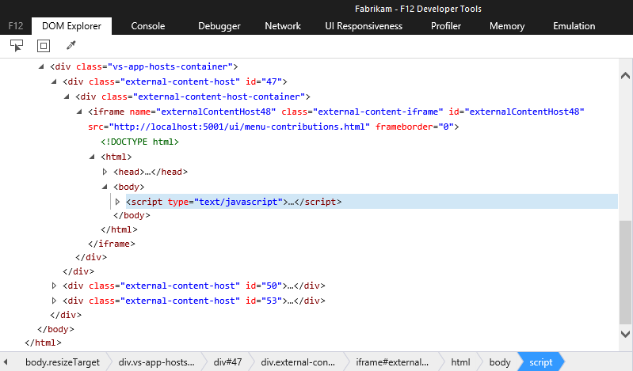

# Debug a web extension

Modern web browsers, like Microsoft Edge and Google Chrome, include tools for debugging the JavaScript that runs on a web page. Usually these are referred to as the "F12 Tools", "Inspector", or "Developer Tools". Since your extension is loaded onto a Visual Studio Team Services page in an iframe, you can use these browser tools to debug the JavaScript portion of your extension. The standard shortcut to launch the browser developer tools is F12. 

    
*The Internet Explorer 11 F12 Tools*

## Ensure your extension is loaded
Your extension is sandboxed in the browser with an iframe. The host page (served from visualstudio.com) cannot directly access elements and scripts within the iframe, and the extension cannot directly access the host. Because extensions are loaded on-demand, your extension is not loaded in its iframe until the user performs an action that causes it to load. For example, if your extension contributes new items to a menu, the extension won't get loaded into an iframe until the relevant menu is created and displayed, such as when a context menu is invoked on right-click. 

You can check the "Target" dropdown in your Developer Tools to see if your extension is currently loaded:

## Inspecting your extension's iframe

 By default, when you launch the Developer Tools, the *Developer Console* will be in the context if the primary page, or the *top window*. In other words, you will only be able to access the top window's DOM and state. Use the "Target" dropdown (shown above) to switch the context to your extension's frame. You are now able to access the DOM and global state of your extension's frame.

### Inspecting the DOM of your extension

Depending on the contributions that are needed from your extension, its iframe may be loaded in the background, styled to be invisible to normal users. For example, a provider of menu items will probably only be loaded in the background. Background iframes are placed in the DOM under a root-level DIV element with the class "vs-app-hosts-container". Expanding this node will allow you to drill into the DOM of each loaded extension.

If your extension's iframe is placed in the foreground, you can use the regular element selector tool (IE:  , Chrome:  ) to inspect within the DOM of your extension.

## Using the debugger

Setting a breakpoint within your extensions scripts is easy. [Once your extension is loaded](#ensure-your-extension-is-loaded), you can find it in the list of source files in the Debugger. Since there will be a lot of files in the list, use the search filter to narrow the list to find the right file. Most browser developer tools use CTRL+O to perform a search through names of source files. 

Once you select your script, you can click in the gutter to set breakpoints. If the developer tools are open, when a script hits your breakpoint, execution will pause.

**Tip**: You may need to set a breakpoint in a script block that is executed when your extension is first loaded, such as during initialization. If that is the case, ensure your extension is loaded, set the breakpoint, then refresh the page. Once the page is refreshed, cause your extension to get loaded again. The breakpoint will be persisted and execution should pause when it is encountered during initialization.

    
*Paused script execution during extension initialization*

### Viewing callback context objects

Extension developers often need context information from Visual Studio Team Services to perform various actions. For example, an extension that adds a Work Item Action would probably be interested in details about the work item that is being viewed. When Visual Studio Team Services makes a call to a function contributed by an extension, it will pass an object containing relevant context information as an argument to the function. The most reliable way to determine the format of data in this callback is by using the Debugger to inspect this context object.

1. Set a breakpoint on the first line of the function whose context object you want to inspect.

2. Perform the action that causes the function to get executed. Script execution will pause at the breakpoint.

3. Hover over the function argument to see its value. You can expand the object hierarchy as needed. Alternatively, you can type the name of the argument in the console to see its value.

