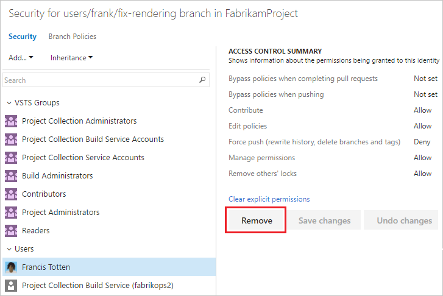

# Set branch permissions

###### VSTS 

## Overview

Set up permissions to control who can read and update the code in a branch on your Git repo.
You can set permissions for individual users and groups, and inherit and override permissions as needed from your [repo permissions](../security/set-git-tfvc-repository-permissions.md#git-repository).

## Use the branches view to configure security

0. Open the **Branches** view while viewing your repo on the web.

   

0. Locate the branch on the **Branches** view. You can search for your branch using the **Search all branches** box in the upper right.

0. Open the context menu by selecting the **...** icon next to the branch name. Select **Branch security** from the menu. 

   

## Add users or groups

> Avoid trouble:  You can only add permissions for users and groups already in your Team Project. [Add new users and groups to your Team Project](../accounts/add-users.md) before setting branch permissions. 

Add users or groups to your branch permissions by selecting **Add**, then choosing **Add user** or **Add VSTS group**. 
Enter the display name or their Microsoft Account, then select **Save Changes**.

## Remove users or groups

Remove permissions for a user or group by selecting the user or VSTS group, then selecting **Remove**. 
The user or group will still exist in your Team Project and this change will not affect other permissions for the user or group.    

 
## Set permissions 

Control branch permission settings from the branch permission view. Users and groups with permissions set at the repo level will
[inherit those permissions](../security/about-permissions.md#inheritance) by default. 

> [!NOTE] 
> These permissions have changed in TFS 2017 Update 1 and VSTS.
> If you are using an earlier version of TFS, see the [previous list of permissions](branch-permissions-before-2017.md).

<table valign="top" width="100%">
<tbody valign="top">
	<tr>
		<th width="30%">Permission</th>
		<th width="70%">Description</th>
	</tr>
	<tr>
		<th id="git-contribute-permission">Contribute</th>
		<td>
			Users with this permission can push new commits to the branch and lock the branch.
		</td>
	</tr>
	<tr>
		<th id="git-edit-policies-permission">Edit Policies</th>
		<td>
			Can edit [branch policies](branch-policies.md).
		</td>
	</tr>
	<tr>
		<th id="git-exempt-from-policy-enforcement-permission">Exempt from policy enforcement</th>
		<td>
			Users with this permission are exempt from the [branch policy](branch-policies.md) set for the branch.
		</td>
	</tr>
	<tr>
		<th id="git-force-push-permission">Force Push (Rewrite History and Delete Branches)</th>
		<td>
			Can force push to a branch, which can rewrite history.
			This permission is also required to delete a branch.
		</td>
	</tr>
	<tr>
		<th id="git-manage-permissions-permission">Manage Permissions</th>
		<td>
			Can set permissions for the branch.
		</td>
	</tr>
	<tr>
		<th id="git-remove-others-locks-permission">Remove Others' Locks</th>
		<td>
			Can remove [locks](lock-branches.md) set on branches by other users.
		</td>
	</tr>
</tbody>
</table>
 