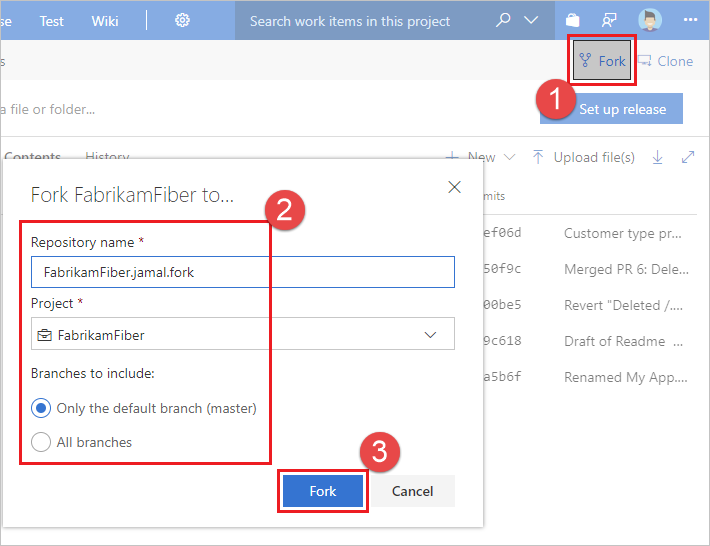
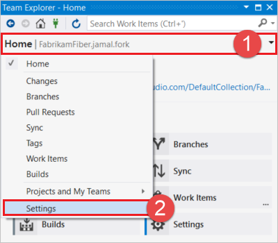
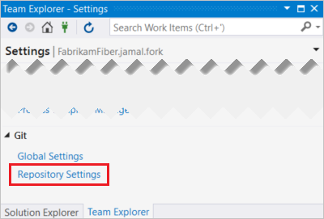
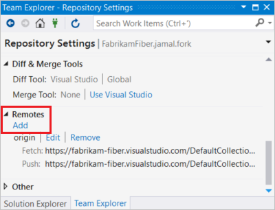
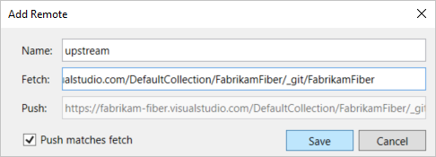
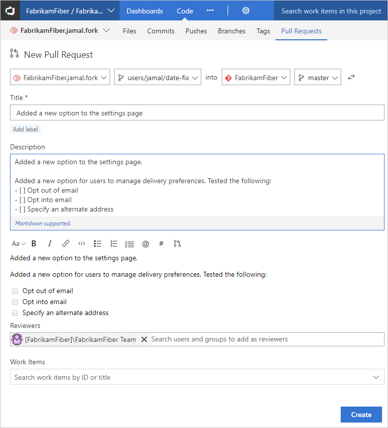
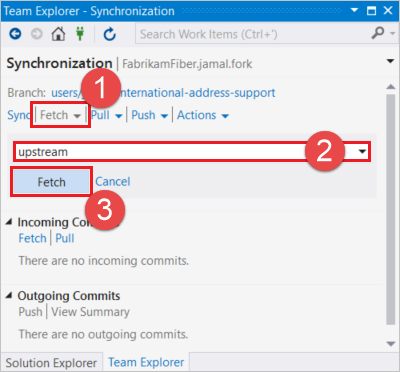
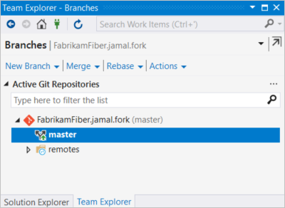
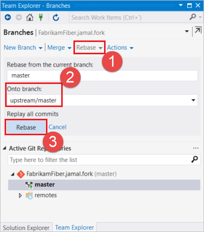

# Forks

A fork is a complete copy of a repository, including all files, commits, and (optionally) branches.
Forks are a great way to isolate experimental, risky, or confidential changes from the original codebase.
Once you're ready to share those changes, it's easy to use [pull requests](pull-requests.md) to push the changes back to the original repository.

## What's in a fork

A fork starts with all the contents of its upstream (original) repository.
When you create a fork, you can choose whether to include all branches or limit to only the  default branch.
None of the permissions, policies, or build definitions are applied.
The new fork acts as if someone cloned the original repository, then pushed to a new, empty repository.
After a fork has been created, new files, folders, and branches are not shared between the repositories unless a PR carries them along.

### Sharing code between forks

You can create PRs in either direction: from fork to upstream, or upstream to fork.
The most common direction will be from fork to upstream.
The destination repository's permissions, policies, builds, and work items will apply to the PR.

## Choosing between branches and forks

For a very small team (2-5 developers), we recommend working in a single repo.
Everyone should work in topic branches, and master should be protected with [branch policies](../branch-policies.md).
As your team grows larger, you may find yourself outgrowing this arrangement and prefer to switch to a forking workflow.

If your repository has a large number of casual or infrequent committers (similar to an open source project), we recommend the forking workflow.
Typically only core contributors to your project have direct commit rights into your repository.
You should ask collaborators from outside this core set of people to work from a fork of the repository. 
This will isolate their changes from yours until you've had a chance to vet the work.

## The forking workflow

1. [Create a fork](#create-fork)
2. [Clone it locally](#clone-locally)
3. [Make your changes locally and push them to a branch](#push-changes)
4. [Create and complete a PR to upstream](#create-pr)
5. [Sync your fork to the latest from upstream](#sync-fork)

<a name="create-fork" />
### Create the fork

Choose the Fork button (1), then choose the project where you want the fork to be created (2).
Give your fork a name and choose the Fork button (3).
> You must have the Create Repository permission in your chosen project to create a fork.
> We recommend you create a dedicated project for forks where all contributors have the Create Repository permission.



If the repository contains a lot of topic branches, we recommend you fork only the default branch.
On the other hand, for a newer repository which will primarily be used with forking, we recommend choosing all branches.

<a name="clone-locally" />
### Clone your fork locally

Once your fork is ready, clone it using the [command line](../tutorial/clone.md?tabs=command-line) or an IDE like [Visual Studio](../tutorial/clone.md).
The fork will be your `origin` remote.

For convenience, you'll want to add the upstream repository (where you forked from) as a remote named `upstream`.
On the command line, you can type:

```git remote add upstream {upstream_url}```

Or, in Visual Studio, follow these steps:

1. Open the **Settings** page.

   

2. Choose **Repository Settings**.

    

3. Under **Remotes**, choose **Add**.

    

4. Add a new remote called `upstream`, using the Git clone URL of the repo you forked from.

    

<a name="push-changes" />
### Make and push changes

It's possible to work directly in `master` - after all, this fork is your personal copy of the repo.
We recommend you still work in a topic branch, though.
This allows you to maintain multiple, independent workstreams simultaneously.
Also, it reduces confusion later when you want to sync changes into your fork.

Make and commit your changes as you normally would.
When you're done with the changes, push them to `origin` (your fork).

<a name="create-pr" />
### Create and complete a PR

Open a pull request from your fork to the upstream.
All the policies, required reviewers, and builds will be applied in the upstream repo.
Once all policies are satisfied, the PR can be completed and the changes become a permanent part of the upstream repo.



> Important note: Anyone with the Read permission can open a PR to upstream.
> If a PR build definition is configured, the build will run against the code introduced in the fork.

<a name="sync-fork" />
### Sync your fork to latest

When you've gotten your PR accepted into upstream, you'll want to make sure your fork reflects the latest state of the repo.
We recommend rebasing on `upstream`'s `master` branch (assuming `master` is the main development branch).
On the command line, run:

```
git fetch upstream master
git rebase upstream/master
git push origin
```

Or, using Visual Studio, you can use the **Synchronization** page to fetch and rebase.

1. Open the **Synchronization** page in Team Explorer.

2. Fetch from `upstream`.

    

3. Open the **Branches** page in Team Explorer. Make sure `master` is checked out.

    

4. Rebase `master` onto `upstream/master`.

    

Now you're all set to start your next feature on a new topic branch.

<hr/>

The forking workflow lets you isolate changes from the main repository until you're ready to integrate them.
When you're ready, integrating code is as easy as completing a pull request.
