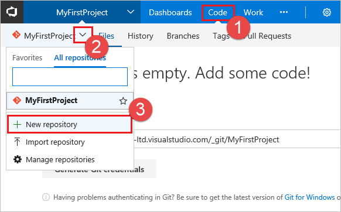
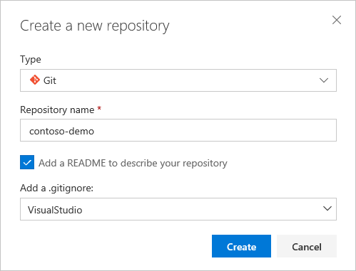
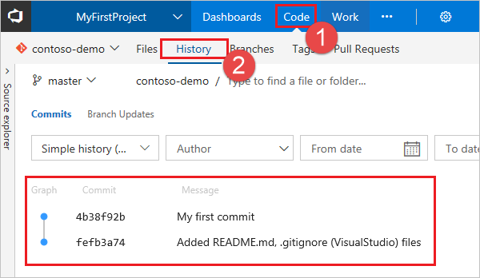
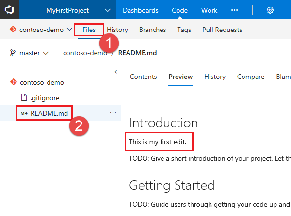

# Create a new Git repo in your team project

#### Team Services | TFS 2015 & TFS 2017 

Team projects provide a repository for source code and a place for a group of developers and teams to plan, track progress, and collaborate on building software solutions. You can use Git repos in your team projects to manage your source code as your project grows. Every Git repo has its own set of permissions to isolate itself from other work in your project. This guide shows you how to create a Git repo using the web portal for either Visual Studio Team Services (VSTS - hosted on Azure) or Team Foundation Server (TFS - on-premises).

## Create a repo using the web portal 

0. Navigate to your team project by browsing to `https:\\<your project name>.visualstudio.com`.

  If you don't have a VSTS account, [sign up](../setup-admin/team-services/sign-up-for-visual-studio-team-services.md) to upload and share code in free unlimited private Git repositories.

0. In the team project area in the web portal, select **Code**, then select the drop-down next to the current repo name and choose **New Repository**.

      

0. In the **Create a new repository** dialog, verify that Git is the repo type and enter a name for your new repo. You can also choose to add a README and create a .gitignore for the type of code you plan to manage in the repo. A [README](create-a-readme.md) contains information about the code in your repo, and a [.gitignore](./tutorial/ignore-files.md) file tells Git which types of files to ignore, such as temporary build files  from your development environment.

  

0. When you're happy with the repo name and choices, select **Create**.

  A new empty Git repo is now created in your team project. 

    - If you created an empty repo (no README or .gitignore), you'll see instructions on how to [clone](tutorial/clone.md) the repo to your computer or [push](tutorial/pushing.md) code in an existing repo into the newly created one.
    - In this example you created a README and a .gitignore, so you'll see an overview of the files in your repo, and you can [clone](tutorial/clone.md) the repo using the **Clone** link on the upper right of the page to get working with a local copy of the repo immediately. 

## Clone the repo to your computer

To work with a Git repo, you clone it to your computer. Cloning a repo creates a complete local copy of the repo for you to work with. 

0. In this example, you'll clone the repo is using Git command line tools:

  - To install Git for Windows, including Git Credential Manager, see [Install the Git Credential Manager - Windows](set-up-credential-managers.md#windows)
  - To install Git for macOS and Linux, see [Install the Git Credential Manager - macOS and Linix](set-up-credential-managers.md#macos-and-linux)

0. Select Clone in the upper-right corner of the **Code** window and copy the **Clone URL**.

  

0. Open the Git command window (Git Bash on Git for Windows), navigate to the folder where you want the code from the repo stored on your computer, and run `git clone` followed by the path copied from the **Clone URL** in the previous step, as shown in the following example.

  ```
  git clone https://contoso-ltd.visualstudio.com/MyFirstProject/_git/contoso-demo
  ```
  After running the previous command, Git downloads and creates a copy of the code from the repo in a new folder for you to work with.

  Keep this command window open, as you'll use it in the following steps.

## Work with the code

In this step, we'll make a change to the files on your computer, commit them, push them up to the repo that is stored on the server, and view the changes there.

0. Browse to the folder on your computer where you cloned the repo, open the `README.md` file in your editor of choice, make some changes, and save and close the file.

0. In the Git command window, navigate to the folder of the cloned repo by entering a command similar to the following: 

  ```
  cd contoso-demo
  ```

0. Commit your changes by entering the following command in the Git command window:

  ```
  git commit -a -m "My first commit"
  ```

  When using `git commit`, `-a` means to commit all changed files, and `-m` specifies a commit message.

0. Push your changes up to the Git repo on the server by entering the following command into the Git command window:

  ```
  git push
  ```

0. Switch back to the web portal and select **History** from the **Code** view to view your new commit. The new repo has two commits: the first commit where the README and .gitignore were added when the repo was created, and the commit you just made.

  

0. Switch to the **Files** tab and click on the README file to view your changes.

    

## Clean up resources

You can remove unused Git repos from your team project when they are no longer needed. If you want to save the repo (and its [commit history](tutorial/history.md)) but no longer need to work with it, consider [renaming](repo-rename.md) the repo and [locking](lock-branches.md) its default branch instead of removing it.

You cannot remove a repo if it is the only Git repo in the Team Project. If you need to delete the only Git repo in a Team Project, create a new Git repo first, then delete the repo.

To delete a repo, see [Delete a Git repo from your team project](delete-existing-repo.md).

## Next steps

- New to git repos? [Learn more](https://www.visualstudio.com/learn/set-up-a-git-repository/)
- [Invite others](../setup-admin/team-services/add-account-users-assign-access-levels-team-services.md) to collaborate with you in the repo
- Learn more about [cloning](./tutorial/clone.md) the repo to your computer
- Learn about the general [Git workflow](./tutorial/gitworkflow.md) that most developers use when writing code and sharing it with the team
- Learn how to use [branches](./tutorial/branches.md) to manage and isolate your code
- Review code and merge it into your default branch with [pull requests](./tutorial/pullrequest.md)

