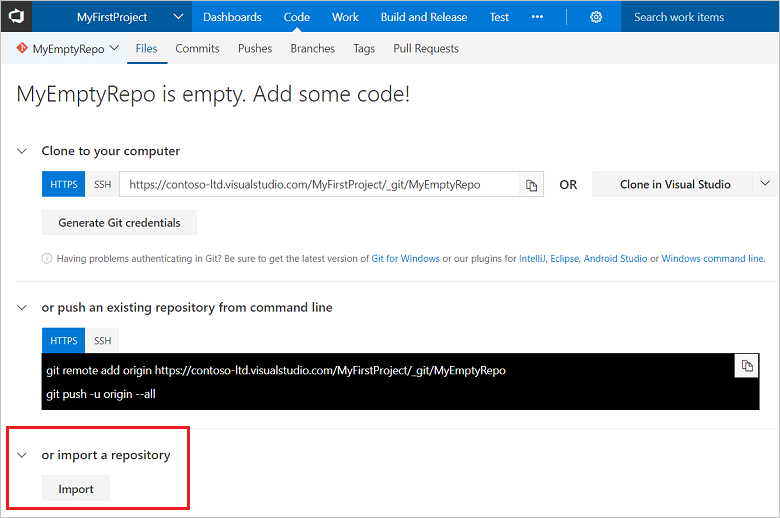

# Import a Git repo
#### Team Services | TFS 2017 Update 1

This guide shows you how to import an existing Git repo from GitHub, BitBucket, GitLab, or other location into a new or empty existing repo in your Team Project. If you don’t have a VSTS account, you can [sign up](../setup-admin/team-services/sign-up-for-visual-studio-team-services.md) for one for free. Each account includes free, unlimited private Git repositories.

## Import into a new repo

From the repo drop-down, select **Import repository**. 

If the source repo is publicly available, just [enter the clone URL](tutorial/clone.md#clone_url) of the source repository and a name for your new Git repository.

If the source repository is private but can be accessed using basic authentication (username-password, personal access token, etc.),  select **Requires authorization** and enter the your credentials.

## Import into an existing empty repo

On the **Files** page of the empty Git repository, select **Import repository** and [enter the clone URL](tutorial/clone.md#clone_url). You will need to provide credentials if the source repository requires authentication. 

## Frequently asked questions

Although most of the time the import is successful, the following conditions can cause problems.

* [What if my Source repository is behind two-factor authentication?](#what-if-my-source-repository-is-behind-two-factor-authentication)
* [What if my source repository does not support multi_ack?](#what-if-my-source-repository-does-not-support-multiack)
* [Can I import from previous versions of Team Foundation Server?](#can-i-import-from-previous-versions-of-team-foundation-server)
* [Can I use MSA based credentials?](#can-i-use-msa-based-credentials)

### What if my source repository is behind two-factor authentication?

The import service uses REST APIs to validate and trigger import and cannot work directly with repositories that require two-factor authentication.
Most Git hosting providers like [GitHub](https://help.github.com/articles/creating-an-access-token-for-command-line-use/) and [Team Services](https://www.visualstudio.com/en-us/docs/setup-admin/team-services/use-personal-access-tokens-to-authenticate) support personal tokens which can be supplied to the import service. 

### What if my source repository does not support multi_ack?

The import service uses the [multi_ack](https://git-scm.com/book/en/v2/Git-Internals-Transfer-Protocols) capability of the Git protocol during the import.
If the source repository does not provide this capability, the import service can fail to import from the given source.
This failure can happen when creating import request or while import is in progress.

### Can I import from previous versions of Team Foundation Server?
If the source Git repository is in a TFS version earlier than TFS 2017 RTM, then import will fail.
This happens because of a contract mismatch between latest TFS/Team Services and pre-2017 RTM versions of TFS.

### Can I use MSA based credentials?
Unfortunately, MSA based credentials will not work. Import service relies on basic authentication to communicate with the source repository. If the username / password you are using are not basic auth then authentication will fail and import will fail.
One way to check if the username / password you are using are basic auth or not is to try using git.exe to clone your repository using the below format

    `git clone https://<<username>>:<<password>>@<<remaining clone Url>>`

