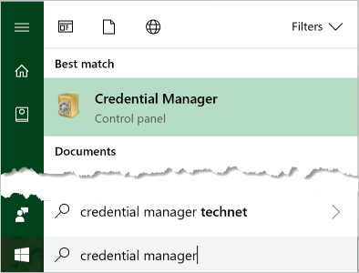
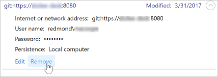

# Manage and store large files in Git

Git is great at keeping the footprint of your source code small because the differences between versions are easily picked out and code is easily compressed. 
Large files that don't compress well and change entirely between versions (such as binaries) present problems when stored in your Git repos. 
Git's fast performance comes from its ability to address and switch to all versions of a file from its local storage.   

If you have large, undiffable files in your repo such as binaries, you will keep a full copy of that file in your repo every time you commit a change to the file.
If many versions of these files exist in your repo, they will dramatically increase the time to checkout, branch, fetch, and clone your code.  

## What kind of files should you store in Git?

### Source code-not dependencies

As your team works with editors and tools to create and update files, you should put these files into Git so your team can enjoy the benefits of Git's workflow.
Don't commit other types of files, such as DLLs, library files, and other dependencies that aren't created by your team but your code depends on into your repo. Deliver these files 
through [package management](../package/overview.md) to your systems. 

Package management bundles your dependencies and installs the files on your system when you deploy the package. 
Packages are versioned to ensure that code tested in one environment runs the same in another environment as long as they have the same installed packages. 

### Don't commit outputs

Don't commit the binaries, logs, tracing output or diagnostic data from your builds and tests. These are outputs from your code, not the source code itself. Share logs and trace information
with your team through [work item tracking](../work/backlogs/add-work-items.md) tools or through team file sharing.

### Store small, infrequently updated binary sources in Git

Binary source files that are infrequently updated will have relatively few versions committed, and will not take up very much space provided that their file size is small.
Images for the web, icons, and other smaller art assets can fall into this category.  It's better to store these files in Git with the rest of your source so your team can use 
consistent workflow. 

> [!IMPORTANT] 
> Even small binaries can cause problems if updated often. One hundred changes to a 100KB binary file uses up as much storage as 10 changes to a 1MB binary, and due to the frequency of updates to the smaller binary will take slow down branching performance more often than the large binary.

### Don't commit large, frequently updated binary assets

Git will manage one main version of a file and then store only the differences from that version in a process known as deltification. 
Deltification and file compression allow Git to store your entire code history in your local repo. 
Large binaries usually change entirely between versions and are often already compressed, making these files difficult for Git to manage since the difference between versions is very large.
Git must store the entire contents of each version of the file and has difficulty saving space through deltification and compression. 
Storing the full file versions of these files causes repo size to increase over time, reducing branching performance, increasing the clone times, and expanding storage requirements.

## Strategies for working with large binary source files

- Don't commit compressed archives of data. It's better to uncompress the files and commit the diffable sources, letting Git handle compressing the data in your repo.
- Avoid committing compiled code and other binary dependencies. Commit the source and build the dependencies, or use a package management solution to version and supply these files 
to your system.
- Store configuration and other structured data in diffable plain text formats, such as JSON.

## Use Git Large File Storage (LFS)

When you have source files with large differences between versions and frequent updates, you can use [Git LFS](https://git-lfs.github.com/) to manage these file types. 
Git LFS is an extension to Git which commits data describing the large files in a commit to your repo, and stores the binary file contents into separate remote storage. 
When you clone and switch branches in your repo, Git LFS downloads the correct version from that remote storage. 
Your local development tools will transparently work with the files as if they were commited directly to your repo.

###  Benefits

The benefit of Git LFS is that your team can use the familiar end to end Git workflow no matter what files your team creates. 
LFS files can be as big as you need them to be.
Additionally, as of version 2.0, Git LFS supports [file locking](https://github.com/git-lfs/git-lfs/wiki/File-Locking) to help your team work on large, undiffable assets like videos, sounds, and game maps.

Git LFS is [is fully supported and free in VSTS](https://blogs.msdn.microsoft.com/visualstudioalm/2015/10/01/announcing-git-lfs-on-all-vso-git-repos/).
To use LFS with Visual Studio, you need at least [Visual Studio 2015 Update 2](https://www.visualstudio.com/en-us/news/vs2015-update2-vs.aspx).
Just follow the [instructions to install the client](https://git-lfs.github.com/), set up LFS tracking for files on your local repo, and then push your changes to VSTS.

### Limitations

Git LFS has some drawbacks that you should consider before adopting:

0. Every Git client used by your team must install the Git LFS client and understand its [tracking configuration](https://github.com/github/git-lfs/tree/master/docs). 
0. If the Git LFS client is not installed and configured correctly, you will not see the binary files committed through Git LFS when you clone your repo. 
Git will download the data describing the large file (which is what Git LFS commits to the repo) and not the actual binary file itself. 
Committing large binaries without the Git LFS client installed will push the binary to your repo.
0. Git cannot merge the changes from two different versions of a binary file even if both versions have a common parent.
If two people are working on the same file at the same time, they must work together to reconcile their changes to avoid overwriting the other's work.
Git LFS provides [file locking](https://github.com/git-lfs/git-lfs/wiki/File-Locking) to help.
Users must still take care to always pull the latest copy of a binary asset before beginning work.
0. Team Services currently does not support using SSH in repos with Git LFS tracked files.   
   
### File format

The file written into your repo for a Git LFS tracked file will have a few lines with a key and value pair on each line:

```
version https://git-lfs.github.com/spec/v1
oid a747cfbbef63fc0a3f5ffca332ae486ee7bf77c1d1b9b2de02e261ef97d085fe
size 4923023
```

> [!NOTE] 
> The GitHub URL included for the version value only defines the LFS pointer file type, and is not a link to your binary file.

### Known issues

#### Kerberos authentication
If you use TFS, Git may be using the Kerberos protocol to authenticate.
(This does not apply to VSTS, which uses a different form of authentication.)
LFS does not support Kerberos, so you will get errors which say "Your user name must be of the form DOMAIN\user".
To get out of this state, you will need to remove the Kerberos credential and let Git pick up a new NTLM credential instead.

0. Open the Windows Credential Manager. On Windows 10, you can press Start and then type "Credential Manager".

   

0. Choose *Windows Credentials*.

   

0. Find your TFS URL in the credential list.
0. Choose *Remove*.

   

0. Return to your Git client (Visual Studio or the command line) and push your changes.
When prompted for credentials, be sure to enter them in the form *DOMAIN\username*.
