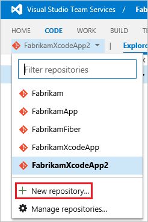
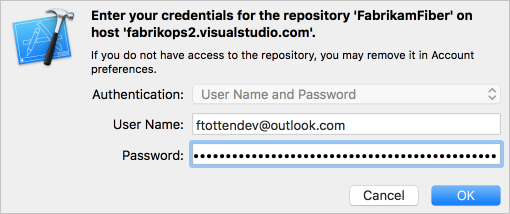

#  Share your code in Git using Xcode
#### Team Services | TFS 2015 & 2017

Share your Xcode projects in a Team Services Git repo.

## Create a local Git repo for your Xcode project

Create a local Git repo for your code to manage your project in version control. 

> If your project is already in a local Git repo, you can skip this step.

### New projects

Create a local Git repo when you create a new project. Choose **Create Git repository on My Mac** when creating a new project. 

### Existing projects

Create a local Git repo for your existing projects not in version control by going to **Source Control, Create Working Copy...** . Select the projects to add to the local Git repo and select **Create**. Xcode creates a Git repo for your code and adds a [commit](tutorial/commits.md) with your project files.

## Create a new Team Services repo

Create a new Git repo in Team Servies for your Xcode project. 

> If you have already created a repo for your Xcode project in Team Services, you can skip this step.

0. Browse to your Team Project in your Team Services account and select the drop-down  next to the name of the current Git repo. Select **New Repository..**  
  

0. Enter a name for your new Git repo and select **Create**. Your browser will navigate to your new empty Git repo for your Xcode project. Copy the clone URL to the clipboard so that you can use it in Xcode to connect to Team Services.  

 

## Push your project

0. Go to **Source Control** in Xcode and select **_Projectname_ -- master**, then **Configure...**  

  

0. Select **Remotes**, then select the  icon and choose **Add Remote...**

0. In the **Address** field, paste the Git clone URL for your Team Services repo copied in the previous step. Select **Add Remote**, then select **Done** to finish creating the `origin` remote for your local Git repo.  

  

0. Go to **Source Control, Push...**, enter the branchname on `origin` to push to, and select **Push**.

  

0. If prompted, enter your Team Services credentials. For **Username**, enter your Team Services username. For **Password**, enter a [Personal Access Token](../setup-admin/team-services/use-personal-access-tokens-to-authenticate.md) created for your user in Team Services. Select **OK**. 

  

Xcode will [push](tutorial/pushing.md) your project to your Team Services Git repo so you can share it with your team.

## Try this next

Learn more about using Git in the [Git tutorial](tutorial/gitworkflow.md) and [create a build](../build-release/overview.md) for your project code.

## Q&A

<!-- BEGINSECTION class="m-qanda" -->

###Q: Can I use SSH to connect to my Team Services Git repo? 

A:  Yes. [Set up SSH credentials](use-ssh-keys-to-authenticate.md) and use the SSH clone URL when adding the remote for your local Git repo.

<!-- ENDSECTION -->