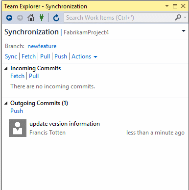

#  Share code with push (command line)

###### Git command line

## Share code with push

Share changes made in [commits](commits-cmdline.md) and [branches](branches-cmdline.md) using the `push` command. 
Push your branches to the remote repository, where Git takes the commits and adds them to an existing branch on the remote or creates a new branch with the same commits as your local branch.

Git makes sure that pushed changes are consistent with the remote branch so others can [pull](pulling-cmdline.md) your commits and merge them into their own local copy of the branch. 
Pushed branches that have finished work are reviewed and merged into the main branch of the your repo through a [pull request](pullrequest-cmdline.md).

<li>
<a data-toggle="collapse" href="#expando-git-cmdline-tutorial">This article is part of the command line Git tutorial. Expand to view more Git tutorial steps &#x25BC;</a>

<ul>
<li><a href="gitworkflow-cmdline.md">Learn about Git</a></li>
<li><a href="creatingrepo-cmdline.md">Create a new repo</a></li>
<li><a href="clone-cmdline.md">Clone an existing repo</a></li>
<li><a href="commits-cmdline.md">Save work with commits</a></li>
<li><a href="branches-cmdline.md">Create work in branches</a></li>
<li><a href="pushing-cmdline.md">Share code with push (this article)</a></li>
<li><a href="pulling-cmdline.md">Update code with fetch and pull</a></li>
<li><a href="pullrequest-cmdline.md">Review code with pull requests</a></li>
<li><a href="rebase-cmdline.md">Apply changes with rebase</a></li>
<li><a href="cherry-pick-cmdline.md">Copy changes with cherry-pick</a></li>
<li><a href="merging-cmdline.md">Resolve merge conflicts</a></li>
<li><a href="undo-cmdline.md">Undo changes</a></li>
<li><a href="ignore-files-cmdline.md">Ignore files</a></li>
<li><a href="history-cmdline.md">Review history</a></li>
<li><a href="howto-cmdline.md">Frequently asked questions</a></li>
</ul>

</li> 

## Video overview
   
<iframe src="https://channel9.msdn.com/series/Team-Services-Git-Tutorial/Git-Tutorial-Push/player" width="640" height="360" allowFullScreen frameBorder="0"></iframe>

## Share your code with push

<ul class="nav nav-pills" style="padding-right:15px;padding-left:15px;padding-bottom:5px;vertical-align:top;font-size:18px;">
<li style="float:left;" data-toggle="collapse" data-target="#changeexample">How to push changes</li>
<li style="float: right;"><a style="max-width: 374px;min-width: 120px;vertical-align: top;background-color:#AEAEAE;margin: 0px 0px 0px 8px;min-width:90px;color: #fff;border: solid 2px #AEAEAE;border-radius: 0;padding: 2px 6px 0px 6px;outline-style:none;height:32px;font-size:14px;font-weight:400" data-toggle="pill" href="#cmdline0">Command Line</a></li>
</ul>

<h6>VSTS | TFS 2015 &amp; 2017 | Visual Studio 2015 &amp; 2017</h6>
 

In Team Explorer, open the **Sync** view. The view lists outgoing commits and will present you with one of two links to push them to your remote repo:
<ul>
<li> **Publish** when there is not a branch on the remote repo associated with the current local branch. This will create a branch with the same name on the remote repo
and push the commits to it. Later you will **Push**, not publish changes when using this branch since the relationship between the branch on the local branch and the remote repo exists. 
<li> **Push** when there is a relationship between the local branch and  the remote repo. Clicking this will `push` the commits to the remote branch.    

</ol>

The `push` command will update the remote branch on `origin` with the commits from your local branch.

<pre style="color:white;background-color:black;font-family:Consolas,Courier,monospace;padding:10px">
&gt; git push
Counting objects: 3, done.
Delta compression using up to 8 threads.
Compressing objects: 100% (2/2), done.
Writing objects: 100% (3/3), 861 bytes | 0 bytes/s, done.
Total 3 (delta 1), reused 0 (delta 0)
remote: Analyzing objects... (3/3) (114 ms)
remote: Storing packfile... done (62 ms)
remote: Storing index... done (53 ms)  
</pre>

If the remote branch doesn't exist, run the following to create a remote branch on `origin`.

<pre style="color:white;background-color:black;font-family:Consolas,Courier,monospace;padding:10px">
&gt; git push -u origin users/frank/bugfix
</pre>

 Your commits on your local branch are added to the branch on `origin`, and a upstream tracking relationship will be set up in
Git so that next time you `push` (or `pull`) from this local branch, you won't have to specify the remote branch name.

### Resolve merge conflicts before pushing   

If there are [conflicts](merging-cmdline.md) between your local commits on the commits on the remote branch, you must first resolve these conflicts before you can push your changes. 
You should [pull](pulling-cmdline.md) the changes from others first, resolve the conflicts and commit the changes, then re-attempt the `push`.

## What's next

- [Review code with pull requests](pullrequest-cmdline.md)
- [Update code with fetch and pull](pulling-cmdline.md)