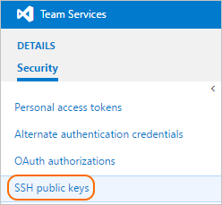
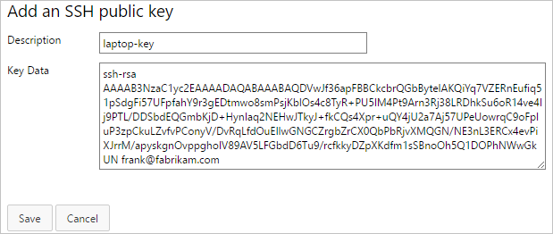
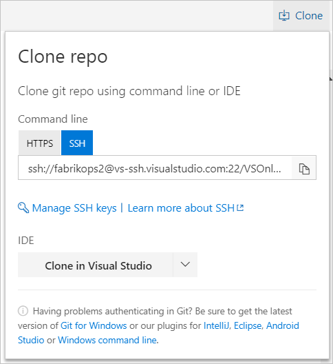

# Use SSH key authentication
#### VSTS | TFS 2015 Update 3 | TFS 2017

Connect to your Git repos through SSH when you can't use the recommended [Git Credential Managers](set-up-credential-managers.md) or
[Personal Access Tokens](../accounts/use-personal-access-tokens-to-authenticate.md) to securely connect using HTTPS authentication.

>[!IMPORTANT]
> SSH URLs are changing on September 5, 2017. Old SSH URLs will continue to work through November 6, 2017. If you have already set up SSH, you will need to update your remote URLs:
> - Visit your repository on the web and select the **Clone** button in the upper right.
> - Select **SSH** and copy the new SSH URL.
> - In your Git client, run: ```git remote set-url <remote name, e.g. origin> <new SSH URL>```. Alternatively, in Visual Studio, go to **Repository Settings**, and edit your remotes.

>[!NOTE]
> As of Visual Studio 2017, SSH can be used to connect to Git repos.

## How SSH key authentication works
SSH public key authentication works with a pair of generated encryption keys. The _public_ key is shared and used to encrypt
messages. The _private_ key is kept safe and secure on your system and is used to read messages encrypted with the public key. 

## Set up SSH key authentication

The following steps cover configuration of SSH key authentication on the following platforms:

--- 
- Linux
- Mac OS X running at least Leopard (10.5)
- Windows systems running  [Git for Windows](http://www.git-scm.com/download/win)   

---

Configure SSH using the command line. `bash` is the common shell on Linux and Mac OS X and the Git for Windows installation adds a shortcut to Git Bash in the Start Menu.
Other shell environments will work, but are not covered in this article.

### Step 1: Create your SSH keys

> If you have already created SSH keys on your system, skip this step and go to [configuring SSH keys](use-ssh-keys-to-authenticate.md#configuration).   

The commands here will let you create new default SSH keys, overwriting existing default keys. Before continuing, check your 
`~/.ssh` folder (for example, /home/frank/.ssh or C:\Users\frank\\.ssh) and look for the following files:

- _id_rsa_
- _id_rsa.pub_

If these files exist, then you have already created SSH keys. You can overwrite the keys with the following commands, or skip this step and go to [configuring SSH keys](use-ssh-keys-to-authenticate.md#configuration) to reuse these keys.

Create your SSH keys with the `ssh-keygen` command from the `bash` prompt. This will create a 2048-bit RSA key for use with SSH. You can give a passphrase
for your private key when prompted&mdash;this provides another layer of security for your private key. 
If you give a passphrase be sure to [configure the SSH agent](use-ssh-keys-to-authenticate.md#rememberpassphrase) to cache your passphrase so you don't have to enter it every time you connect.

<pre style="color:white;background-color:black;font-family:Consolas,Courier,monospace;padding:10px">
&gt;  ssh-keygen -C "frank@fabrikam.com"
Generating public/private rsa key pair.
Enter file in which to save the key (/home/frank/.ssh/id_rsa): /home/frank/.ssh/id_rsa</font>
Enter passphrase (empty for no passphrase): passphrase</font>
Enter same passphrase again: passphrase
Your identification has been saved in /home/frank/.ssh/id_rsa.
Your public key has been saved in /home/frank/.ssh/id_rsa.pub.
</pre>

This produces the two keys needed for SSH authentication: your private key ( _id_rsa_ ) and the public key ( _id_rsa.pub_ ). It is important to never share the contents of your private key. If the private key is
compromised, attackers can use it to trick servers into thinking the connection is coming from you.

<a name="configuration"></a>

### Step 2:  Add the public key to VSTS/TFS

Associate the public key generated in the previous step with your user ID.

0.  Open your security settings by browsing to the web interface and selecting your name in the upper right of the
user interface. Select **My security** in the menu that appears.

    

0. Select **SSH Public Keys** , then select **Add**.

    

0. Copy the contents of the public key (for example, id_rsa.pub) that you generated into the **Key Data** field. Avoid adding whitespace or new lines into the **Key Data** field-they can cause VSTS to use an invalid public key. 

    

0. Give the key a useful description (this will be displayed on the **SSH public keys** page for your profile) so that you can remember it later. Select **Save** to store the public key. Once saved, you cannot change the key. You can delete the key or create a new entry for another key. There are no restrictions on how many keys you can add to your user profile.
  
### Step 3: Clone the Git repository with SSH

> To connect with SSH from an existing cloned repo, see [updating your remotes to SSH](use-ssh-keys-to-authenticate.md#migrate).

0. Copy the SSH clone URL from the web interface:

   
   
0. Run `git clone` from the command prompt. 

   ```
   git clone ssh://fabrikops2@vs-ssh.visualstudio.com:22/DefaultCollection/_git/fabrikamtools
   ```

SSH will ask you to verify that the SSH fingerprint for the server you are connecting to. You should verify that the shown fingerprint matches the fingerprint on the **SSH public keys**  page.
SSH displays this fingerprint when it connects to an unknown host to protect you from [man-in-the-middle attacks](https://technet.microsoft.com/en-us/library/cc959354.aspx).
Once you accept the host's fingerprint, SSH will not prompt you again unless the fingerprint changes. 

```
git clone ssh://fabrikops2@vs-ssh.visualstudio.com:22/DefaultCollection/_git/fabrikamtools
```

When you are asked if you want to continue connecting, type `yes`. Git will clone the repo and set up the `origin` remote to connect with SSH for future Git commands. 

> Avoid trouble: Windows users will need to [run a command](use-ssh-keys-to-authenticate.md#rememberpassphrase) to have Git reuse their SSH key passphrase. 

## Questions and Troubleshooting

<a name="rememberpassphrase"></a>

### How can I have Git remember the passphrase for my key on Windows?
Run the following command included in Git for Windows to start up the `ssh-agent` process in Powershell or the Windows Command Prompt. `ssh-agent` will cache
your passphrase so you don't have to provide it every time you connect to your repo.

```
start-ssh-agent.cmd
```

If you are using the Bash shell (including Git Bash), start ssh-agent with:

```
eval `ssh-agent`
```

### I use [PuTTY](http://www.putty.org/) as my SSH client and generated my keys with PuTTYgen. Can I use these keys with VSTS?

Yes. Load the private key with PuTTYgen, go to **Conversions** menu and select **Export OpenSSH key**. 
Save the private key file and then follow the steps to [set up non-default keys](use-ssh-keys-to-authenticate.md#newkeys).
Copy you public key directly from the PuTTYgen window and paste into the **Key Data** field in your security settings.

### How can I verify that the public key I uploaded is the same key as I have locally?

  You can verify the fingerprint of the public key uploaded with the one displayed in your profile through the following `ssh-keygen` command run against your public key using
  the `bash` command line. You will need to change the path and the public key filename if you are not using the defaults.
  
```
ssh-keygen -l -E md5 -f ~/.ssh/id_rsa.pub
```

You can then compare the MD5 signature to the one in your  profile. This is useful if you have connection problems or have concerns about incorrectly
pasting in the public key into the **Key Data** field when adding the key to VSTS.

<a name="migrate"></a>
 
### How can I start using SSH in a repository where I am currently using HTTPS?
 
You'll need to update the `origin` remote in Git to change over from a HTTPS to SSH URL. Once you have the SSH clone URL, run the following command:

```
git remote set-url origin ssh://fabrikops2@vs-ssh.visualstudio.com:22/DefaultCollection/_git/fabrikamtools
```

You can now run any Git command that connects to `origin`.

<a name="newkeys"></a>

### I'm using Git LFS with VSTS and I get errors when pulling files tracked by Git LFS.

VSTS currently doesn't support LFS over SSH. Use HTTPS to connect to repos with Git LFS tracked files.
 
### How can I use a non default key location, i.e. not ~/.ssh/id_rsa and ~/.ssh/id_rsa.pub ?

To use keys created with `ssh-keygen` in a different place than the default, you do two things:

0. The keys must be in a folder that only you can read or edit. If the folder has wider permissions, SSH will not use the keys.
0. You must let SSH know the location of the keys. You make SSH aware of keys through the `ssh-add` command, providing the full path to the private key. 

```
ssh-add /home/frank/.ssh/id_frank.rsa 
```

On Windows, before running `ssh-add`, you will need to run the following command from included in Git for Windows:

```
start-ssh-agent.cmd
```

This command runs in both Powershell and the Command Prompt. If you are using Git Bash, the command you need to use is:

```
eval `ssh-agent`
```

You can find `ssh-add` as part of the Git for Windows distribution and also run it in any shell environment on Windows. 

On Mac OS X and Linux you also must have `ssh-agent` running before running `ssh-add`, but the command environment on these platforms usually 
takes care of starting `ssh-agent` for you.