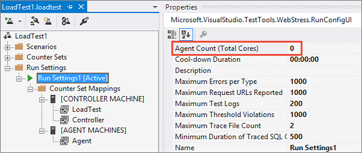
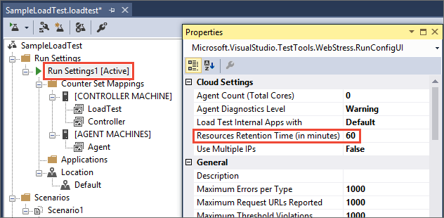
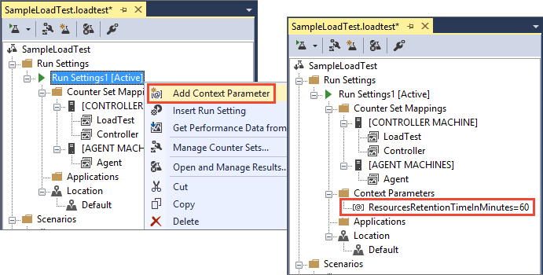
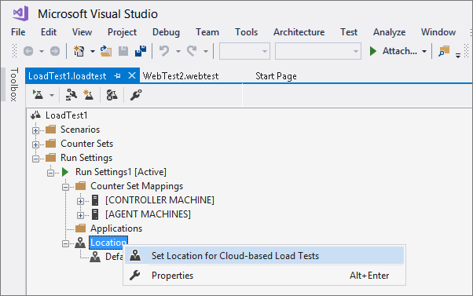
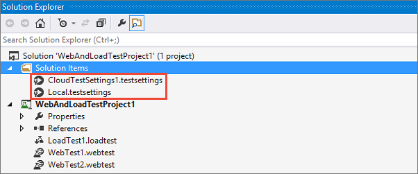
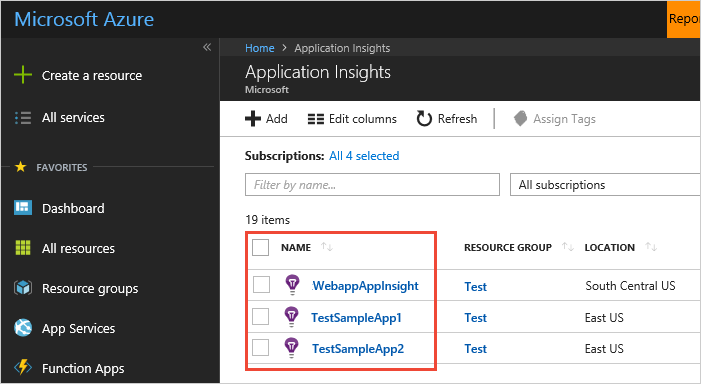
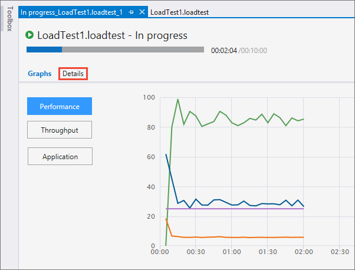

# FAQs for load testing

[!INCLUDE [version-header-vs-ts](_shared/version-header-vs-ts.md)] 

<a name="qageneral"></a>
## General

### Q: How do I learn more about Cloud-based Load Testing?

**A**: Watch this video, or check out the 
[Cloud-based Load Testing blog](https://blogs.msdn.microsoft.com/devops/?s=clt). 

<iframe src="//channel9.msdn.com/Events/Visual-Studio/Launch-2013/QE103/player" width="600" height="315" allowFullScreen="true" frameBorder="0"></iframe>

### Q: Do I need anything to load test in the cloud with Visual Studio Ultimate 2013?

**A**:  Yes, you'll need Update 4 or Update 5 installed. [Download this version](https://www.visualstudio.com/downloads/download-visual-studio-vs).

### Q: My Visual Studio trial period ended, but I still want to run load tests.

**A**:  To continue load testing after the trial, you'll need an active and valid 
Visual Studio Enterprise 2017 or 2015 license, or a Visual Studio Ultimate 2013 license. 
[Learn more about licensing](https://www.visualstudio.com/products/how-to-buy-vs).

### Q: Can I run cloud-based load tests on any app, even behind a firewall?

**A**:  Yes, you can load test apps or sites that are only available to your company, 
like internal or pre-release apps, staging or preproduction deployments. To learn more, see 
[Testing private and intranet applications using cloud-based load testing](https://blogs.msdn.microsoft.com/visualstudioalm/2016/08/23/testing-privateintranet-applications-using-cloud-based-load-testing/).

Or, you can 
[run a load test locally using Visual Studio](../load-test/run-performance-tests-app-before-release.md).

### Q: What are virtual users?

**A**:  Virtual users create load by accessing your app or web site all at the same 
time during your test run. That way, you can test performance under more realistic 
or projected conditions. Virtual users are simulated by test agents.

### Q: What are test agents? How do they relate to my test run?

**A**: Test agents are computing resources, like CPU, memory, and network, 
that generate load by simulating virtual users. Test agents use agent cores 
to create virtual users. Each core creates at least 1 virtual user. 

For load test runs in Visual Studio Team Services (VSTS) with the Visual Studio IDE,
you can specify the number of cores to use. For example,
if you get errors when you run your test, 
you might have to increase the number of cores.

Otherwise, your tests and the number of virtual users that 
you specify determine how many cores and agents are used.

### Q: Where do I specify the number of cores for runs in VSTS with the Visual Studio IDE?

**A**: You can do that here:



What do the values mean?

| Cores | Agents |
| --- | --- | 
| 0 | (Default) The number of cores is based on the number of virtual users that you specify for your test. |
| 1 | Your test run will use 1 agent. |
| 2 - 10 | Each agent will always use 2 cores. |
| 11 - 40 | Each agent will always use 4 cores. |
| 41 - 200 | Each agent will always use 8 cores. |

The maximum number of cores for each test run is 200. 
If your test run needs more cores, you can run up to 10 load tests at the same time.

The minimum number of virtual users per agent core is 1. 
If your load test requires more cores, contact
[vsoloadtest@microsoft.com](mailto:vsoloadtest@microsoft.com).

The number of agents also depends on your text mix (web performance test or unit test). 
If you have only web performance tests, we suggest using between 600 and 2,500 virtual users for every two cores. 
If you have unit tests, the agent count depends on what your unit tests do. 
This means you will have to test if you have enough agents by 
running a shorter duration load test run or use 
[goal-based load testing](http://blogs.msdn.com/b/visualstudioalm/archive/2015/08/03/announcing-support-for-goal-based-load-pattern-in-cloud-based-load-tests.aspx).

<a name="VUM"></a>
### Q: What are virtual user minutes (VUMs)? How many minutes will my load test use?

**A**: If your test run uses 25 or more virtual users per core, 
then VUMs = (max virtual user load for your test run) * (test run duration in minutes).

If your test run uses fewer than 25 users per core, then VUMs = 
(number of cores) \* (25 virtual users per core) \* (test run duration in minutes).

The minimum values used to calculate VUMs are 25 virtual users and 1 minute. 
If your test run values are smaller than the minimum values, 
then those values are rounded up to meet the minimums. 
For example, if your test run specifies 20 virtual users for 30 seconds,
then your test run will actually run with 25 virtual users for 1 minute = 25 VUMs, 
not 15 VUMs.
 
Also, test run duration is in minutes, not seconds. For example, 
if your test run duration is 5 minutes and 15 seconds, 
then that duration is rounded up to 6 minutes. 
   
A minimum of 250 virtual user minutes, including the warm-up period, is deducted from your account for:

* Completed runs, based on the full duration of the run
* Aborted runs, based on the elapsed run duration

For runs that end in an error state, no virtual user minutes will be deducted from your account.

Note that there is an additional charge for [resource retention](#retain-resources).

To check how many virtual user minutes that your VSTS account 
has used or has remaining, go to your VSTS account home page 
(```https://{youraccount}.visualstudio.com```).

<a name="test-limits"></a>
### Q: Are there any limits when running the cloud-based load tests?

**A**: Yes. Based on where you're running the test, each test run duration limit is:

* Visual Studio IDE: 48 hours
* VSTS Load test hub:
 - URL-based load tests: 48 hours
 - JMeter load tests: 4 hours
* Azure portal: 1 hour

### Q: Do other load tests run on the same virtual machines that host my agents?

**A**:  No, the virtual machines that host your agents host only one load test run.

### Q: Are there load test features that aren't supported when you run load tests in the cloud?

**A**: These features aren't currently supported:

*   Network mix property
*   Agent to Use in test settings - use the core count property instead
*   SQL Trace properties in run settings
*   IP switching

<a name="retain-resources"></a>
### Q: Can I speed up my load testing cycle by retaining the resources the tests use?

**A**: Yes, you can reduce the delay while your load test starts each time during a typical 
test &gt; fix &gt; retest scenario by retaining the resources for an appropriate period 
after each test completes, instead of having to wait for them to be acquired and 
provisioned for each test run. In Visual Studio Update 3
and later, specify the retention time in your run settings properties.



In earlier versions of Visual Studio, add a context parameter named **ResourcesRetentionTimeInMinutes**
to your run settings.



Note:

* The maximum resource retention period is 4 hours (240 minutes).

* The resources will be released after the specified period if you do not start another 
test during that period. When you start another test, the resource retention period you 
specify in that test will be applied - effectively allowing you to extend the retention 
period. You can specify a different retention period each time you start a test.

* There a small additional charge applied when you use this feature. In addition to 
the usual VUMs that your load test consumes, a surcharge of 5 VUMs per core is applied
for the duration of the run. So if you retain 20 cores for 10 minutes, an additional
1000 VUMs (5 x 20 x 10) will be charged. The status messages display this information.

* Resource retention is not available for Apache JMeter tests at the present time.

For more details, see [this blog post](https://blogs.msdn.microsoft.com/visualstudioalm/2016/07/18/speed-up-cloud-load-test-execution-by-retaining-resources-for-quick-consecutive-runs/).

----------

<a name="qavisualstudio"></a>
## Visual Studio load testing

### Q: How can I increase the capacity of my load tests?

**A**: You can use the [Cloud-based Load Testing service](https://go.microsoft.com/fwlink/?LinkID=317257), so you can run your tests across multiple virtual machines in the cloud.

<a name="howmanyusers"></a>
### Q: How many virtual users can I configure in my load test?

**A**: In the full version of Visual Studio Enterprise, the number of virtual users is unlimited. In Visual Studio Enterprise trial version, the virtual user count is limited to 250.

### Q: Can I analyze load tests that ran previously?

**A**: Yes, to open and manage those results, click  in the load test editor. You can have multiple tests open at the same time to compare runs, and [create trend analysis reports](https://msdn.microsoft.com/library/dd728091%28v=vs.140%29.aspx) to compare them.

### Q: Is there a difference between what I can analyze during a running test versus a completed test?

**A**: Yes, these are the differences:

* **Performance counters** A smaller subset of the performance counter data is available while a test is running.

* **Views** When the load test run has completed, the [Summary View](https://msdn.microsoft.com/library/ms404677%28v=vs.140%29.aspx#SummaryView) and [Details View](https://msdn.microsoft.com/library/ms404677%28v=vs.140%29.aspx#DetailsView) are available.

### Q: Can load tests use other test types in their test mix besides web performance tests?

**A**: Yes, you can include unit tests and [coded UI tests](https://msdn.microsoft.com/library/dd286652.aspx).

### Q: Can virtual users simulate pausing between test steps?

**A**: Yes, you can [specify think times](https://msdn.microsoft.com/library/dd997697.aspx) to simulate the time spent by a user on a web page.

### Q: Why should I use Cloud-based Load Testing?

**A**: If you don't want to set up machines for load testing, or you don't have available resources, you can use the [Cloud-based Load Testing service](https://go.microsoft.com/fwlink/?LinkID=317257). It sets up virtual machines in the cloud that will run your load test. Note that your web site must be publicly available on the internet for load testing using VSTS to access it.

----------

<a name="qaazure"></a>
## Azure load testing

### Q: Why can't I see my existing VSTS account to run load tests? 

**A**: To use a VSTS account for running load tests from the Azure
portal, one of the following criteria must be satisfied:

* The account is backed by Azure Active Directory,
  [Has an Azure subscription](https://docs.microsoft.com/en-us/azure/active-directory/active-directory-how-subscriptions-associated-directory)
  is linked to it, and the user is a member of the linked Azure subscription.

* The account is backed by [Azure Active Directory](https://docs.microsoft.com/en-us/azure/active-directory/)
  and the user is an owner of the account.

### Q: Is there a limit on how long I can run a test? 

**A**: Yes, you can run your test up to an hour in the Azure Portal.

### Q: How much time do I get to run performance tests? 

**A**: After public preview, you get 20,000 virtual user minutes (VUMs) 
free each month with your VSTS account. 
A VUM is the number of virtual users multipled by the number 
of minutes in your test. If your needs exceed the free limit, 
you can purchase more time and pay only for what you use.

### Q: Where can I check how many VUMs I've used so far?

**A**: You can check this amount in the Azure Portal.


### Q: What is the default option and are my existing tests impacted?

**A**: The default option for performance load tests is a manual test -
the same as before the multiple URL test option was added to the portal.
Your existing tests continue to use the configured URL and will work as before.

### Q: What features not supported in the Visual Studio Web Test file?

**A**: At present this feature does not support Web Test plug-ins, data 
sources, and extraction rules. You must edit your Web Test file to remove 
these. We hope to add support for these features in future updates.

### Q: Does it support any other Web Test file formats?
  
**A**: At present only Visual Studio Web Test format files are supported.
We'd be pleased to hear from you if you need support for other file formats. 
Email us at [vsoloadtest@microsoft.com](mailto:vsoloadtest@microsoft.com).

<a name="TeamServicesAccount"></a>
### Q: What else can I do with a VSTS account?

**A**: To find your new account, go to ```https://{accountname}.visualstudio.com```. 
Share your code, build, test, track work, and ship software - all in the cloud 
using any tool or language. Learn more about how [Visual Studio Team Services](https://www.visualstudio.com/products/what-is-visual-studio-online-vs) 
features and services help your team collaborate more easily and deploy continuously.

### Q: Can I get more detailed profiler information?

**A**: Yes, see [Profiling live Azure web apps with Application Insights](https://docs.microsoft.com/en-us/azure/application-insights/app-insights-profiler).

----------

<a name="set-up-tests"></a>
## Setting up tests

### Q: Can I have other test types, besides web performance tests, in a load test mix?

**A**: Yes, you can include unit tests and coded web tests, but not coded UI tests.

### Q: How long do I have to wait until I can run my load test after creating a VSTS account?

**A**:  It can take between 5 seconds to 3 hours until you get permissions 
to run the load test in the cloud. If you previously created your VSTS account, 
you might be able to run the load test right away.

### Q: How do I provide different values to the same test?

**A**:  Use a .csv file or an Excel spreadsheet. Using SQL Server is currently not supported. 
Learn how to [supply values to your test](https://msdn.microsoft.com/library/ms243142.aspx).

### Q: Help, I'm having problems with my agents!

**A**: You must have at least 1 virtual user per core. If you're getting status 
messages that an agent stopped working due to load, 
or if the downloaded report shows high CPU use for an agent, 
try increasing the number of agents that you're using. 

If you need more help, contact 
[vsoloadtest@microsoft.com](mailto:vsoloadtest@microsoft.com)

### Q: Where are the test agents used for my load test runs located?

**A**:  When you set up your load test run, you can select the test agent location from any supported Azure datacenter, starting with Visual Studio Ultimate 2013 Update 5 and Visual Studio Enterprise 2015. 
After your run finishes, your results are stored in the same location as your VSTS account.



If you're using an earlier version of Visual Studio, 
the agent location is based on the location that you chose 
when you created your VSTS account.

| VSTS Account Region | Test Agent Azure Datacenter |
| :---------------------------------- | :-------------------------- |
| South Central US                    | East US 2                   |
| West Europe                         | West Europe                 |

### Q: Can virtual users simulate pausing between test steps?

**A**: Yes, you can specify think times. Select a scenario in your load test and 
edit the think time in the Properties view.
 
### Q: Where can I get more information about simulating real-world loads?

**A**: Learn more about how to specify 
[web performance test properties, load test scenario properties, and run settings properties](https://msdn.microsoft.com/library/ff406975.aspx).

### Q: Can I run load tests locally and in the cloud from the same project?

**A**: Yes, your project can have multiple test settings files. Add another 
test settings file to your Solution Items folder. 


 
Now you can use one settings file to run your tests locally and the 
other settings file to run your load tests in the cloud. To switch between them, 
open the file's shortcut menu, then select the test settings file that you want to use.

### Q: How do I install certificates or software on agents that run my load tests in the cloud?

**A**: In the test settings, you can use deployment options and a setup script. 
In the Deployment window, add the .exe or other files that you want to deploy on the agents. 
To install those files on the agents, use the setup script.

All the items deployed on the agents are copied to a directory on the agent. 
You can access the directory location by using %DeploymentDirectory% in the setup and cleanup script. 
For example, if you want to install WebDeploy on the agent machine, 
add WebDeploy_x64_en-US.msi to Deployment window. The setup.cmd will look like this: 

`%DeploymentDirectory%\WebDeploy_x64_en-US.msi /passive`

----------

<a name="jmeter-tests"></a>
## Apache JMeter tests

### Q: What are the supported JMeter versions?

**A**: The latest supported version of Apache JMeter is version 3.2.

### Q: Which samplers are supported?

**A**: Currently, only HTTP samplers are supported.

### Q: I want to supply properties to JMeter. How do I do that?

**A**: Add the properties you need to a **user.properties** 
file. Upload it using the **Supporting files** parameter 
when you set up the test, and it will be applied when the load test runs.

### Q: Are custom listeners supported?

**A**: Custom listeners are not currently supported.

----------

<a name="run-monitor-tests"></a>
## Running and monitoring load tests

### Q:  Can I use mstest to run load tests with VSTS?

**A**: Yes, you can in Team Foundation Server (TFS) 2015 and in VSTS.
For more information, see
[this blog post](https://blogs.msdn.microsoft.com/visualstudioalm/2015/08/24/cloud-load-test-support-in-mstest-exe-command-line-and-xaml-builds/).

### Q:  Can I debug a load test while it's running in the cloud?

**A**: Yes, you can do this when you use Visual Studio Enterprise 2015. 
[Learn more](https://blogs.msdn.com/b/visualstudioalm/archive/2015/02/06/using-advanced-diagnostics-to-debug-issues-in-cloud-load-test.aspx).

### Q: How can I check the status of the Cloud-based Load Testing service?

**A**: You can view the service status at the top of the 
[Visual Studio Team Services support page](https://www.visualstudio.com/support-overview-vs) 
and on our [service blog](http://blogs.msdn.com/b/vsoservice/). 
You can also subscribe to alerts for service status by following 
[this post in our support forum](https://social.msdn.microsoft.com/Forums/vstudio/74fdaf92-e293-4d71-bd63-cfcc8a9dcd60/subscribe-to-alerts-about-team-foundation-service-and-elastic-load-service-status).

### Q: What are the possible load test run states?

**A**: When you run load tests with VSTS, the test run states are:

* **In-Progress**: The test run is currently running in the cloud.
* **Completed**: The test run was completed successfully.
* **Aborted**: The test run was stopped because the user clicked the stop button. 
This state can also result from issues related to your load test, 
such as issues with your test scripts.
* **Error**: The test run was stopped due to an error with the service itself. 
For example, there might be an infrastructure issue in the service, 
and it can't continue to run your test. This is not an issue caused 
by your load test or test scripts.

### Q: Where is my load test report stored after I download it?

**A**: Your downloaded reports are stored in a local SQL Server Express database. 
You can 
[change the default location](http://msdn.microsoft.com/library/ms318550.aspx), 
if you want. You can also store all the reports together for everyone by changing 
the location for each user to the same database.

SQL Server Express works best for storing test results from a trial run. 
For better performance as you download more reports, use SQL Server. 
[Learn more](https://msdn.microsoft.com/library/ms182600.aspx)

### Q: How should I view test logs after downloading the test results locally?

**A**: Due to a known issue, you must currently use this workaround:

1.  Start Notepad with administrator privileges.
1.  Open devenv.exe.config file. You can usually find this file at: 
    C:\Program Files (x86)\Microsoft Visual Studio 12.0\Common7\IDE
1.  Change the value of bindingRedirect to "8.0.0.0-14.0.0.0"

    ```xml
    <dependentAssembly>
      <assemblyIdentity name="Microsoft.VisualStudio.QualityTools.LoadTest" publicKeyToken="b03f5f7f11d50a3a" culture="neutral" />
      <bindingRedirect oldVersion="8.0.0.0-14.0.0.0" newVersion="12.0.0.0"/>
    </dependentAssembly>
    ```

----------

<a name="recordreplay"></a>
## Recording and replaying tests

### Q: Can I simulate actions from different users and data-drive my test?

**A**: No, this capability is planned but is not available at present.

### Q: Does the feature automatically identify and correlate all dynamic information from all requests?

**A**: No, this capability is currently supported only for the ASP.NET information 
such as VIEWSTATE, EVENTVALIDATION, and similar values. Your request may fail if it 
contains other dynamic information. In these cases, you should 
[run the tests using Visual Studio](record-and-replay-cloud-load-tests.md#exportvs).

### Q: Can I test REST APIs using the functionality provided by the VSTS portal?

**A**: Yes, you can use the URL-based test to test REST APIs. Enter the request URL of your 
API and the details required to create your test.

### Q: I want to see what's possible in Visual Studio after I export the test. Do I need to have Visual Studio Enterprise edition?

**A**: No, you can use the 90-day trial version of Visual Studio Enterprise edition. This
allows you to run cloud-based load tests. See 
[this blog post](https://blogs.msdn.microsoft.com/visualstudioalm/2016/05/09/trying-out-the-cloud-load-testing-service-using-visual-studio-enterprise-trial/).

----------

<a name="qaappinsights"></a>
## Application Insights

### Q: Can I get more detailed profiler information?

**A**: Yes, see [Profiling live Azure web apps with Application Insights](https://docs.microsoft.com/en-us/azure/application-insights/app-insights-profiler).

### Q: Can I view data from other app monitoring tools when load testing in the cloud?

**A**: No.

### Q: Can I increase how often data is collected?

**A**: No, this is currently a fixed frequency of one minute.

### Q: I don't see any counters even after waiting a few minutes. What's wrong?

**A**: Go to Application Insights and check that you can view performance data 
for your app there. If you see data collected there, report your issue to 
[vsoloadtest@microsoft.com](mailto:vsoloadtest@microsoft.com). 

<a name="qaconnectts"></a>
### Q: Why do I get an "Unable to connect to VSTS due to network failure" error when trying to add apps using the Get Performance Data from Application Insights menu command?
 
**A**: This can happen because:

* No apps are configured to push analytics data to Application Insights. See 
  [Get started with Visual Studio Application Insights](https://azure.microsoft.com/en-in/documentation/articles/app-insights-get-started/).
  Also check that you can see the apps in **Application Insights** in the 
  Azure portal, as shown here:
  
  
 
* The Azure Resource Manager access token has expired. The token is valid for 12 hours 
  in the context of VSTS. Sign out of your VSTS account and then sign 
  in again to refresh the token.

* Azure Active Directory is not enabled for your VSTS account.
  See [Enable Azure Active Directory](https://www.visualstudio.com/docs/setup-admin/team-services/manage-organization-access-for-your-account-vs).

If none of the above works, contact us at [vsoloadtest@microsoft.com](mailto:vsoloadtest@microsoft.com).

----------

<a name="troubleshooting"></a>
## Troubleshooting

### Q: What do I do if Visual Studio stops responding when I try run a load test in the cloud?
**A**: To resolve this issue, see [Known issues with load testing](https://blogs.msdn.com/b/visualstudioalm/archive/2013/11/07/known-issues-with-load-testing-in-visual-studio-2013.aspx).

### Q: How do I record a web performance test with Internet Explorer 11?

**A**: If the web test recorder is not active when you try and record your 
web test with Internet Explorer 11, 
see [Using Internet Explorer 11 and not able to record a web performance test](https://blogs.msdn.com/b/visualstudioalm/archive/2013/09/16/using-internet-explorer-11-and-not-able-to-record-a-web-performance-test-successfully.aspx) 
to resolve the issue.

### Q: How do I view errors and warnings that happen when my load test is running in the cloud?

**A**: Status messages and test errors are reported while your load test runs. 
Status messages give you details about the load test run itself, 
such as when a connection to the results database is lost. 
Test errors relate to the test. View both these messages from the 
Details tab on the progress graphs.



### Q: I get an error when I try to import downloaded test results. What do I do?

**A**: If the error states that the connection's current state is closed, 
you can set the amount of time that a connection waits before timing out. 

Set the ConnectTimeout or Connection Timeout keywords in the connection string. 
Do not set a value of 0 as a timeout in a ConnectionString because the 
connection will keep trying to connect indefinitely.

### Q: Why can't I use more than 250 virtual users or plug-ins when I have Visual Studio Ultimate or Visual Studio Enterprise?

**A**: If this happens, you must take the Visual Studio Ultimate 2013 or Visual Studio 
Enterprise 2015 Product Key from your MSDN subscription and use the "Change my Product License" 
option on the Product Information page. You must do this on every machine where you want 
to run load tests using VSTS. To get the product key, 
[visit this site](https://msdn.microsoft.com/subscriptions/keys/).

### Q: Why did the REST API calls that I use stop working?

**A**: Starting on 26th November 2014, you must add the version 
information to your REST API calls. If your call fails with a 
**VssVersionNotSpecifiedException** exception, 
you must include **?api-version=1.0-preview.1** 
in your REST API calls. To do this, see
[Get started with the REST APIs](../integrate/get-started/rest/basics.md).

### Q: I noticed that user code fails to execute if it depends on the test names. Are test names changed when run against the service?

**A**: When the test runs using VSTS, 
test names in load tests are converted to lower case. 
Any string match done on a test name by user code should 
ignore the case or convert test names to lower case.

### Q: How do I enable client-side logs to help troubleshoot issues with load tests run in the cloud?

**A**: Edit devenv.exe.config with a text editor. You can usually find file at:

"C:\Program Files (x86)\Microsoft Visual Studio 12.0\Common7\IDE"

1. Add this line inside the &lt;appSettings&lt; section:

   ```xml
   <add key="ElsClientLogLevel" value="XXX"/>
   ```

   Where XXX can be any of the following:

   * **all** - logs all messages
   * **off** - stops logging any messages
   * **critical** - only logs critical messages
   * **error** - only logs error and critical messages
   * **warning** - logs error, critical and warning messages (default)
   * **information** - logs error, critical, warning and info messages
   * **verbose** - logs error, critical, warning, info and verbose messages

1. Add this section to the bottom of the devenv.exe.config file, 
   just above the closing tag. You can specify the path for the log 
   file by changing the initializeData value.

   ```xml
   <system.diagnostics>
     <trace autoflush="true" indentsize="4">
      <listeners>
       <add name="myListener" type="System.Diagnostics.TextWriterTraceListener" initializeData="d:\VSTestHost.log"/>
      </listeners>
     </trace>
     <switches>
      <!-- You must use integral values for "value": 0 = off, 1 = error, 2 = warn, 3 = info, 4 = verbose.-->
      <add name="EqtTraceLevel" value="4" />
     </switches>
   </system.diagnostics>
   ```
                   
1. Restart Visual Studio and reproduce the issue. 
   You can then review the log file or share it with Support. You can find the log file at `%Temp%\ELSClient\`.

### Q: Why don't I see the individual timing values in the Load Tests Results Store?

**A**: For Visual Studio 2013 Update 4, Visual Studio Enterprise 2015, 
and later versions, the default value for the TimingDetailsStorage property 
was changed from AllIndividualDetails to None. If you want to collect the individual timings, 
you must specifically set TimingDetailsStorage property to be AllIndividualDetails. 
See [Load Test Run Settings Properties](https://msdn.microsoft.com/library/ff406976.aspx).

----------

<a name="errors"></a>
## Errors

### Q: My test run failed with these errors. What do I do?

**A**: If you get one of these errors: 

* VS1550064
* VS1550072
* VS1550078
* VS1550081
* VS1550082
* VS1550083

[Contact Visual Studio Team Services Support](https://www.visualstudio.com/team-services/support). 
You will have to give them your test run id.

### Q: My run was aborted because the .loadtest xml file could not be parsed. What do I do?

**A**: You might get these errors if you manually edit the .loadtest xml file:

* VS1550084

Open the file and revert any changes that you added. Rerun the load test. The run should complete successfully.

### Q: Too many applications or counters were selected to run for my load test. What do I do?

**A**: You might get these errors if you manually edit the .loadtest xml file:

* VS1550026
* VS1550027

Open the file and revert any changes that you added. Rerun the load test. The run should complete successfully.

### Q: No active load test settings were found in my load test. What do I do?

**A**: You might get this error if you close the load test wizard without completing it:

* VS1550030

To fix this problem, create another load test. Delete the failed test run.

### Q: My load test got an error when it started or was aborted during the run. What do I do?

**A**: Generally, these problems happen due to issues with the cloud-based load testing service. Just try and run your load test again. If these problems still happen, contact VSTS support. You will have to give them your test run id.

### Q: Where can I find information about other errors?

**A**: See [Visual Studio Cloud Load Testing error codes](https://blogs.msdn.com/b/visualstudioalm/archive/2014/10/21/visual-studio-cloud-load-testing-amp-error-codes.aspx) to find more details about other errors and their resolutions, where applicable.

----------

<a name="qalinks"></a>
## Links to useful resources

**Tutorials**

* [All about Load Test planning](https://blogs.msdn.microsoft.com/geoffgr/archive/2014/08/22/all-about-test-planning-part-1-introduction.aspx)
* [Simulating expected load - how to model real world load in CLT](https://blogs.msdn.microsoft.com/edglas/archive/2010/04/02/simulating-peak-load-with-vs-load-tests.aspx)
* [Analyzing Load Test results](https://blogs.msdn.microsoft.com/visualstudioalm/archive/2014/06/10/analyzing-load-test-results-and-everything-you-wanted-to-know-about-load-test-reports.aspx)
* [Data driven Load Tests with VSO and SQL Azure](https://blogs.msdn.microsoft.com/visualstudioalm/archive/2014/08/26/data-driven-load-tests-using-visual-studio-online-and-sql-azure.aspx)
* [Driving Unit Tests from Cloud-based Load test](https://blogs.msdn.microsoft.com/visualstudioalm/archive/2014/08/01/driving-unit-tests-from-cloud-load-test.aspx)
* [Parameterizing tests to run in different environments](https://blogs.msdn.microsoft.com/edglas/archive/2010/02/16/parameterizing-tests-to-run-in-different-environments.aspx)
* [A Web Performance Test primer](https://blogs.msdn.microsoft.com/edglas/archive/2010/03/24/web-test-authoring-and-debugging-techniques-for-visual-studio-2010.aspx)
* [Managing Load Test results](https://blogs.msdn.microsoft.com/slumley/archive/2007/06/14/managing-load-test-results.aspx)
* [Getting 90th and 95th percentile results in a Load Test](https://blogs.msdn.microsoft.com/slumley/archive/2007/07/06/how-to-get-90th-and-95th-percentile-information-as-well-as-timing-details-for-every-page-test-and-transcation.aspx)
* [Understanding Load Test results schema](https://blogs.msdn.microsoft.com/billbar/archive/2006/02/10/what-is-the-data-in-the-vsts-load-test-results-store.aspx)
* [Load Test plug-ins](https://blogs.msdn.microsoft.com/slumley/archive/2009/04/10/load-test-plug-ins.aspx)
* [Generating Excel reports for your Load Test runs](https://blogs.msdn.microsoft.com/slumley/archive/2009/05/22/dev10-feature-load-test-excel-report-integration.aspx)
* [Generating Run Comparison report in Excel](https://blogs.msdn.microsoft.com/slumley/archive/2009/11/07/vsts-2010-feature-load-testing-run-comparison-report-in-excel.aspx)
* [Understanding Virtual User Activity visualization](https://blogs.msdn.microsoft.com/slumley/archive/2009/06/09/vsts-2010-feature-load-test-virtual-user-activity-visualization.aspx)
* [Using fiddler to create web tests](http://www.bugtrap.co.uk/2010/06/using-fiddler-with-visual-studio-team.html) 
* [Creating web tests transactions from fiddler](https://blogs.msdn.microsoft.com/nexpert/archive/2009/05/04/creating-transactional-web-tests-for-visual-studio-with-fiddler-nexpert.aspx)
* [Creating custom Load profiles via plug-ins](https://blogs.msdn.microsoft.com/slumley/archive/2009/05/04/creating-a-custom-load-profile-which-will-step-user-load-up-and-then-back-down.aspx)

**Case Studies**

* [Load Testing Visual Studio Online itself](https://blogs.msdn.microsoft.com/edglas/archive/2013/11/27/load-testing-visual-studio-online.aspx)
* [NORAD Tracks Santa](https://blogs.msdn.microsoft.com/visualstudioalm/archive/2014/01/23/using-visual-studio-online-to-load-test-the-norad-tracks-santa-website.aspx)
* [Eovendo - Ad Rating Service](http://www.microsoft.com/casestudies/Case_Study_Detail.aspx?CaseStudyID=710000003474)

**Blogs and other references**

* [Quick Reference Guide for VS Performance Testing](http://vsptqrg.codeplex.com/)
* [Geoff Gray's blog](https://blogs.msdn.microsoft.com/geoffgr/)
* [Ed Glas' blog](https://blogs.msdn.microsoft.com/edglas/archive/2007/12/17/content-index-for-web-tests-and-load-tests.aspx)
* [Sean Lumley's blog](https://blogs.msdn.microsoft.com/slumley/)

**Samples**

* [Sample plugins](http://teamtestplugins.codeplex.com/)
* [Sample code for REST APIs (Test Execution)](https://code.msdn.microsoft.com/windowsdesktop/Cloud-Load-Testing-API-b333e778)
* [Sample code for REST APIs (Importing Results)](https://code.msdn.microsoft.com/windowsdesktop/Importing-Load-Test-Results-b577864b)

-----------------

[!INCLUDE [help-and-support-footer](_shared/help-and-support-footer.md)] 
