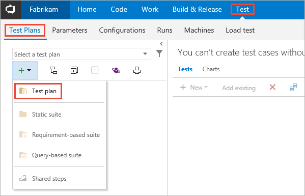
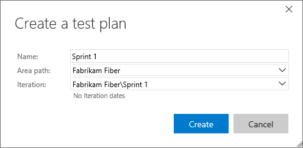
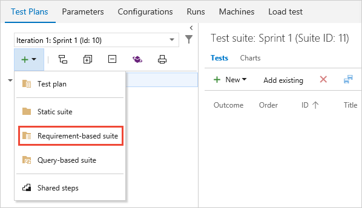
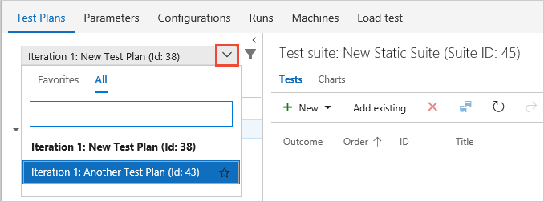

# Create a test plan and test suite

Create test plans to track manual testing 
for sprints or milestones. That way, 
you can see when the testing for a 
specific sprint or milestone is complete.

Test plans are used to group together test suites and individual test cases.
This includes static test suites, requirement-based suites, and
[query-based suites](../reference-qa.md#query-based-suites). You can add individual test cases to a test plan without creating
a test suite if you wish, but using a test suite provides a way to group
test cases for separate testing scenarios within a single test plan.

In this example, you'll learn how to:

* [Create a test plan](#testplan)
* [Add a test suite and select backlog items to test](#backlog)
* [Find a test plan](#findplan)

## Create a test plan

1. If you haven't already, 
   [sign up for Visual Studio Team Services](https://www.visualstudio.com/products/visual-studio-team-services-vs), 
   [create your team project](../../accounts/account-management.md), 
   and [create your backlog](../../work/backlogs/create-your-backlog.md). 

1. In VSTS, select your team project. 
   (If you haven't been here before, use Browse.)

   

1. Go to the **Test Plans** tab of the **Test** hub. Create a test plan for your current sprint.

   

1. Name the test plan. Check the area path and iteration. Then choose **Create*.

    

## Add a test suite and select backlog items to test

1. Now add test suites for the backlog items that need manual tests. 
   (These backlog items could be user stories, requirements, or other 
   work items based on the setup of your team project.)

    

   You use requirement-based suites to group your test cases together. 
   That way, you can track the testing status of a backlog item. 
   Each test case that you add to a requirement-based test suite is 
   automatically linked to the backlog item.

1. Add a clause to filter by the iteration path for the sprint. 
   Run the query to view the matching backlog items.

   

1. Select the backlog items that you want to test this sprint. 
   Add them as requirements to your test plan by creating test suites from them.

   

   Now you've created a requirement-based test suite for each backlog item.

## Find a test plan

* The **Test Plans** page shows a single test plan. Use the
   icon or the drop-down
  list at the top of the left column select the test plan you want to work with.

  

Test plans, suites, and test cases are stored in VSTS and TFS as special types of work items.
   
## See also

*  [Q &amp; A for manual testing](../reference-qa.md#testplans)

##  Next step

> [!div class="nextstepaction"]
> [Create manual test cases](create-test-cases.md#test-cases) 
