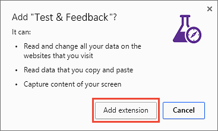
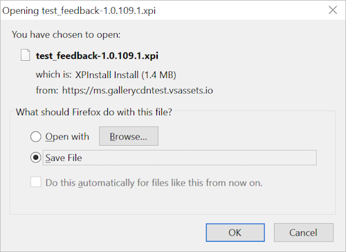
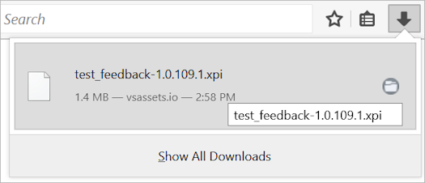
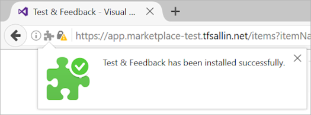
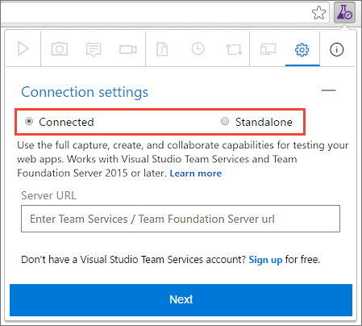

# Exploratory test and submit feedback directly from your browser

The **Test &amp; Feedback extension** (previously called the Exploratory Testing extension)
helps teams perform exploratory testing and provide feedback. 
Everyone in the team, such as developers, product owners, managers, UX or UI engineers, 
marketing teams, early adopters, and other stakeholders can use the 
extension to submit bugs or provide feedback and contribute to the 
quality of your product. 

## What is the Test &amp; Feedback extension?

The Test &amp; Feedback extension
is a simple browser-based extension you can use to test web apps 
anytime and anywhere, and is simple enough for everyone in the team to use.
It helps to improve productivity by allowing you to spend more time
finding issues, and less time filing them.

Using the extension is a simple, three step process.

 
* **Capture your findings** quickly and easily using the tools in the extension. 
  Capture notes, screenshots with annotations, and screen recordings 
  to describe your findings and highlight issues. Additionally, in 
  the background the extension automatically captures rich data such
  as user actions as an image action log, page load data,
  and system information about the browser, operating system, memory,
  and more that can serve as a starting point for debugging. 

* **Create work items** such as bugs, tasks, and test cases directly from 
  the extension. The captured findings automatically become a part of the work item. 
  Users can file a bug to report an issue with the product, or create a task that
  indicates a new work requirement. The extension can also be used to 
  create test cases for scenarios discovered during exploration. 

* **Collaborate with your team** by sharing your findings. 
  Export your session report in Standalone mode, or connect to VSTS or
  Team Foundation Server (2015 or later) for a fully integrated experience
  including exploring user stories and backlog items, simplified tracking and triaging of 
  bugs and tasks, and managing feedback requests in one place.

As users perform exploratory testing, you can
[get insights from the sessions](../insights-exploratory-testing.md) in the **Test** hub of 
VSTS or TFS. View completed exploratory sessions and derive meaningful
insights across all the sessions. Get end-to-end traceability such as a breakdown 
of the work items created, the work items explored and not explored, session owners,
and more.

<iframe width="640" height="360" src="//channel9.msdn.com/Series/Test-Tools-in-Visual-Studio/IntroducingTestFeedbackextension/player" frameborder="0" allowfullscreen="true"></iframe>

## Install the Test &amp; Feedback extension

1. Check the list of [supported browsers](../reference-qa.md#browser-support) and decide which you want to use.

1. Download and install your chosen browser, if you haven't already, then open it.

1. Go to [Visual Studio Marketplace > Test &amp; Feedback](https://marketplace.visualstudio.com/items?itemName=ms.vss-exploratorytesting-web)
   and choose **Install**.

   

1. Follow the instructions shown to install the Test &amp; Feedback extension in your browser:

   - If you are using Google Chrome, choose the **Install** link to open the 
     Google Chrome web store and follow the instructions to install the extension.

     

     

   - If you are using Mozilla Firefox 50.0 and higher, choose the **Download** link
     and save the file to a local folder on your computer. 

     

     Select and drag the downloaded file and drop it on any tab in Firefox.

     

     Choose **Install**.

     

     

>You need to install the extension or add-on only once. Afterwards your browser will
update it automatically.

##  Select an exploratory testing mode

1. Open the extension you installed in your browser by choosing the
    icon.

   
 
1. Decide if you want to use the extension in Connected or Standalone mode.

   

   **[Connected mode](../connected-mode-exploratory-testing.md)**  
   Available to all users of VSTS and TFS 2015 or later:

   - Users with **Basic** access: Full capture and create capabilities
     to submit bugs, tasks, and test cases. Includes collaboration
     capabilities such as end-to-end traceability, rich insights
     across completed exploratory sessions, simplified tracking
     and triaging for bugs and tasks, and more.
   - Users with **Stakeholder** access: Full capture and create capabilities,
     except for test cases, to submit feedback and respond to feedback
     requests from the team. 
   - Feedback experience is available only in VSTS and TFS 2017 or later.

 
   **[Standalone mode](../standalone-mode-exploratory-testing.md)**  
   Available to everyone. No connection to VSTS or TFS is required. Take notes and screenshots with
   inline annotations to capture issues. Create bugs and export
   a session report to share findings.
 
>If you have problems connecting to VSTS or TFS, you may find
the topic [TF31002: Unable to connect](https://www.visualstudio.com/en-us/docs/work/reference/error/tf31002-unable-connect-tfs) useful.

## See also

*  [Q &amp; A for manual testing](../reference-qa.md#tandfext)

## Next step

> [!div class="nextstepaction"]
> [Use the Test &amp; Feedback extension in **Connected** mode](../connected-mode-exploratory-testing.md)
