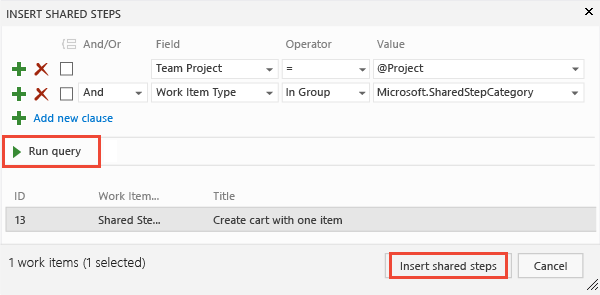
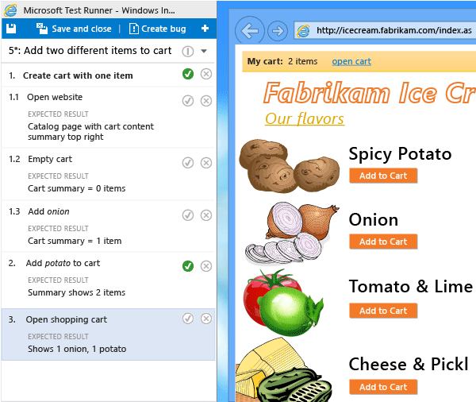

# Share steps between test cases

[!INCLUDE [version-header-vs-ts-tfs](../_shared/version-header-vs-ts-tfs.md)] 

When you [plan manual tests](../getting-started/create-a-test-plan.md) there are some sequences of steps, such as logging in, that occur in many test cases. To avoid having to enter these sequences again and again, create *shared steps*.  
  
## Create shared steps 
 
While you're editing a test case, select a sequence of steps that you want to share:  
  
  
  
The steps you selected are replaced with a link to the new shared steps work item:  
  
  
  
## Use shared steps  

Now you can use the shared steps in another test case:  
  
  
  
A TFS query opens. Run it to find the steps you want to insert:  
  
  
  
## When you run a test with shared steps  

When you [run a test](../getting-started/run-manual-tests.md), you can either mark the whole shared sequence as passed or failed, or mark each step separately:  
  
  
  
## See also

*  [FAQs for manual testing](../reference-qa.md#sharesteps)

[!INCLUDE [help-and-support-footer](../_shared/help-and-support-footer.md)] 
