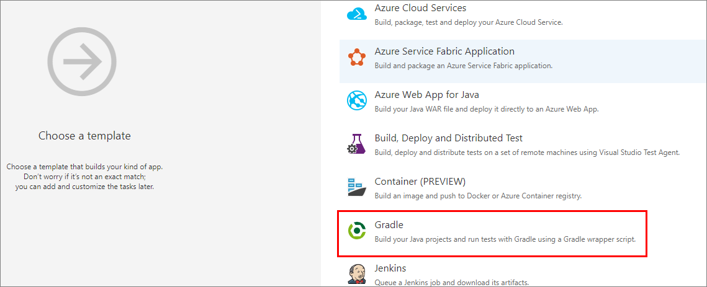

# Pull a Maven package with Gradle and build with it using VSTS

Gradle is a popular package manager for Android Java developers. Learn how to pull a Gradle package and build with it for your team project with Visual Studio Team Services (VSTS).

## Prerequisites

Before you start, [install the Gradle package management software](https://gradle.org/install/). Note that Gradle itself requires a prior installation of the Java JDK or JRE (version 7+). You
can [get the Java JDK here](http://www.oracle.com/technetwork/java/javase/downloads/index.html).

Verify that you have the Java SDK or JRE version 7 from a CLI:

```cli
java -version
```

And then install Gradle. Once it completes, confirm the installation from a CLI:

```cli
gradle -v
```

You're ready to start! This tutorial will guide you through the process of pulling a Gradle package and then building your code project with it.

> [!NOTE]
> This topic assumes you have cloned your Git repo to your local machine. If you aren't sure how to clone your repo, read [Clone a repo](/vsts/git/tutorial/clone).

## Set up authentication

First, you need a **gradle.properties** file that contains a VSTS credential token.

Navigate to `https://{yourAccount}.visualstudio.com/_details/security/tokens`, where `{yourAccount}` is the name of your VSTS account or project.

Click **Add**.


Give your new token a name and a duration. 

Select the **Packaging (read and write)** scope.


The token will be a long alphanumeric string, like "lzitaoxppojf6smpl2cxdoxybepfxfetjvtkmcpw3o6u2smgebfa". Copy this string and store it securely. [DOUGE NOTE: Example of a best practice here?]

Now, go to the `.gradle` folder under the gradle installation root directory. Typically, this is `%INSTALLPATH%\gradle\user\home\.gradle\`. In that folder, create a file titled
**gradle.properties**. 

Open the **gradle.properties** file with a UTF-8 text editor and add the following:
```
vstsMavenAccessToken=YOUR_TOKEN_HERE
```

Where *YOUR_TOKEN_HERE* is the token string you created and saved previously. Save the file when you're done.


## Pull a Gradle package into your project


Open your **build.gradle** file and confirm that the following text is present at the top of it:
```
apply plugin: 'java'
```

Now, add this code to the end of your **build.gradle** file. Use the `groupId`, `artifactId`, and `version` you supplied in the previous step.

```
dependencies { 
    compile(group: '{your-group-ID-here}', name: '{your-artifact-ID-here}', version: '{your-version-number-here}')  
} 
```   
For example: `compile(group: 'siteOps', name: 'odata-wrappers', version: '1.0.0.0')

This tells `gradle build` to include the package you created prior, which is effectively named `orgId:artifactId`, and that it should be applied to the app named in the dependencies. 

To test this, create a simple Java code file and build it with Gradle. You can use this code to test:

```java
package 

public class HelloWorld { 
    public static void main(String[] args) { 
        System.out.println("Hello, world!"); 
    } 
} 
```

Build the code by running Gradle from a CLI:

```cli
gradle build
```

If the build is successful, you will see `BUILD SUCCESSFUL` returned when it completes.


## Set up Team Build to use Gradle packages

Open a CLI and run the following command:

```cli
gradle wrapper
```

The gradle wrapper is created in the directory where you ran the above command. The wrapper's file name is **gradlew**. Do not rename this file.

`git push` an update that contains the wrapper (gradlew) from your local (clone) repo to origin. Team Build requires this file on the remote repo for your project.

Go to the **Build and Release** hub for your project, and then select **Builds**.

Select the **+ New Definition** button. Scroll down and select the **Gradle** template.



Select **Apply** to start configuring the Build task agent to use your Gradle wrapper.

Now, select the **gradlew build** process. You can use the default settings to start.


Here, you can configure various Gradle tasks to run on the agent.  Once you've configured the task agent, click **Save & queue** from the top menu and start building with your Gradle wrapper. You're done!


