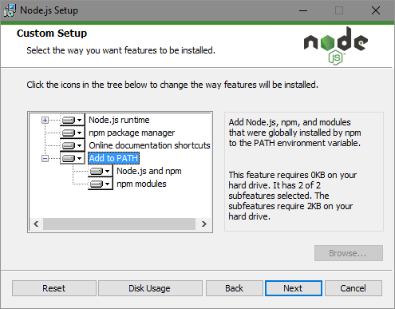

# Set up your client's npmrc

[!INCLUDE ]

All Package Management feeds require authentication, so you'll need to store credentials for the feed before you can install or publish packages. npm uses [`.npmrc` configuration files](https://docs.npmjs.com/files/npmrc) to store feed URLs and credentials.

## Where are my `.npmrc` files?

VSTS recommends using two `.npmrc` files: 

1. One at the root of your project that contains *configuration* that's shared with the whole team.
2. One in your user profile folder (`$home`, `~`, etc. depending on your shell) that contains *credentials* and never leaves your machine.

This enables you to share your configuration with the whole team while keeping your credentials secure. 

## Getting credentials
- For **Windows** users on **VSTS**, the [vsts-npm-auth package](https://www.npmjs.com/package/vsts-npm-auth) can help you acquire and manage credentials. When you execute `vsts-npm-auth`, it reads your configured package source from the provided `.npmrc`, and writes credentials to your user profile `.npmrc`.
- For **Mac, Linux, and Windows Bash Shell** users on **VSTS**, and all **Team Foundation Server** users, the *Connect to feed* dialog will generate an appropriately-formatted token that you can place into your `.npmrc` file.

[!INCLUDE ]

## Troubleshooting vsts-npm-auth

If you receive an error like:

* Command Prompt: `'vsts-npm-auth' is not recognized as an internal or external command, operable program or batch file.`
* PowerShell: `vsts-npm-auth : The term 'vsts-npm-auth' is not recognized as the name of a cmdlet, function, script file, or operable program.`

then it's likely that the npm modules folder is not in your path. 

To fix this, re-run Node.js setup and ensure the `Add to PATH` option and its child options are selected for installation.

Alternatively, you can edit the PATH variable to add `%APPDATA%\npm` (Command Prompt) or `$env:APPDATA\npm` (PowerShell).