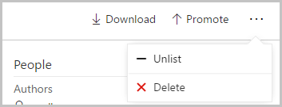

# Unlist or delete a NuGet package

[!INCLUDE [](../_shared/availability-nuget.md)]

There are two options available to remove a version of a NuGet package from a feed.

1. **Unlist:** unlisting a version of a package modifies how the package appears in NuGet clients (see the [NuGet docs](https://docs.microsoft.com/en-us/nuget/policies/deleting-packages) for a full description of how unlist works).
Unlisting a version can help you prevent new usage of it without breaking dependent projects and builds.
2. **Delete:** Deleting a version of a package makes it permanently unavailable for install or restore.

Unlist and delete both respect [feed immutability](../feeds/immutability.md). Once you publish a particular version of a package to a feed, that version number is permanently reserved. 
You cannot upload a newer revision package with that same version number, or delete it and upload a new package at the same version.

## Unlisting or deleting a package in VSTS

You must be a **contributor** to unlist and an **owner** to delete.
To unlist or delete a version of a package, choose the package from the **Packages** menu, and select the appropriate option from the menu under the ellipses. 



## Unlisting a package using NuGet.exe
First, get the tools (make sure you're using NuGet 3.5 or later) and your feed URL:

[!INCLUDE [](../_shared/nuget-publish-endpoint.md)]

Then, run

```no-highlight
nuget.exe delete {your_package_id} {version} -Source {feed URL} -ApiKey key
```

Currently, NuGet.exe can only **unlist** packages; Team Services and TFS interpret `nuget.exe delete` as an unlist operation to be consistent with NuGet.org. To **delete** a package, you must use either the REST APIs or the web interface. 