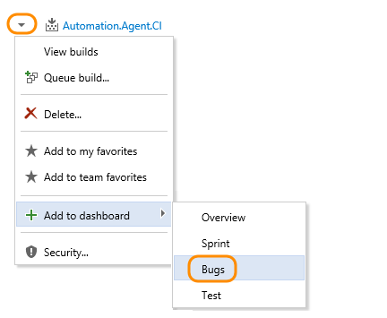
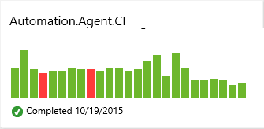
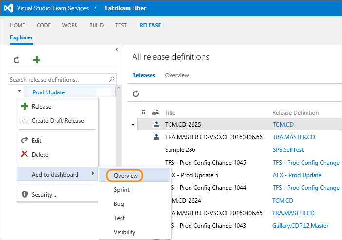
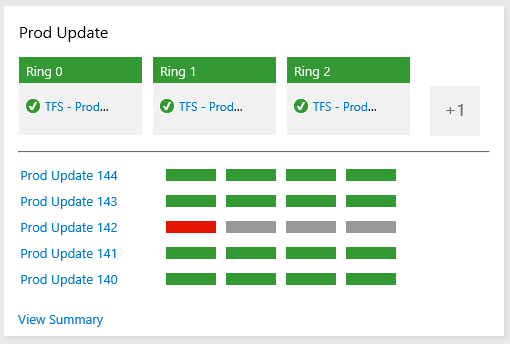
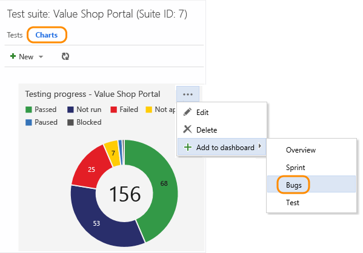
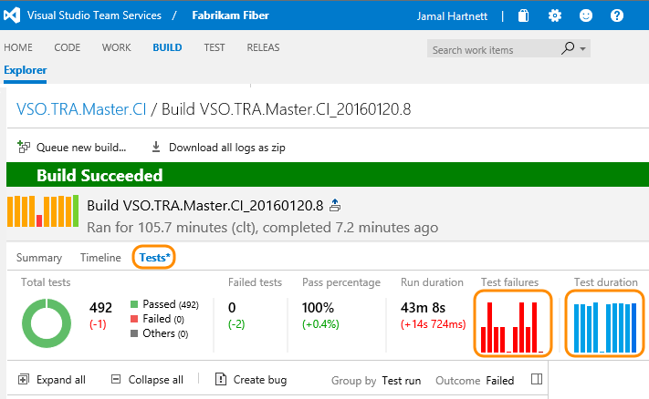
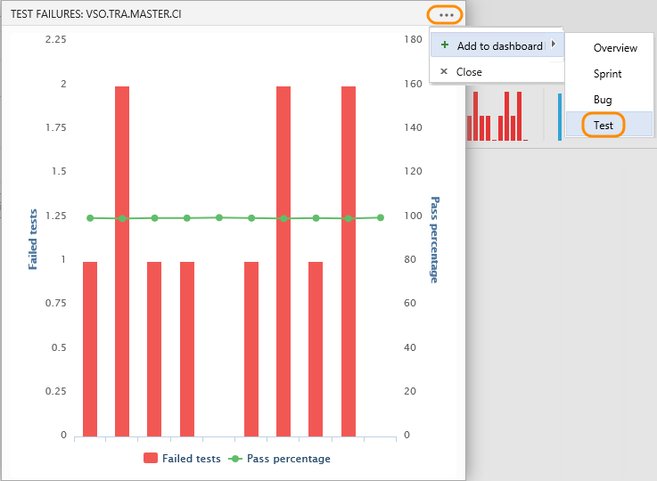
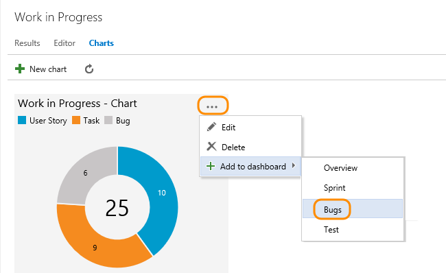

# Add charts to a dashboard

<b>VSTS | TFS 2018 | TFS 2017 | TFS 2015.1-2015.3  </b>  

All charts listed in the following table are available from VSTS and TFS 2017.2 and later versions. You can add them to a dashboard from the widget catalog or directly from the Build, Release, Test, or Work hubs. For TFS 2015 and earlier versions, some charts require you to add them to a team dashboard from their respective hub. 

<table >
<thead align="center">
<tr >
<th align="center" width="30%">Chart </th>
<th align="center" width="18%">TFS 2015 </th>
<th align="center" width="18%">TFS 2015.1</th>
<th align="center" width="18%">TFS 2015.2</th>
<th align="center" width="18%">TFS 2017.1</th>
</tr>
</thead>
<tbody align="center"  >

<tr>
<td align="left">[Build history chart](#build-history)  1</td>
<td>  </td>
<td></td>
<td></td>
<td></td>
</tr>

<tr>
<td align="left">[Release summary chart](#release-summary)  1</td>
<td>  </td>
<td>  </td>
<td>  </td>
<td></td>
</tr>

<tr>
<td align="left">[Test status or result chart](#test-result)  2 </td>
<td></td>
<td></td>
<td></td>
<td></td>
</tr>
<tr>
<td align="left">[Test quality trend chart](#test-quality) 1  </td>
<td>  </td>
<td>  </td>
<td></td>
<td></td>
</tr>
<tr>
<td align="left">[Work item query](#work-item-query)  2</td>
<td></td>
<td></td>
<td></td>
<td></td>
</tr>
<tr>
<td align="left">[Work item query chart](#work-item-query)  2</td>
<td></td>
<td></td>
<td></td>
<td></td>
</tr>

</tbody>
</table>

1. These charts are configured by the system. You can't edit them. 
2. These charts are user-configurable.     
 

>[!NOTE]  
>**Required permissions:** You must be a team admin to add a chart to a team dashboard or homepage, or be [granted permissions to manage a dashboard](dashboards.md#manage). Or, if you're a member of the Project Administrators group, you can add charts to any team's dashboards or home page. 
 

## Add a build history chart

>[!NOTE]  
><b>Feature availability: </b> This chart is supported from VSTS and TFS 2015.1 and later versions. With VSTS and later versions of TFS, you can also add it to a team dashboard from the [widget catalog](widget-catalog.md#build-history-widget).  

Each time a build is run, it logs information about the build, including the run time, errors and warnings, and whether it successfully completed or failed.   

1. Select your [team context](../work/how-to/switch-team-context-work.md?toc=/vsts/report/toc.json&bc=/vsts/report/breadcrumb/toc.json) and then open the Build hub to add a build history chart to a team dashboard.   

	  

	If you aren't a team administrator, [get added as one](../work/scale/add-team-administrator.md). The Add to dashboard menu selection is disabled when you don't have permissions to add it to the dashboards of the selected team context.  

2. Build summary charts look like this:  

	  

	Hover over a bar to view build information and run time. Click a bar to go to the build summary page.   

## Add a release summary chart

>[!NOTE]  
><b>Feature availability: </b> This chart is supported from VSTS and TFS 2017.1 and later versions. You can also add it to a team dashboard from the [widget catalog](widget-catalog.md#release-definition-widget).  

Each time a [release is deployed](../build-release/actions/view-manage-releases.md#add-widget), it logs information about the release to each of its environments. You can add a release tile to your team dashboard to monitor release progress and gain quick access to each release. 

1. Select your [team context](../work/how-to/switch-team-context-work.md?toc=/vsts/report/toc.json&bc=/vsts/report/breadcrumb/toc.json) and then open the Release hub to add a release definition chart to a team dashboard.   

	  

	If you aren't a team administrator, [get added as one](../work/scale/add-team-administrator.md). The Add to dashboard menu selection is disabled when you don't have permissions to add it to the dashboards of the selected team context.  

2. Release definition charts show the success (green), in progress (blue), cancellation (red), or non-deployment (grey) to an environment for the current and last four releases:  

	  

  
## Add a test status or result chart  

>[!NOTE]  
><b>Feature availability: </b> This feature is supported from VSTS and TFS 2015. From VSTS, you can add a [Chart for test plans widget](widget-catalog.md#chart-test-plan-widget) to a dashboard. 

As you create and run tests, you can track your status by defining [lightweight charts of test plans and test results](../manual-test/getting-started/track-test-status.md).  

1. Select your [team context](../work/how-to/switch-team-context-work.md?toc=/vsts/report/toc.json&bc=/vsts/report/breadcrumb/toc.json), make sure you're a [team admin](../work/scale/add-team-administrator.md), and if you haven't yet created the dashboard, [do that now](dashboards.md).  

2. Open the Test hub charts page and select the dashboard to add the test chart to.  

	  

  
## Add a test quality trend chart   

>[!NOTE]  
><b>Feature availability: </b> This chart is supported from VSTS and TFS 2015.2 or later versions. From VSTS and TFS 2017 and later versions, you can add a [test result trend chart widget](widget-catalog.md#test-results-widget) to a dashboard. 

You can add trends to the dashboard of the failures and duration of those [tests that were run as part of a build](../build-release/test/getting-started-with-continuous-testing.md).  

1. Select your [team context](../work/how-to/switch-team-context-work.md?toc=/vsts/report/toc.json&bc=/vsts/report/breadcrumb/toc.json), make sure you're a [team admin](../work/scale/add-team-administrator.md), and if you haven't yet created the dashboard, [do that now](dashboards.md).  

2. Open a build summary for a build definition to which you've added tests, open the Tests page, and click the bar chart for either Test failures or Test duration.    

	  

3. Click the  Actions menu and choose the dashboard to add the chart to.  

	  

	Learn more about [reviewing automated test results after a build](../build-release/test/review-continuous-test-results-after-build.md).  

## Add a work item query or chart  

>[!NOTE]  
><b>Feature availability: </b> This feature is supported from VSTS or TFS 2015. With VSTS, you can add a [work item query chart widget](widget-catalog.md#build-history-widget) to a team dashboard.  

You add work item queries and charts to a dashboard from the Queries page. Queries and charts must be associated with queries under the Shared queries folder.  

1. First, make sure you have selected your team context. Only those dashboards created for a team appear in the context menu for each query or chart. [Switch team context](../work/how-to/switch-team-context-work.md?toc=/vsts/report/toc.json&bc=/vsts/report/breadcrumb/toc.json) as needed.  

2. If you aren't a team administrator, [get added as one](../work/scale/add-team-administrator.md). Only team and project admins can add and customize team dashboards.  

3. If you haven't yet created the dashboard, [do that now](dashboards.md).  

4. From the charts Actions menu, choose the team dashboard.  

	  

	You can only add charts associated with shared queries. Charts associated with queries under My Queries folder won't display the add to dashboard option.  

## Add a markdown file to a dashboard  
 
>[!NOTE]  
>**Feature availability:** Adding a Markdown file to a team dashboard is available from VSTS and the web portal for TFS 2015.3 and later versions.

Open the Markdown file defined in your repository and make sure you are in your team context. 

Click **Add to dashboard**, and then choose the team dashboard to add the markdown file to. As you update the Markdown file, changes will automatically appear on the dashboard upon refresh. See [Dashboards](../Report/dashboards.md) for more info.  

## Markdown widgets   

Use these widgets to support your team and stakeholders by adding information such as:  
- Team goals  
- Provide links to team backlogs or boards, metrics, or other items located in a network share such as a OneNote, SharePoint site or wiki pages   
- Important dates or target deadlines  

Here's an example:  

 

>[!NOTE]  
>Links to documents on file shares using `file://` are not supported on VSTS or TFS 2017.1 and later versions. This restriction has been implemented for security purposes.
>
>For information on how to specify relative links from a Welcome page or Markdown widget, see [Source control relative links](../reference/markdown-guidance.md#relative-links). 

To edit a markdown widget, you must be a team admin or a member of the Project Administrators group. To be added as a team admin, go [here](../work/scale/add-team-administrator.md). 

## System-generated work tracking charts 

There are a number of system-generated charts that you can access from the web portal, but can't add to a dashboard. However, you may find a comparable widget listed in the [widget catalog](widget-catalog.md) that tracks the same or similar data which you can add to the dashboard. These include: 

- [Team velocity](./guidance/team-velocity.md)
- [Sprint burndown chart](../work/scrum/sprint-burndown.md) (see [Sprint burndown widget](widget-catalog.md#sprint-burndown-widget))
- [Cumulative flow](guidance/cumulative-flow.md) (see [CFD widget](widget-catalog.md#cfd-widget))

