# Add a report server

**TFS 2017 | TFS 2015 | TFS 2013**  

>[!IMPORTANT]
>**Feature availability**: You can only add a report server to an on-premises TFS.  If you're using VSTS, adding a report server isn't a supported option, instead, you can use [PowerBI](../powerbi/overview.md).

This is the first task in the four-task sequence to add reports to a team project. If you have already installed SQL Reporting Services and Analysis Server, then go to step 2 to upload reports.

[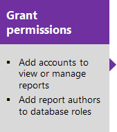](grant-permissions-to-reports.md) 

On-premises installations of TFS can include reports to help you manage your software development projects. However, you need a report server as part of your deployment in order to use them. If you don't have one, you can add SQL Server Reporting Services to your deployment. 

>[!NOTE]  
>If you installed TFS on a client operating system, such as Windows 7, you can't add reporting as described here, because it isn't supported on client operating systems. 

##What do I need to know before adding a report server?  
<!-- BEGINSECTION class="md-qanda" -->

####Q: What kind of report server can I add?

**A:** You'll need to add SQL Server Reporting Services to provide a report server for TFS. This can be added to the SQL Server instance that is supporting TFS, or to a different instance.

####Q: What permissions do I need?

**A:** You need to be a member of the local administrators group on the server, the Team Foundation Administrators group in TFS, and the sysadmin group in SQL Server, or have the equivalent permissions. If you don't have them, [get those permissions now](../../accounts/add-administrator-tfs.md).

####Q: Can I add reporting if TFS is installed on a client operating system?

**A:** No. You can't add reporting and analysis services on a client operating system. Your choices aren't easy. If you still want to add reporting, either [move the team project collection](../../tfs-server/admin/move-project-collection.md) to a deployment of TFS that supports reporting, or [restore your entire deployment to a different server](../../tfs-server/admin/backup/tut-single-svr-home.md) that is running a server operating system and a version of SQL Server that supports reporting.

####Q: How do I find out if I already have reporting available for TFS?

**A:** Look in the administration console for Team Foundation Server. If you see a reporting node and it shows that reporting is configured and enabled, it's already there.  

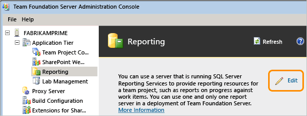  

Jump to the bottom of this topic to confirm that reports are available for the team project collection, and then move on to [Upload reports to a team project](upload-reports.md).

####Q: Do I need to back up my data first?

**A:** You should have a recent backup available. If you don't, you can [make a backup using Scheduled Backups](../../tfs-server/admin/backup/config-backup-sched-plan.md).

<!-- ENDSECTION -->

## Verify your options and upgrade if necessary

1.	Find out what version and edition of SQL Server you haveby following the instructions provided in [Validate a SQL Server Installation](https://technet.microsoft.com/library/bb510455.aspx). 
	If the answer is SQL Server Express, keep following these steps. If it's any other edition, but you don't see any version and edition information about reporting or analysis services, jump ahead to [Add Reporting Services](#AddRSandAS). If you do see information about these services, then your SQL Server already has them installed, and you can jump ahead to [Add Reporting to TFS](#AddRStoTFS).  

2.	If your deployment is using SQL Server Express, [upgrade to a different edition](https://msdn.microsoft.com/library/cc707783.aspx). For more information about the editions that support reporting in TFS, see [Requirements and compatibility, SQL Server](../../accounts/requirements.md#sql-server). 

##Add Reporting Services and Analysis Services to SQL Server 
After you confirm that you have an edition of SQL Server that supports reporting (or you upgrade to one), add the reporting and analysis services features if they aren't already configured.

1.	Open the SQL Server Installation Center to add features to an existing installation.  

	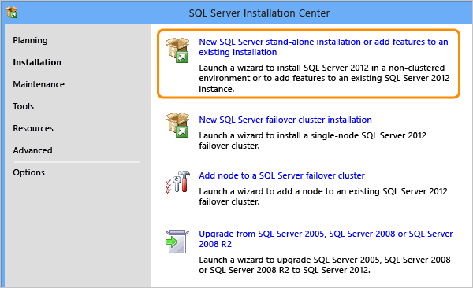

	You might have to restart your computer during this process, particularly if you've just finished upgrading from SQL Server Express.  

2.	Once your server has passed all the setup rules checks, pick the instance to add features to.   

	**Tip:** If you upgraded from SQL Server Express, you'll have a named instance called SQLEXPRESS.  

	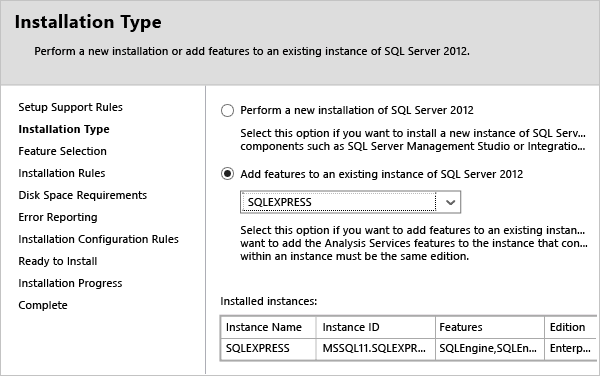  

3.	In **Feature Selection**, add these features:
	*	Analysis Services
	*	Reporting Services - Native
	*	Management Tools – Complete (not pictured)

	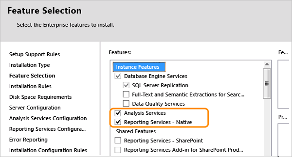

4.	Accept the defaults for service accounts in **Server Configuration**, unless your deployment has specific service account needs. Make sure all services are set to start automatically.  

	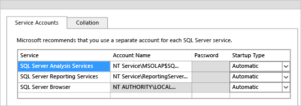  

5.	Add your user account in **Analysis Services Configuration**.  

6.	Choose **Install and Configure** for reporting services if you can; if not, choose **Install Only**.  

	If you're adding features after upgrading from SQL Server Express, Install Only might be the only option available.  

	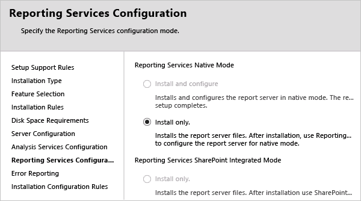  

7. Finish the wizard, including any server restarts that might be required.

If you had to choose **Install Only** when you added reporting, you'll need to open Reporting Services Configuration Manager and do some additional configuration. If not, jump ahead to [Add Reporting to TFS](#add_reporting_to_tfs).

##Configure Reporting Services Manually  

1.	Open Reporting Services Configuration Manager and connect to your report server.  

	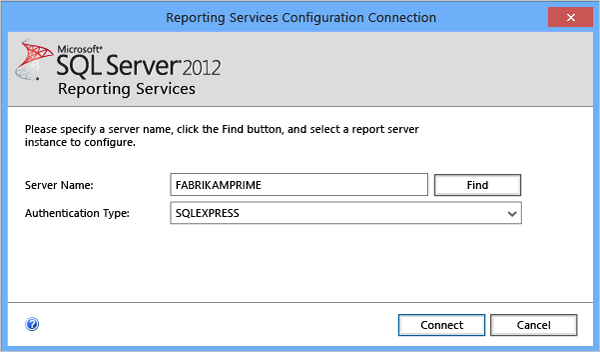  

2.	Once you've connected, make sure the service is started, then go to the **Web Service URL** page and apply all the defaults.  

3.	Now you'll need to create a database for reporting. On the **Report Server Database** page, the **Change Database** option will open the Report Server Database Configuration Wizard assist you in creating that database.  

 	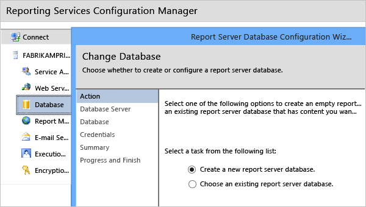  

4.	When you specify the database server connection, include the instance name as well as the server name, separated by a slash (\).  

	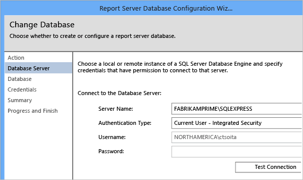  
	If you aren't using a named instance, you can just provide the server name.  

5.	Accept the default values on the rest of the pages of the wizard and wait for it to finish. This can take a few minutes.  

6.	Accept all the defaults on the **Report Manager URL** page.  

	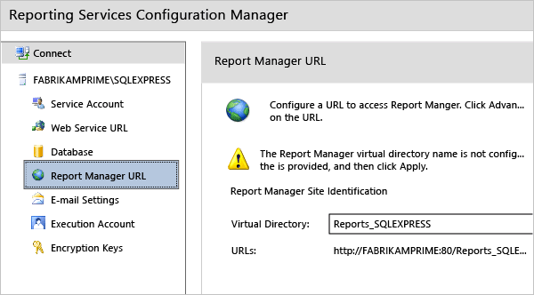  

You've now fully configured reporting on the SQL Server instance that supports TFS. It's time to add the reporting features to TFS!  

  

## Add Reporting to TFS  

You'll need to add reporting in two places: to TFS itself, and then to your team project collection.

1.	Open the administration console for TFS and go to the **Reporting** node to start the configuration process.   

	  

2.	Select the **Use Reporting** check box. On the **Warehouse** tab, provide the name of the report server and instance for the warehouse database. Use the default name for the database (TFS_Warehouse), and test the connection.  

	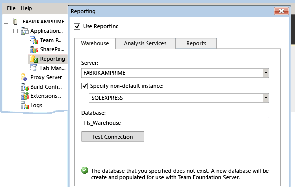  

	**Tip:** Because you're configuring reporting for the first time, the databases don't exist yet. They will be created when you finish the configuration process.

3. Provide the same server and instance information for **Analysis Services**, but use the default name for the analysis database (TFS_Analysis). Provide an account name and password for a data sources account, a special account you've created just for this purpose as described in [Service accounts and dependencies in TFS](../../tfs-server/admin/service-accounts-dependencies-tfs.md). 

	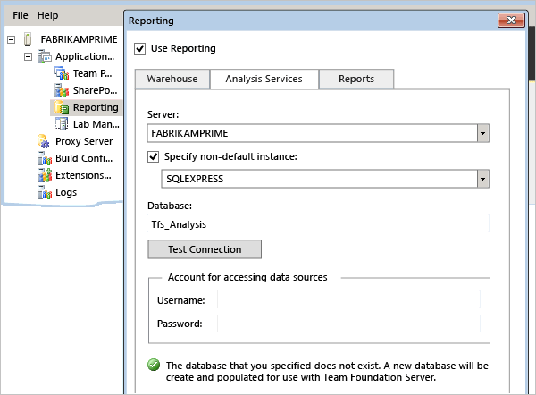  

	**Tip:** Test the connection before continuing.  

4.	For **Reports**, provide the server name and the instance name in **Server**, separated by a slash.  

	Use **Populate URLs** to automatically populate the next two boxes. Add the same data sources account information you provided on the previous tab.  

	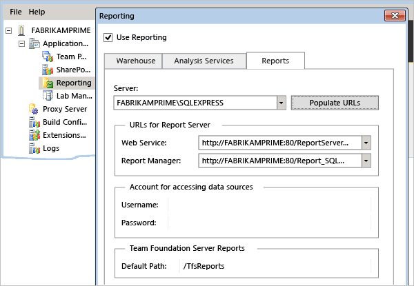  
	Once you finish, databases will be created, and the warehouse will start building.  

	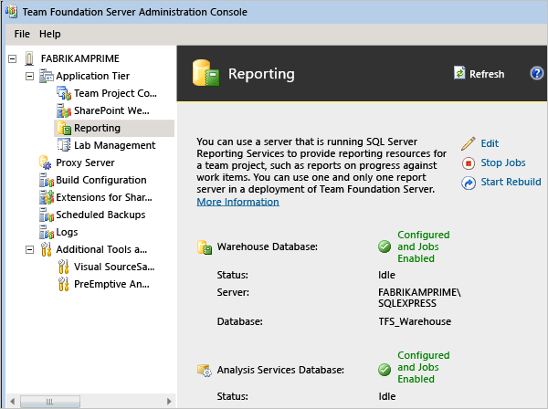  

5.	Now add the report server to the team project collection. Edit the information in **Reports Folder**.  

	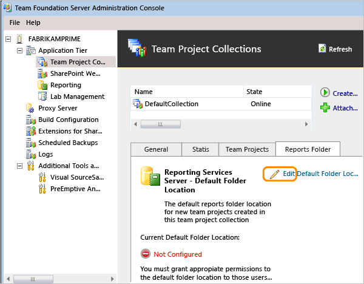  

	**Tip:** If you don't see the **Reports Folder** tab, you might need to refresh or restart the administration console.  
 
6.	Unless you have reasons otherwise, use the example provided, and make sure you include the collection name.  

	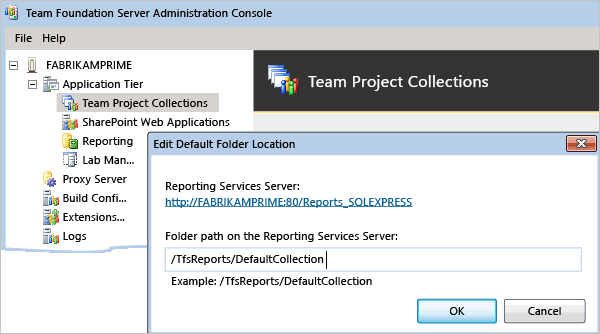

Now that you've added reporting to the server and to the team project collection, you're ready to start adding reports to your projects.

##Try this next

[Upload reports to a team project](upload-reports.md) 

##Related content
You can learn more about installing and configuring SQL Server for use with on-premises TFS from these topics:  

*  [Supported versions and editions](../../accounts/requirements.md#sql-server)  
*  [Working with named instances](../../tfs-server/install/sql-server/install-sql-server.md)  
*  [Using SQL Server 2012 AlwaysOn](../../tfs-server/install/sql-server/use-always-on-groups.md)  
*  [Understanding how TFS, SQL Server, and Reporting all work together](../../tfs-server/architecture/sql-server-databases.md)   

###Set permissions

- [Set administrator permissions](../../accounts/add-administrator-tfs.md)  

###Change the data reader account  

- [Change the service account or password for SQL Server Reporting Services](../../tfs-server/admin/change-service-account-or-password-sql-reporting.md)
- [Service accounts and dependencies in Team Foundation Server](../../tfs-server/admin/service-accounts-dependencies-tfs.md) 

