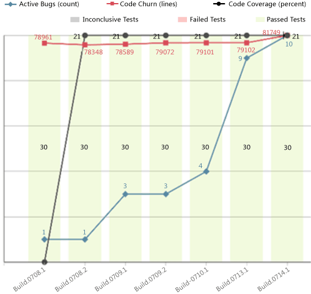
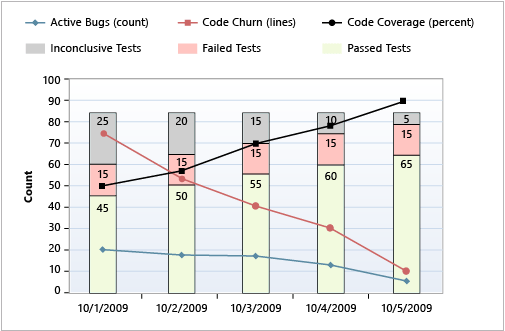
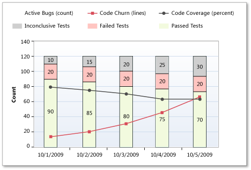
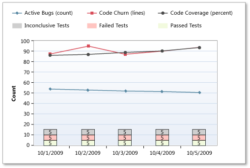
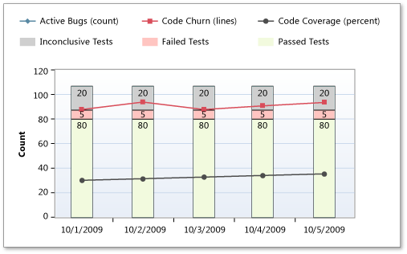
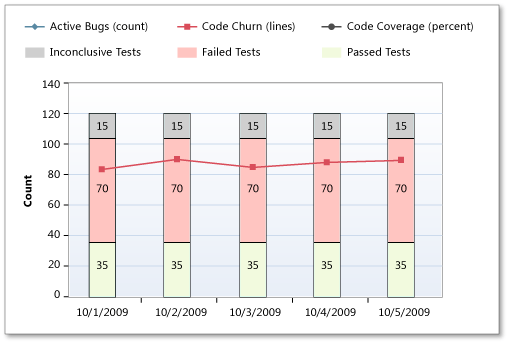
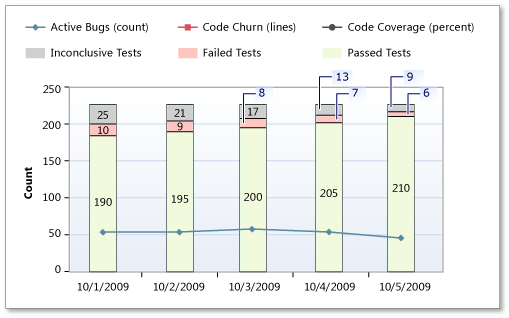

# Build Quality Indicators Report

[!INCLUDE [temp](../_shared/tfs-header-17-15.md)]

The Build Quality Indicators report shows test coverage, code churn, and bug counts for a specified build definition. You can use this report to help determine how close portions of the code are to release quality.  
  
 Ideally, test rates, bugs, and code churn would all produce the same picture, but they often do not. When you find a discrepancy, you can use the Bug Quality Indicators report to examine the details of a specific build and data series. Because this report combines test results, code coverage from testing, code churn, and bugs, you can view many perspectives at the same time.  
  
 For information about how to access, refresh, or manage reports, see [Reporting Services Reports](reporting-services-reports.md).  
  
> [!NOTE]
>  This report requires that the team project collection that contains your team project was provisioned with SQL Server Reporting Services. This report is not available if  **Reports** does not appear when you open Team Explorer and expand your team project node.  
  
**You can use this report to answer the following questions**:   -   What is the quality of the software? -   How often are tests passing, and how much of the code is being tested? -   Based on the code and test metrics, is the team likely to meet target goals? 
  
 **Required Permissions**  
  
 To view the report, you must be assigned or belong to a group that has been assigned the **Browser** role in Reporting Services. For more information, see [Add users to team projects](../../setup-admin/add-users.md).  
  
##   Data in the Report  
 The data that appears in the Build Quality Indicators report is derived from the data warehouse. The X-axis lists the specific builds that the report includes, based on the filters that you have set for the platform, configuration, and build definition.  
  
 Each vertical bar represents a set of data that was derived from one or more builds. In the code size variant of the report, each vertical bar's length represents the size of the checked in code base. The bars are scaled so that the largest figure fits into the height of the chart. Manual tests can be run any time after the build, and they are associated with that build. Tests that have not been run yet are counted as "inconclusive."  
  
 The following illustration displays a sample Build Qualities Indicators report.  
  
   
  
 The following table describes the information that appears for each quality indicator in the report:  
  
|Quality indicator|Description|  
|-----------------------|-----------------|  
|**Active Bugs (count)**|Line chart that depicts the number of bugs that were active at the time of the build. **Note:**  Bugs are not explicitly associated with builds. Some of the bugs counted might not affect the builds that appear in the chart. You can use the Area parameter to filter bugs by product area. This technique might show bugs that are most likely to affect the builds in the report.|  
|**Code Churn (lines)**|Line chart that depicts the number of lines of code that the team added, removed, and changed in the checkins before the build. The code churn is calculated by determining the number of lines of code that have been added, deleted, or modified to the build divided by the total lines in the build.|  
|**Code Coverage (percent)**|Line chart that depicts the percentage of code that the tests cover.|  
|**Inconclusive Tests**|Gray portion of the stacked bar chart, which indicates the number of tests that did not succeed or were paused. If the build did not succeed, the tests are either not counted or counted as inconclusive.|  
|**Failed Tests**|Red portion of the stacked bar chart, which indicates the number of tests that failed for the build.|  
|**Passed Tests**|Green portion of the stacked bar chart, which indicates the number of tests that passed for the build.|  
  
> [!NOTE]
>  For more information about the meaning of failing and passing tests results, see [Test Plan Progress](test-plan-progress-report.md).  
  
 You can filter the report in the following ways:  
  
-   Change the range of the X-axis by specifying the number of builds and specifying the end date for the report. The date of the first build shown will depend on the frequency of builds.  
  
-   Filter the set of builds that the report shows by specifying the platform, configuration, and build definition to include in the report. Set the parameters in that sequence because the set of available values for build definition depends on the platform and configuration.  
  
-   Filter the bugs that are counted in the report by specifying the product areas to include. This filter does not affect the set of builds that appear on the X-axis, the code churn, code coverage, or test results.  
  
 For more information, see [Filtering the Report](#Changing) later in this topic.  
  
### Required Test and Build Management Activities  
 For the Build Quality Indicators report to be useful and depict all the quality indicators that it can display, team members must perform the following activities to manage tests and builds:  
  
-   **Configure a build system**. To use Team Foundation Build, you must set up a build system.  
  
     For more information, see [Build and Release agents](../../build-release/concepts/agents/agents.md). 
  
-   **Create build definitions**. You can create several build definitions, each of which can be run to produce code for a different platform. Also, you can run each build for a different configuration.  
  
     For more information, see [Get started with CI/CD](../../build-release/get-started/ci-cd-part-1.md).
  
-   **Define tests to run automatically as part of the build**. As part of the build definition, you can define tests to run as part of the build or to fail if the tests fail.  
  
     For more information, see [Set up continuous testing for your builds](../../test/continuous-testing/set-up-continuous-testing-builds.md).
  
-   **Configure tests to gather code coverage data**. For code coverage data to appear in the report, team members must instrument tests to gather that data.  
  
-   **Run builds regularly**. You can run builds at set intervals or after every check-in. You can create regular builds when you use the schedule trigger.  
  
     For more information, see [Build triggers](../../build-release/define/triggers.md).
  
    > [!NOTE]
    >  Although a team member can manually rate a build by using Build Explorer, this rating is not reflected in the Build Quality Indicators report. The build rating appears in the Build Summary report. For more information, see [Rate the quality of a completed build](https://msdn.microsoft.com/library/ms181734.aspx) and [Build Summary](build-summary-report.md).  
  
##   Changing the Number of Builds in the Report  
 The display of the Build Quality Indicators report will vary significantly based on the number of builds that the report includes and other filters that you apply to the report. You can focus the report on a specific range of builds by changing the number of builds that appear in the report.  
  
#### To set the number of builds that are represented in the report  
  
1.  In **Number of Builds**, type the number to include.  
  
2.  Next to **End (Date)**, click the calendar icon, and then click the date that corresponds to the last day that builds were run that you want to include in the report.  
  
3.  Click **View Report**.  
  
##   Interpreting the Report  
 You can review the report to find answers to these questions for any specific build definition:  
  
-   What is the quality of the software?  
  
-   Is the team testing enough of our code?  
  
-   Are the tests passing?  
  
-   Is the team is likely to finish based on the code and test metrics?  
  
-   How often are tests passing, and how much of the code is being tested?  
  
    > [!NOTE]
    >  The ratio of colored to grey segments reflects the fraction of the code that tests cover, but the proportions within the colored segments only approximately reflect the fractions of code that passes or fails tests. This ambiguity is because the fraction of green within the colored segment actually represents the number of tests that pass. A single error in one part of the code could cause many tests to fail, or a single failure might represent an extensive error in the design that has consequences throughout the code base.  
  
### Healthy Version of Report  
 A healthy Build Quality Indicators report will show the following indicators:  
  
-   Most tests are passing (large areas of green), and few tests are failing (small amounts of red).  
  
-   The percentage of red is less than 20-30 percent.  
  
 As the following illustration shows, code coverage and test pass rates are high and increasing over time. Code churn, active bugs, inconclusive tests, and failed tests are all low and decreasing.  
  
   
  
### Unhealthy Versions of the Build Quality Indicators Report  
 An unhealthy version of the Build Quality Indicators report shows one or more of the following indicators. You might want to investigate the cause according to the following guidance.  
  
-   **Less code coverage and more code churn**. The following illustration shows a decrease in code coverage and an increase in code churn. This data is a clear warning that new code is being checked in without corresponding unit tests to cover it.  
  
       
  
-   **Low rate of tests being run**. The following illustration shows a low rate of tests being run. This data might indicate that the team is not performing enough testing. This blockage could indicate lack of resources, or testers might be doing something else, such as writing test automation instead of testing the current functionality. In either case, resource balancing might be warranted.  
  
       
  
-   **High code churn, low rate of code coverage**. High code churn suggests that bugs will be introduced as side effects of the changes. In a perfectly refactored project, you can see code churn with no change in code coverage or test pass rates. Otherwise, high code churn might indicate decreased coverage and the need to rewrite tests.  
  
     The following illustration shows a high rate of code churn and a low rate of code coverage from testing, even though test pass rates remain high. This data indicates that tests that are being run are not exercising the new code.  
  
       
  
-   **High rate of tests failing**. The following illustration shows that many tests are being run with reasonable code coverage, but the tests are failing. This data might indicate loose development practices, or, in early iterations, the tests might be too harsh for this stage of the product.  
  
       
  
     Failing tests should be addressed as soon as possible. If fixing the code is not practical, the failing tests should be temporarily disabled, and a bug should be logged. Although it is sometimes acceptable to treat code analysis faults with less urgency early in the project, you should not let the red sections get too large.  
  
-   **High rate of tests passing and high active bug rate**. The following illustration shows a high test pass rate but still a large incoming bug rate. This situation can occur for several reasons. Tests might not be sufficiently rigorous for this stage of the product.  
  
       
  
     In early iterations, simple tests are good, but as the product matures, tests should exercise broader scenarios and integrations. Tests might be stale, or they might be testing the wrong functionality. It might be time to switch test techniques.  
  
-   **Test pass rates increasing and no increase in code coverage**. Ordinarily, as more tests are run, more code should be covered. On the other hand, if test execution and test pass rates increase without a corresponding increase in code coverage, the incremental tests might be redundant.  
  
-   **Active bug count is increasing, but test failures are not increasing**. If the active bug count is increasing and your tests are not showing corresponding failures, your tests are probably not testing the same functionality that the bugs are reporting.  
  
-   **Active bug count is decreasing, but test passes are not increasing**. If the active bug count is decreasing and test pass rates are not increasing, you might be at risk for an increasing reactivation rate.  
  
-   **Large areas of gray**. Gray segments signify code that was not built or tested within the given build. This data appears only in a periodic report where one or more of the specified builds did not occur within the period.  
  
##   Filtering the Report  
 You can filter the Build Quality Indicators report in the following ways:  
  
-   Change the time interval by specifying the number of builds and specifying the end date for the report.  
  
-   Filter the set of builds that are represented in the report by specifying the platform, configuration, and build definition to include in the report.  
  
    > [!NOTE]
    >  You can configure build definitions to run no tests, some tests, or all tests. The report will vary greatly based on the configuration of the build definitions.  
  
-   Filter the bugs that are counted in the report by specifying the product areas to include.  
  
 The following illustration shows the available filters:  
  
   
  
 Apply the filters in the sequence that the following procedure specifies. The options that are available with some filters depend on the filters that you previously set.  
  
#### To filter the builds that appear in the report  
  
1.  In **Number of Builds**, type the number to include.  
  
2.  Next to **End Date**, click the calendar icon, and then click the last date for builds to include.  
  
3.  In the **Platform** list, select the check box of each platform to include.  
  
4.  In the **Configuration** list, select the check box of each configuration to include.  
  
5.  In the **Build Definition** list, select the check box of each build definition to include.  
  
6.  Click **View Report**.  
  
#### To filter the bug counts that are displayed in the report  
  
1.  In the **Area** list, select the check box of each test result to include.  
  
     This step filters the report based on the hierarchy of test results.  
  
2.  Click **View Report**.  
  
## Related notes 
 [Reporting Services Reports](reporting-services-reports.md)