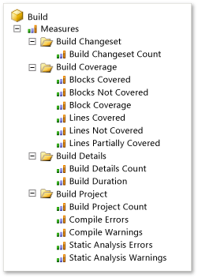
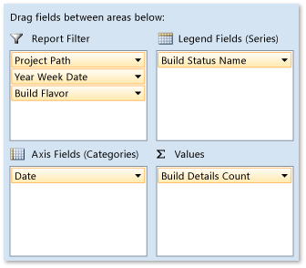

# Analyze and report on build details and build coverage using the Build perspective

[!INCLUDE [temp](../_shared/tfs-header-17-15.md)]

By using the Build perspective, you can view just the measures, dimensions, and attributes in the SQL Server Analysis Services cube for Visual Studio Team Foundation Server that pertain to the build process. For example, you can use these measures to determine how many builds are failing and how much of the code changed within a build.  
  
 The Build perspective is based on the relational tables that enable reporting on builds as either a property of the build, code coverage, or a changeset in version control. For more information, see [Build Details tables](table-reference-build-details.md), [Build Project tables](table-reference-build-project.md), [Build Coverage tables](table-reference-build-coverage.md), and [Build Changeset tables](table-reference-build-changeset.md).  
  
 

By using the Build perspective, you can create reports that answer the following questions:

**Status reports:**  
- Which builds failed and which builds succeeded?   Which builds reflect a significant number of changes to the code?  
- Which builds are ready to install?  

**Trend reports:**  
- What is the status of all builds over time?  
- How much of the code was executed by the tests over time?   

>[!NOTE]  
>If your data warehouse is using SQL Server Enterprise Edition, the list of cubes will include Team System and a set of perspectives. The perspectives provide a focused view of the data so that you do not have to scroll through all of the dimensions and measure groups that are defined for the whole Team System cube.
  
   
 
##  Example: Build status report  
By using PivotChart reports in Excel, you can display the build status over time, similar to the data in the following illustration.  
  
   
  
 The [Agile](../../work/guidance/agile-process.md) and [CMMI](../../work/guidance/cmmi-process.md) process templates include the Build Status report in Excel. For more information, see [Build Status](../excel/build-status-excel-report.md).  
  
### Pivot field selection and filters  

   
  
 You can create the summary report for build status by performing the following steps:  
  
1.  In Excel, connect to the Analysis Services cube for Team Foundation Server, and insert a PivotChart report.  
  
     For more information, see [Create Excel reports from a work item query](../excel/create-status-and-trend-excel-reports.md).  
  
2.  Open the context menu for the chart and then choose **Change Chart Type**, **Area**, **Stacked Column**.  
  
3.  For each report filter, open the context menu for each of the following fields, specify the hierarchies, weeks, or other elements of interest, and then drag the field to the **Report Filter** area.  
  
    -   **Team Project Hierarchy** from the **Team Project** dimension  
  
    -   **Year Week Date** from the **Date** dimension  
  
    -   **Build Definition Name** from the **Build** dimension  
  
4.  In the **Date** dimension, expand **More fields**, and drag the **Date**, **Week**, or **Month** fields to the **Axis Fields (Categories)** area to specify how granular a report you want to generate.  
  
5.  Drag the **Build Details Count** field from the **Build Details** measure group to the **Values** area.  
  
6.  Drag the **Build Status Name** field from the **Build Status** dimension to the **Legend Fields (Series)** area.  
  
7.  (Optional) Filter the **Build Status Name** field to display only those builds that **Failed**, **Partially Succeeded**, or **Succeeded**.  
  

 
##  Build measures  
 The following table describes the measures that are associated with builds. The **Build Coverage** measure group requires that the test team instrument tests to gather code coverage data. For more information, see [Required activities](#tracking) later in this topic. For an example of a report that uses several of these measures, see [Build Quality Indicators](build-quality-indicators-report.md).  
  
|Measure Group|Measure|Description|  
|-------------------|-------------|-----------------|  
|Build Details|Build Details Count|Number of times that a specific build has been run.|  
||Build Duration|Number of minutes that the build took to finish.|  
|Build Changeset|Build Changeset Count|Number of changesets in the selected set of builds.|  
|Build Coverage|Blocks Covered|Number of blocks that the selected build covers. If multiple test runs are performed against a build, the build coverage reflects the combined coverage of the runs. However, the runs may cover blocks that overlap.|  
||Blocks Not Covered|Number of blocks that the selected build does not cover. If multiple test runs are performed against a build, the build coverage reflects the combined coverage of the runs. However, the runs may cover blocks that overlap.|  
||Build Coverage|Number of builds that are associated with code coverage statistics.|  
||Lines Covered|Number of lines that the selected build covers. If multiple test runs are performed against a build, the build coverage reflects the combined coverage of the runs. However, the runs may cover lines that overlap.|  
||Lines Not Covered|Number of lines that the selected build does not cover. If multiple test runs are performed against a build, the build coverage reflects the combined coverage of the runs. However, the runs might cover lines that overlap.|  
||Lines Partially Covered|Number of lines that the selected build partially covers. If multiple test runs are performed against a build, the build coverage reflects the combined coverage of the runs. However, the runs might cover lines that overlap.|  
|Build Project|Build Project Count|Number of .csproj files, .vbproj files, and other project files in the selected set of builds.|  
||Compile Errors|Number of compile errors that occurred for the selected builds.|  
||Compile Warnings|Number of compile warnings that occurred for the selected builds.|  
||Static Analysis Errors|Number of static analysis errors that occurred for the selected builds.|  
||Static Analysis Warnings|Number of static analysis warnings that occurred for the selected builds.|  
  
 
##  Dimensions and attributes in the Build perspective that support filtering and categorization  
 You can use the attributes in the following table to aggregate a measure, filter a report, or specify a report axis. These attributes supplement the **Team Project** and **Date** shared dimensions that [Working with Shared Dimensions](shared-dimensions-in-the-analysis-services-cube.md) describes.  
  
> [!NOTE]  
> To use the **Assembly**, **Build Flavor**, or **Build Platform** dimension attributes, the test team must publish the test results to the TFS data store. For more information, see [Required activities](#tracking) later in this topic.  
  
|Dimension|Attribute|Description|  
|---------------|---------------|-----------------|  
|Assembly|Assembly|(Published test results only) The name of the code of the application that is tested as part of the build. For more information, see [Get started with continuous testing](../../build-release/test/getting-started-with-continuous-testing.md).|  
|Build|Build Definition Name|Name that is assigned to the build definition for which a build was executed.|  
||Build ID|The number that is assigned to the build. Each time that a particular build definition is run, the **Build ID** is incremented by 1.|  
||Build Name|The name or expression that uniquely identifies a build. For more information, see [build definition options](../../build-release/concepts/definitions/build/options.md).|  
||Build Start Time|The date and time when the build started.|  
||Build Type|The reason why the build was run. Build types are associated with the trigger that was defined for the build. Team Foundation Server supports the following types of builds: manual, continuous (triggered by every check-in), rolling (accumulate check-ins until the previous build finishes), gated check-in, and scheduled. For more information, see [Build definition triggers](../../build-release/concepts/definitions/build/triggers.md).|  
||Drop Location|The Uniform Resource Locator (URL) for the completed build. A URL specifies the protocol with which web browsers will to locate Internet resources. Each URL includes the name of the server on which the details of the build resides. You can also include the path to a resource.|  
|Build Flavor|Build Flavor|(Published test results only) A name that designates the category of builds that was assigned to a set of completed builds that were published as part of a test run. For example, a build flavor can designate a beta release or final release. For more information, see [Command-Line options for publishing test results](https://msdn.microsoft.com/library/ms243151.aspx).|  
|Build Platform|Build Platform|The name of the platform for which an end-to-end (not desktop) build was made (for example, **x86** or **Any CPU**). For an example of a report that uses this attribute, see [Build Summary](build-summary-report.md). For more information, see [How do I build multiple configurations for multiple platforms?](../../build-release/tasks/build/visual-studio-build.md#how-do-i-build-multiple-configurations-for-multiple-platforms).|  
|Build Quality|Build Quality|The quality of the build. For example, you can rate a completed build's quality as **Ready for Deployment**, **Rejected**, or **Under Investigation**. |  
|Build Status|Build Status Name|The current state of the build. Valid values are **Failed**, **Partially Succeeded**, **Stopped**, **Succeeded**, and **Unknown**.|  
|Build Source Project File|File Hierarchy|The full network path of the source file.|  
||File Extension|The extension of the name of the source file.|  
|Version Control Changeset|Changeset ID|The number that is assigned to the changeset.|  
||Checked In By|The user name of the team member who checked in the changeset.|  
||Description|The check-in comment that is associated with the changeset.|  
||Policy Override Comment|The comment that is provided when a policy is overridden. If a policy was not overridden with a changeset, the field is null.|  
  
##   Required activities  
 To create reports that contain useful data about builds, team members should review the information in the following topics:  
  
-   [Run tests in your build process](../../build-release/test/test-build.md)   
-   [Using Code Coverage to Determine How Much Code is being Tested](https://msdn.microsoft.com/library/dd537628.aspx)  
  
## Related notes
-  [Build Quality](../excel/build-quality-excel-report.md)   
-  [Build Status](https://msdn.microsoft.com/library/dd695786.aspx)   
-  [Build Quality Indicators](build-quality-indicators-report.md)   
-  [Build Success Over Time](build-success-over-time-report.md)   
-  [Build Summary](build-summary-report.md)   
-  [Perspectives and measure groups provided in the Analysis Services cube](perspective-measure-groups-cube.md)
