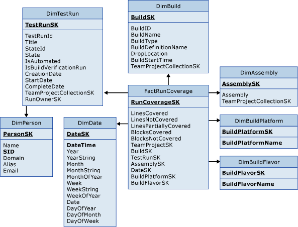

# Run Coverage tables
[!INCLUDE [temp](../_shared/tfs-header-17-15.md)]

You can query for data about how thoroughly a particular test run covered the code that it was intended to test by using FactRunCoverage and the associated dimensions.  
  
 For information about the measures and dimensions that are associated with these tables in the SQL Server Analysis Services cube, see [Code churn and code coverage](perspective-code-analyze-report-code-churn-coverage.md).  
  
   
  
> [!NOTE]
>  You cannot aggregate these coverage values to determine code coverage for a build. To determine the code coverage in a build, you must use FactBuildCoverage. For more information, see [Build Coverage tables](table-reference-build-coverage.md).  
  
 FactRunCoverage is associated with the following dimension tables:  
  
-   DimAssembly  
  
-   DimBuild  
  
-   DimBuildFlavor  
  
-   DimBuildPlatform  
  
-   DimDate  
  
-   DimPerson  
  
-   DimTestRun  
  
## Related notes
 [Code churn and code coverage](perspective-code-analyze-report-code-churn-coverage.md)   
 [Code Churn](../excel/code-coverage-excel-report.md)  
 [Build](https://docs.microsoft.com/en-us/visualstudio/ide/walkthrough-building-an-application)   
 [Table reference for the relational warehouse database](table-reference-relational-warehouse-database.md)