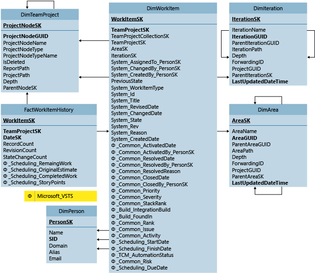

# Work Item History tables

[!INCLUDE [temp](../_shared/tfs-header-17-15.md)]

You can query for historical data about bugs, tasks, and other types of work items by using FactWorkItemHistory and the associated dimension tables as the following illustration shows. Historical data provides information about the status of a work item or a value of a field for a work item as it changed over time. Progress and burndown charts are examples of reports that are built from work item history tables. The data is stored by using compensating records.  
  
 For information about the measures and dimensions that are associated with these tables in the SQL Server Analysis Services cube, see [Test cases and work items](perspective-test-analyze-report-work.md).  
  
   
  
 FactWorkItemHistory is associated with the following dimension tables:  
  
-   DimArea  
  
-   DimIteration  
  
-   DimPerson  
  
-   DimTeamProject  
  
-   DimWorkItem  
  
 You can use the following sample query to find the historical workload trend for the period between 2009-09-21 and 2009-09-30 for certain user stories. For each user story in the team project, this query returns information about the total completed work, the original estimated work, the remaining work, and the total story points for every day during that period.  
  
> [!NOTE]    
>  This query assumes that a user story is linked to other work items through child links.  
  
```  
declare @TeamProjectNodeSK int  
select @TeamProjectNodeSK = ProjectNodeSK from GetProjectNodeInfoFromReportFolder(N'/TfsReports/VSTSDF/ProcessDev10')  
-- This table value function returns the ProjectNodeSK: the Surrogate Key of a team project under a certain area path.  
  
declare @TeamProjectCollectionGuid nvarchar(36)  
select @TeamProjectCollectionGuid = pc.ProjectNodeGUID from DimTeamProject p inner join DimTeamProject pc on p.ParentNodeSK = pc.ProjectNodeSK where p.ProjectNodeSK = @TeamProjectNodeSK  
-- This query finds the team project collection GUID by joining TeamProject.ParentNodeSK to TeamProject.ProjectNodeSK  
```  
 <br/>

```  
select   
    d.DateSK  
    ,wi.System_Title  
    ,wi.System_Id  
    ,coalesce(sum(wih_child.Microsoft_VSTS_Scheduling_CompletedWork),   0) as Total_CompletedWork, -- Finds the total number of hours of completed work.  
    coalesce(sum(wih_child.Microsoft_VSTS_Scheduling_OriginalEstimate), 0) as Total_OriginalEstimate --Finds the total number of hours of original estimate.  
    ,coalesce(sum(wih_child.Microsoft_VSTS_Scheduling_RemainingWork), 0) as Total_RemainingWork--Finds the total number of hours of remaining work.  
    ,coalesce(sum(wih_child.Microsoft_VSTS_Scheduling_StoryPoints), 0) as Total_StoryPoints --Finds the total story points.  
from  
    DimDate d  
cross apply  
    DimWorkItem wi  
cross apply  
    GetWorkItemsTree(@TeamProjectCollectionGuid, wi.System_Id,        
N'Child', d.DateSK) wit   
left join            
    FactWorkItemHistory wih_child     
        on wih_child.WorkItemSK = wit.ChildWorkItemSK  
where  
    d.DateSK >= N'2009-09-21 00:00:00.000'   
    and d.DateSK <= N'2009-9-30 00:00:00.000'  
    and wi.TeamProjectSK = @TeamProjectNodeSK   
    and wi.System_WorkItemType = N'User Story'   
    and wi.System_ChangedDate <= d.DateSK  
    and wi.System_RevisedDate > d.DateSK  
    and wi.System_State = N'Active'  
    and (wih_child.RecordCount != -1 or wih_child.RecordCount is null)  
group by d.DateSK, wi.System_Id, wi.System_Title  
```  
  
  
## Related notes 
- [COALESCE (Transact-SQL)](https://msdn.microsoft.com/library/ms190349.aspx)  
-  [Test cases and work items](perspective-test-analyze-report-work.md)    
-  [Burndown](../excel/burndown-excel-report.md)    
-  [Test Team Progress](../excel/test-team-progress-excel-report.md)    
-  [Table reference for the relational warehouse database](table-reference-relational-warehouse-database.md)  