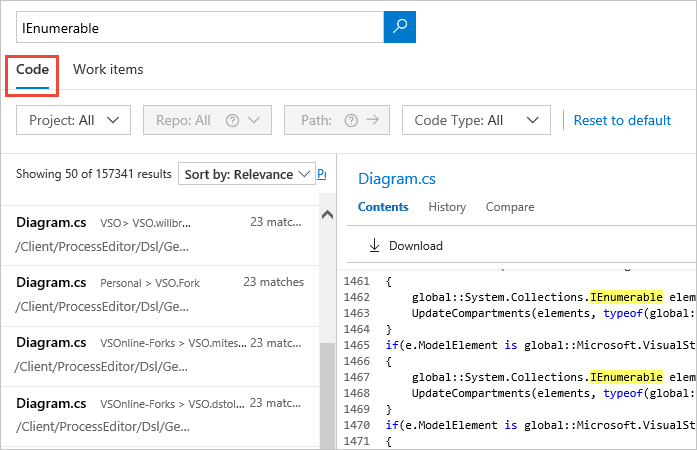
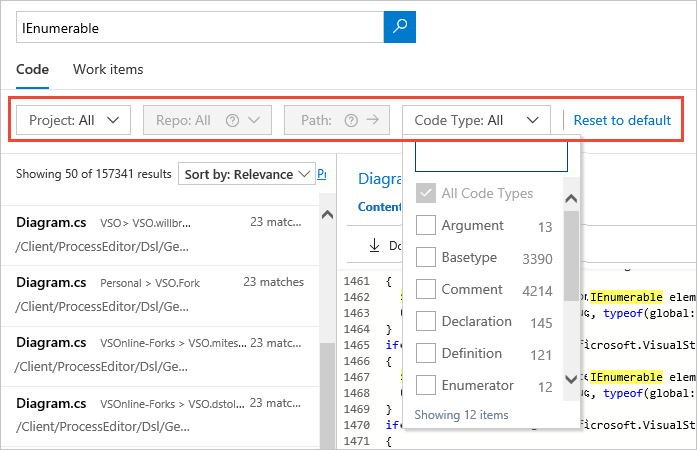

# Search your code

**Team Services | TFS 2015 | TFS 2017**

By using Code Search you can:

* **Search across all of your projects**:
  Search in your own codebase and your partner teams' codebases. Use cross-project 
  searches over all the code in your Team Services or TFS instance to search 
  across your organization's entire codebase. Narrow your search by using project, repository, 
  path, file name, and other filter operators. Use wildcards to widen your search and 
  Boolean operators to fine-tune it. 

* **Find specific types of code**: Use code type filters 
  to search for specific kinds of code such as definitions, references, functions, 
  comments, strings, namespaces, and more. You can use Code Search to narrow 
  down your results to exact code type matches. Navigate quickly to a method 
  definition to understand its implementation simply by applying the definition 
  filter, or scope the search to references in order to view calls and maximize 
  code reuse.

* **Easily drill down or widen your search**: When you find an item of interest, 
  simply place the cursor on it and use the shortcut menu to quickly search for 
  that text across all your projects and files. Easily trace how your code works 
  by using the shortcut menu to search for related items such as definitions and 
  references - directly from inside a file.

## Prepare

Go to [Visual Studio Marketplace](http://go.microsoft.com/fwlink/?LinkId=703823&clcid=0x409)
to install the extension in your Team Services account as an administrator.
Non-administrative users can also go here to request the extension be added to Team Services. 
For more details, see [Install an extension](../../marketplace/get-vsts-extensions.md#install-extension) in the Marketplace documentation.

>Only users with Basic access can use Code Search.

## Get searching

1. In the search textbox at the top right of the window, check that the text says
   _Search code_. The search text box may say _Search work items_. In this case, use the drop-down selector to change it.

   

   If you don't see the 
   selector in the Search box, open the **Manage extensions** page 
   and check that Code Search is installed.

   

1. Enter a search string in the textbox, and press _Enter_ (or choose the 
    icon) to start your search.

1. The search page shows a list of the matching code files. The selected file has all
   instances of the search string highlighted. 

   

   If you see a list of work items, ensure that **Code** is selected in the top left.

1. Try assembling more complex search strings using the operators and functions listed in the handy 
   drop-down list. Select the filter function or code type you want to include in your search string from the
   list, and type the criteria value.

       

   * You can find all instances of "ToDo" comments in your code simply by selecting `comment:` and typing `todo`. 

   * You can search in specific locations, such as within a particular path, by using a search string such as `Driver path:MyShuttle/Server`. 

   * You can search for files by name, such as `Driver file:GreenCabs.cs`, or just by file extension. For example, the search string 
    `error ext:resx` could be useful when you want to review all error strings in your code. 
    But even if your plain text search string (without specific file type functions) 
    matches part of a filename, the file appears in the list of found files.

   * You can combine two or more words by using Boolean operators; for example, `validate OR release`.

   * You can find an exact match to a set of words by enclosing your search terms in double-quotes. For example, `"Client not found"`. 

   * You can use the code type search functions with files written in C#, C, C++, Java, and Visual Basic.NET.

   * See also [full details of the search syntax](advanced-search.md#syntaxdetails). 

4. Widen your search to all projects, or narrow it to specific areas and types of code,
   by selecting from the drop-down lists at the top of the page.

   

5. Use the tabs in the results page to view the history of the file and to compare versions of the file.

   

   >Open the search results in a new browser tab from either search box by
   pressing _Ctrl_ + _Enter_ or by holding _Ctrl_ and clicking  the
    icon.
   In Google Chrome, press _Ctrl_ + _Shift_ + _Enter_ to switch the focus
   to the new browser tab.

6. Choose the filename link at the top of this column to open the file in a new Code Explorer window.

 
## Next steps

* [Filter and scope your search](repos-and-projects.md)
* [Use the rich search results page](search-results.md)

## See also

* [Choose your search scope](repos-and-projects.md)
* [Advanced Code Search options](advanced-search.md)
* [Rich Code Search results](search-results.md)
* [Set up and administration](administration.md)

