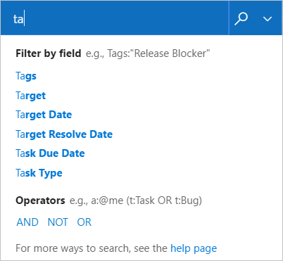

# Search for work items

**| Team Services | TFS 2017.2 |**

Work Item Search provides fast and flexible search across all your work items over all projects in an account. 
You can use the Work Item Search full text search engine to easily search for terms across all work item fields 
and efficiently locate relevant work items. Use in-line search filters, on any work item field, to quickly narrow 
down to a list of work items. By using Work Item Search you can:

* **Search over all your projects**:
  Search in your own and your partner teams' backlog. Use cross-project 
  searches over all the work items in your Team Services account to search 
  across your organization's entire work items. Narrow your search by using project and 
  area path filters. 
  
* **Search across all work item fields**:
  Quickly and easily find relevant work items by searching across all work item fields
  (including custom fields). Use a full text search across all fields to efficiently
  locate relevant work items. The snippet view indicates where matches were found.

  
* **Search in specific fields**:
  Use the quick in-line search filters, on any work item field, to narrow down to a
  list of work items in seconds. The dropdown list of suggestions helps complete your
  search faster. For example, a search such as **AssignedTo:Chris WorkItemType:Bug
  State:Active** finds all active bugs assigned to a user named Chris. 

* **Take advantage of integration with work item tracking**:
  The Work Item Search interface integrates with familiar controls in the **Work** hub,
  letting you view, edit, comment, share, and much more.

## Get searching

1. In the search textbox at the top right of the window, check that the text says
   _Search work items_.

       

   If you have the Code Search extension installed, the search text box may
   say _Search code_. In this case, use the drop-down selector to change it. 

1. Enter a search string in the textbox, and press _Enter_ (or choose the 
    icon) to start your search. 

1. Search results are displayed in a snippet view where the matches found are shown in bold.

   

   This is a full text search that uses simple search strings for words or phrases.
   Work item search matches derived forms of your search terms; for example, a search for
   "updating" will also find instances of the word "updated" and "update". Note that searches are _not_ case-sensitive.

1. Select a snippet of a work item to display it in the right window. 
   You can edit and manage this work item in the usual way.

   

   >Open the search results in a new browser tab from a search box by
   pressing _Ctrl_ + _Enter_ or by holding _Ctrl_ and clicking  the
    icon.
   In Google Chrome, press _Ctrl_ + _Shift_ + _Enter_ to switch the focus
   to the new browser tab. 

1. Fine tune your search by specifying the fields to search. Enter `a:` and a user name
   to search for all items assigned to that user.

       

   The quick filters you can use are:

   * `a:` for **Assigned to:** 
   * `c:` for **Created by:** 
   * `s:` for **State** 
   * `t:` for **Work item type**

 
1. Start typing the name of a field in your work items; for example, type `ta`.

       

   The dropdown list shows work item field name suggestions 
   that match user input thereby helping the user to complete the search faster. For example, a search such as 
   **tags:Critical** finds all work items tagged 'Critical'. 

1. Add more filters to further narrow your search, and use Boolean operators
   to combine terms if required. For example, 
   **a: Chris t: Bug s: Active** finds all active bugs assigned
   to a user named Chris.

1. Widen your search across all projects, or narrow it to specific types
   and states, by using the drop-down selector lists at the top of the results page.

       

   >Work Item search remembers your filter settings. For example, the project and area path that you have selected in a search will be applied in your subsequent searches.

## Next steps

* [Use the rich search results page](search-results.md)
* [Learn about the advanced search syntax](advanced-search-syntax.md)
