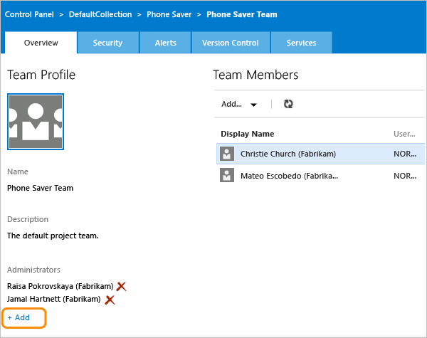

## View permissions for yourself or others  

**Team Services | TFS 2017 | TFS 2015 | TFS 2013** 

!!! WORK IN PROGRESS !!! 

<!--- TO BE COMPLETED  ---> 

* Update to show latest guidance for VSTS 
* Show how to view permissions at the team project level
* Indicate how to view permissions at the object and collection level
* Provide links to other salient topics   

!!! WORK IN PROGRESS !!! 

You can view your permissions or those defined for another. That way, if you don't have the permission to access a feature or function, you can request it from the right resource. 

Permissions are set at the collection, team project, and object level as described 

1.  Open the administrative context for your team project. 

2.  In the **Security** tab, under users, find your own name,
and look at what groups you belong to and what permissions you have.

3.  If you aren't a project administrator, you need to be. Find someone who is, and have them add you:

    

4.  If you need to make changes at the team level, change your context to the team overview.
If you aren't a team administrator, you can add yourself if you're already a project administrator. Otherwise, have someone add you.

    

5.  Similarly, if you need to add users to SharePoint Products or SQL Server Reporting Services,
make sure that you have the required permissions.

## Related notes

- [Add users to a team](../work/scale/multiple-teams.md)  
- [Add users to a team project](../accounts/add-users.md)

