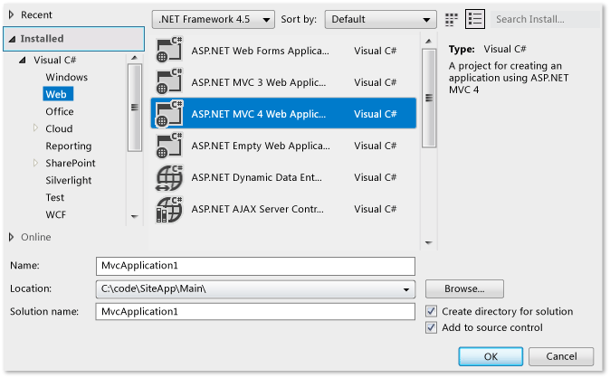
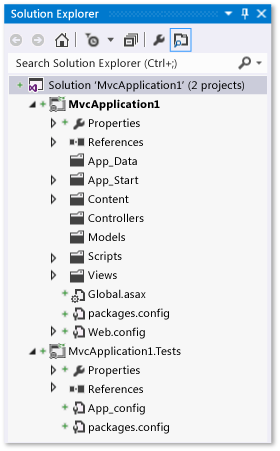
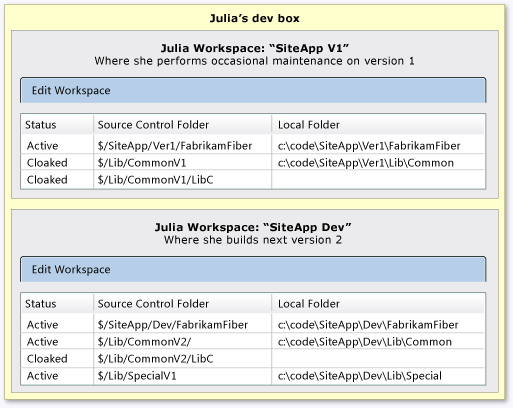

# Add files to the server

**VSTS | TFS 2015 | Visual Studio 2015 | Visual Studio 2013**

Adding a file to version control is often automatic when you use Solution Explorer and your project is under version control. However, in some cases, you have to take some extra steps to add the project to version control.

>**Tip:**  
> Before you add files to version control, you should first [set up the workspace on your dev machine](set-up-team-foundation-version-control-your-dev-machine.md)

## Create a new code project and solution under version control

You can simultaneously create a new team project and add it to version control so that you and your team can immediately enjoy all the benefits of version control beginning from the first line of code you write.

1.  In Visual Studio, if you have not already done so, [connect to the team project](../accounts/connect-to-vsts.md).

2.  Choose **File**, **New**, **Project** (Keyboard: Ctrl + Shift + N).

    The **New Project** dialog box appears.

3.  Select the type of code project that you want to create.

4.  In the **Name** box, specify the name of the code project.

5.  If the **Solution** list appears, make sure **Create new solution** is selected.

6.  In the **Location** list, specify the path to a [good local working folder](optimize-your-workspace.md) (such as **c:\\code\\SiteApp\\Main\\**) in the workspace you created when you [set up your dev machine](set-up-team-foundation-version-control-your-dev-machine.md).

    Make sure the **Create directory for solution** and **Add to source control** check boxes are selected.

7.  Choose **OK** to create the code project, which you can then view in Solution Explorer (Keyboard: Ctrl + Alt + L).

    

8.  In **Solution Explorer**, open the context menu of the solution you created or modified and then choose **Check In** to [submit your pending changes](check-your-work-team-codebase.md).

## Place an existing solution and code projects under version control

To add an existing solution to version control, move all the solution files into your workspace, and then add them.

>**Note:**  
>Avoid using the **Add Solution to Source Control** dialog box to upload your solution into version control. Use the following procedure instead.

1.  In Visual Studio, if you have not already done so, [connect to the team project](../accounts/connect-to-vsts.md).

2.  Choose **View**, **Other Windows**, **Source Control Explorer**.

3.  In Source Control Explorer, navigate to a logical parent folder for your solution, such as **$/SiteApp/Main**, where SiteApp is the name of your team project. [Why is this a good parent folder?](optimize-your-workspace.md)

4.  Choose the link next to **Local Path** to open the parent folder in Windows Explorer (File Explorer in Windows 8).

    [What do I do if the link text is “Not Mapped”](create-work-workspaces.md)?

5.  Move the folder that contains your solution into the parent folder.

6.  In Visual Studio, choose **File**, **Open**, **Project/Solution**, and then use the **Open Project** dialog box to open the solution.

7.  In Solution Explorer (Keyboard: Ctrl + Alt + L), select the solution, open its context menu, and then choose **Add Solution to Source Control**.

8.  In Solution Explorer, select the solution, open its context menu, and then choose **Check In**.

9.  In Team Explorer, the **Pending Changes** page appears.

10. Are there any **Detected** items shown in the **Excluded Changes** section?

    -   **No:** Skip to the next step.

    -   **Yes:** Choose the **Detected** link. The **Promote Candidate Changes** dialog box appears. The files in listed in this dialog box are not referenced by any code projects in your solution. If your team will need these files, make sure they are selected and then choose **Promote** to move them into the **Included Changes** section of the **Pending Changes** page. For more information, see [Check in your work to the team's codebase](check-your-work-team-codebase.md).

11. When you’re ready, [submit your pending changes](check-your-work-team-codebase.md).

## Add one or more files to version control

When you use Solution Explorer to add a file to your code project, the system automatically adds it to version control. However, you can also add files that are not referenced by your code projects.

>**Tip:**  
>If you are creating an automated process or prefer to use the command prompt, you can use [Add command](add-command.md) instead of the following procedures.

## Automatically add one or more files to version control

>[!IMPORTANT]
> These steps only apply when using a [local workspace](decide-between-using-local-server-workspace.md). Files saved when working in a server workspace will add and check in without showing as a pending
> change in Team Explorer.

If you are using a [local workspace](decide-between-using-local-server-workspace.md), then new files are automatically detected by the **Pending Changes** page.

1.  In Visual Studio, if you have not already done so, [connect to the team project](../accounts/connect-to-vsts.md).

2.  Choose **View**, **Other Windows**, **Source Control Explorer**.

3.  In Source Control Explorer, navigate to the folder where you want to add the files or folders.

4.  Choose the link next to **Local Path** to open the target folder in Windows Explorer (File Explorer in Windows 8).

    Move your files and folders into this folder.

    [What do I do if the link text is “Not Mapped”](create-work-workspaces.md)?

5.  In Visual Studio, in Team Explorer, choose **Pending Changes**.

6.  On the **Pending Changes** page, in the **Excluded Changes** section, select the  **Detected** link.

7.  In the **Promote Candidate Changes** dialog box, make sure only files that you want to check in are selected, and then choose **Promote**.

8.  [Submit your pending changes](check-your-work-team-codebase.md).

### Manually add files to version control

You can also manually add files to version control.

1.  Choose **View**, **Other Windows**, **Source Control Explorer**.

2.  In Source Control Explorer, navigate to the folder where you want to place your files.

>**Important:**
>Make sure this folder is checked in before you proceed. If you are creating the folder now, open its context menu and choose **Check In**, and then check in the new folder before proceeding.

3.  Drag the folders or files from Windows Explorer (or File Explorer) into the folder in Source Control Explorer.

4.  When the **Add to Source Control** dialog box appears, make sure all the files you want to add are selected, and then choose **Include item(s)**.

5.  Choose **Finish**.

6.  In Team Explorer, when the **Pending Changes** page appears, make sure the binaries that you want to add appear in the **Included Changes** section. Choose **Check In**.

## Leverage third-party binaries that your code does not build

Many teams develop code that depends on binaries that are not built by the solution in which they manage their code. Typically these binaries are part of a library that the team has licensed from a third party.

Sometimes these binaries come from another team in the same company. For example, Team A depends on binaries produced by Team B, and each team must for some reason work in different team project collections. As a result, Team B delivers binaries to Team A, which then checks them into version control.

> **Tip:**  
>If your dev machines and [build agents](../build-release/concepts/agents/agents.md) can access the Internet, then [NuGet](http://go.microsoft.com/fwlink/?LinkId=246165) may make it easier for your team to manage your dependencies and keep your binaries up to date. Even if you decide to use NuGet, you should probably still add the binaries to version control so that you can reproduce and build historical versions of your code.

The folder and workspace structure you should use to store your third-party binaries depends on the way your solutions depend on these libraries.

### Add the binaries within your folder or branch structure

If you place your third-party binaries in the same parent folder that contains your solution folders, then all your code projects in all solutions can reference the libraries with the same relative path.

For example, a team uses this folder structure:

  
Every code project can then reference the libraries folder with the following relative path: `../../Lib`

If, later in your project, your team needs to isolate separate efforts that require different versions of the binaries, you can branch the library folder along with your solution folder.

For example, Version 1 an app leverages Version 1 of a library. As some developers on the Data Access team work on the next version, they leverage Version 2. But the other teams are not yet ready to upgrade. You can use branches to manage this kind of situation.

### Use a workspace to map in the binaries

Some companies must manage more complicated dependencies on third-party libraries. For example, multiple team projects contain solutions with different dependencies on a common set of libraries. In cases like this, you can store your third-party libraries in a dedicated team project. Contributors to the various team projects map in the folders that contain the libraries they need.

For example, FabrikamFiber puts the following team project, branch, and folder structure in place:

  

Raisa sets up her dev machine with two workspaces for two different efforts, each of which map in the libraries she needs:

## Customize which files are ignored by version control

By default certain types of files (for example, .dll files) are ignored by version control. As a result:

-   When you add ignored files to folders that are mapped in a [local workspace](decide-between-using-local-server-workspace.md), they do not appear in the **Pending Changes** page in Team Explorer.

-   When you try to add ignored files using the Add to Source Control dialog box (for example by dragging them into Source Control Explorer), they automatically appear in the **Excluded items** tab.

You can configure which kinds of files are ignored by placing text file called **.tfignore** in the folder where you want rules to apply. The effects of the .tfignore file are recursive. However, you can create .tfignore files in sub-folders to override the effects of a .tfignore file in a parent folder.

### .tfignore file rules

The following rules apply to a .tfignore file:

-   `#` begins a comment line

-   The `*` and `?` wildcards are supported.

-   A filespec is recursive unless prefixed by the `\` character.

-   `!` negates a filespec (files that match the pattern are not ignored)

### .tfignore file example

    ######################################
    # Ignore .cpp files in the ProjA sub-folder and all its subfolders
    ProjA\*.cpp
    #
    # Ignore .txt files in this folder
    \*.txt
    #
    # Ignore .xml files in this folder and all its sub-folders
    *.xml
    #
    # Ignore all files in the Temp sub-folder
    \Temp
    #
    # Do not ignore .dll files in this folder nor in any of its sub-folders
    !*.dll

### Create and use a .tfignore file

While you can manually create a .tfignore text file using the above rules, you can also automatically generate one when the **Pending Changes** page has detected a change.

>[!IMPORTANT]
> This only applies when using a [local workspace](decide-between-using-local-server-workspace.md). Files changed when working in a server workspace will check in without showing as a pending
> change in Team Explorer.

### To automatically generate a .tfignore file

1.  In the **Pending Changes** page, in the **Excluded Changes** section, select the **Detected** link.

    The **Promote Candidate Changes** dialog box appears.

2.  Select a file, open its context menu, and choose **Ignore this local item**, **Ignore by extension**, **Ignore by file name**, or **Ignore by folder**.

3.  Choose **OK** or **Cancel** to close the **Promote Candidate Changes** dialog box.

4.  A .tfignore file appears in the **Included Changes** section of the **Pending Changes** page. You can open this file and modify it to meet your needs.

The .tfignore file is automatically added as an included pending change so that the rules you have created will apply to each team member who gets the file.

## Work from the command prompt

-    [Add command](add-command.md)  Upload files from the workspace on your dev machine to your server.

## See Also

#### Other Resources

 [Decide between using a local or a server workspace](decide-between-using-local-server-workspace.md)
