# Develop and share your code in TFVC using Visual Studio

**VSTS | TFS 2015 | Visual Studio 2015 | Visual Studio 2013**

Whether your software project is large, small, or brand new, 
in most cases you'll be better off if you use version control 
as early as possible. 
Here, we'll show you how to get started with 
Team Foundation Version Control (TFVC), a centralized system.
If you want to work in a distributed system, 
you can instead use [Git with VSTS](../git/share-your-code-in-git-vs.md).

Is your code in another place? [Learn how to migrate it here](#migrate).

[!INCLUDE [open-team-project-in-vs](_shared/open-team-project-in-vs.md)]

## Configure your workspace

0.	In Visual Studio, configure your workspace.

	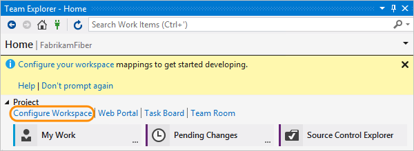

	[I don't see the Configure Workspace link. What do I do next?](#workspace_exists)

0.	Confirm your workspace path, map your workspace, and get the source.

	

0.	Now you can check in source, queue builds, and manage work.

	

## Create a new app

If you already have an app that you want to add to version control,
skip down to [Add an existing app](#app_add).

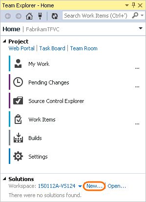

Now that you've added your app, you can skip down to 
[snapshot your code](#snapshot).

## Add an existing app

### Move and open the solution

0. Close the solution.

0. Open the workspace folder that you created when you [configured your workspace](#workspace).

 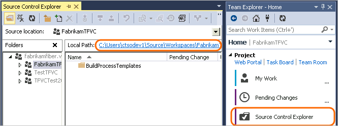

0. Move the code you want to upload to the workspace folder.

 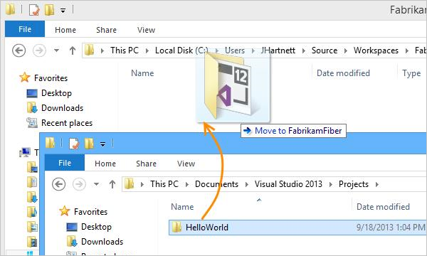

0. Open your solution in Visual Studio.

 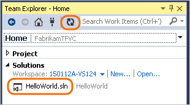

### Add the solution to VSTS

0. Open the solution explorer (Keyboard: Ctrl + Alt + L).

0. Add your solution to version control.

 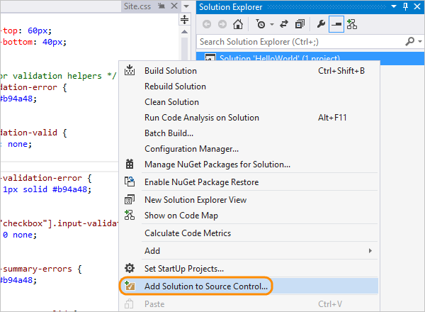

0. Check in the solution.

 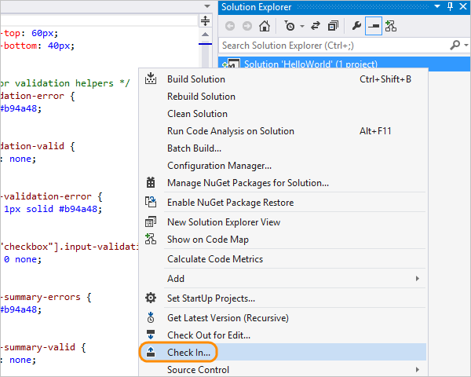

0. Add a comment and check in.

 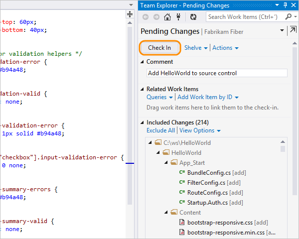

0. Open the source control explorer.

 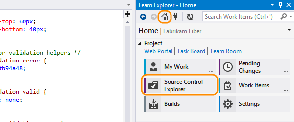

 Your solution is now in TFS.

 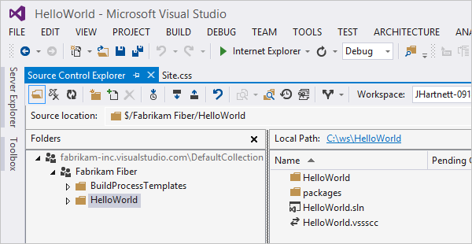

Your whole team can work on the code now. All your changes are tracked in version control.

## Snapshot (check in) your code

0. When you edit code in Visual Studio, the changed file is automatically checked out. For example, Site.css is checked out after the border color has been changed to #ddd.

 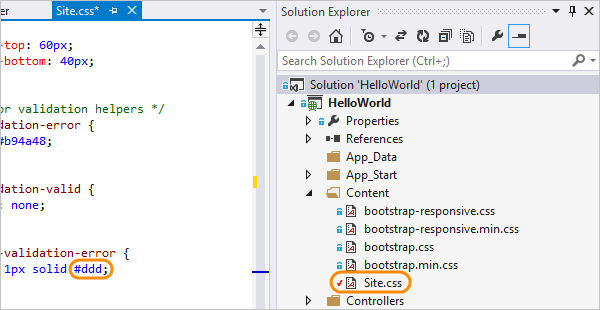

0. Compare the modified file with the latest version in source control.

 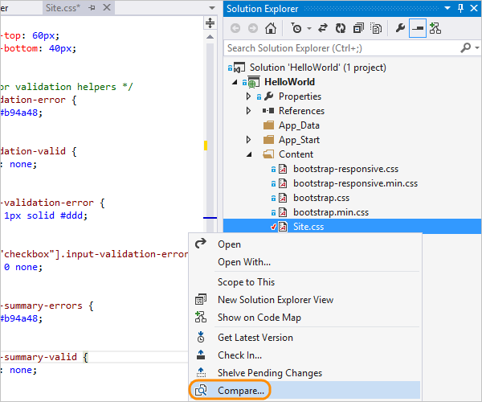

 You can see the difference between the two versions.

 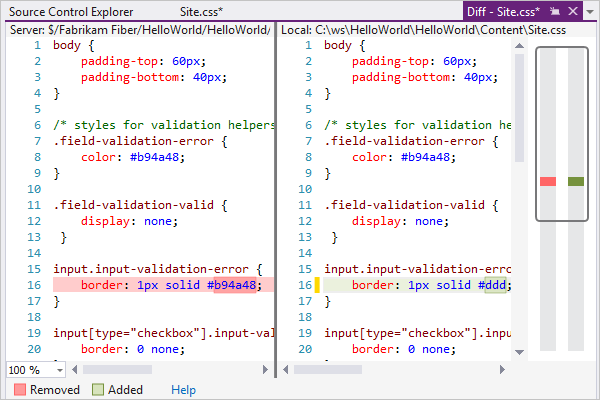

0. Check in the changes.

 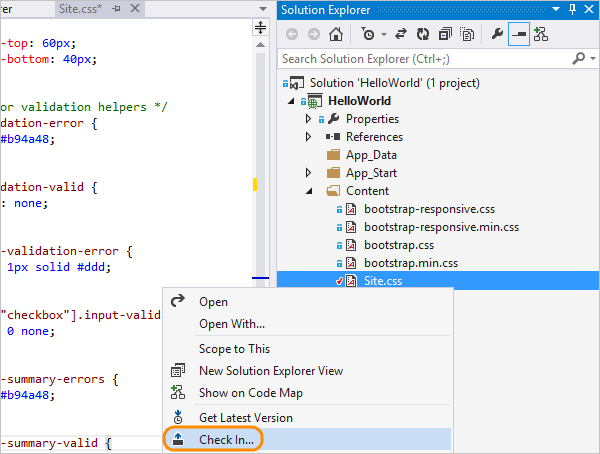

 You can also check in from the code window, or the team explorer.

0. If you're working on a task or fixing a bug that's tracked as a work item, add that work item to your pending changes. Source control will resolve the bug or close the task, and it'll link the changeset to the work item.

 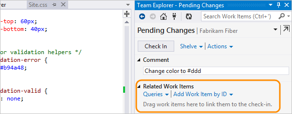

0. Add a comment and check in.

 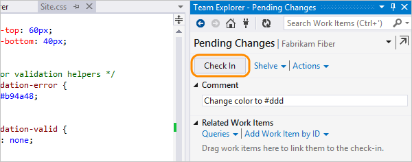

0. Open the source control explorer.

 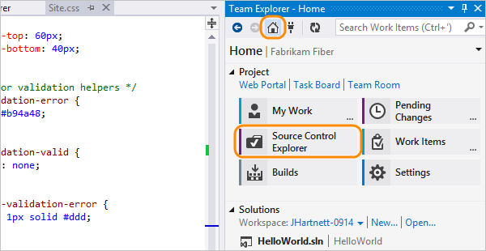

0. View the history of the file you changed.

 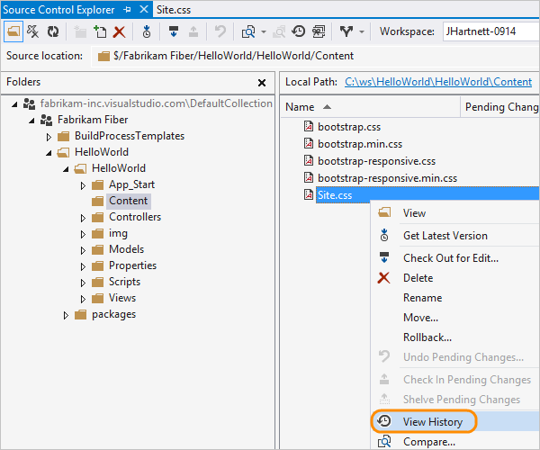

 All the changesets that include this file are listed.

 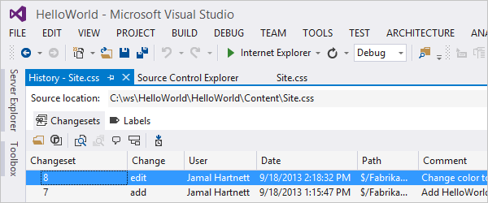

## Troubleshooting

* [My code is somewhere else. Can I migrate it to my TFVC project on VSTS?](#my-code-is-somewhere-else-can-i-migrate-it-to-my-tfvc-project-on-visual-studio-team-services)
* [I don't see the Configure Workspace link shown in the steps above. What do I do next?](#i-dont-see-the-configure-workspace-link-shown-in-the-steps-above-what-do-i-do-next)

### My code is somewhere else. Can I migrate it to my TFVC project on VSTS?

Yes:

 * [Upgrade From Visual SourceSafe](http://msdn.microsoft.com/library/ms253060).
 * [Migrate from Team Foundation Server into VSTS](../articles/migrate-to-vsts-from-tfs.md).

### I don't see the Configure Workspace link shown in the steps above. What do I do next?

You might already have a workspace on your computer. To see your workspace, open Source 
Control Explorer. Or change your workspace. Find out how to [manage files under 
source control](http://msdn.microsoft.com/library/ms181370.aspx) or 
[manage workspaces](http://msdn.microsoft.com/library/ms181383.aspx).

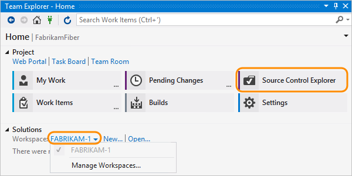

## Next steps

> [!div class="nextstepaction"]
> [Get your code reviewed](get-code-reviewed-vs.md)
