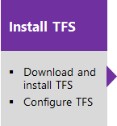

# What is Team Foundation Server? 
**TFS 2017 | TFS 2015 | TFS 2013**

 

It's an on-premises server platform
Supports source control and work tracking 
Main benefits

Choose on-premises TFS when you need your data to stay within your network or you want access to SharePoint sites and SQL Server reporting services that integrate with TFS data and tools.  

   
 

## Where do I start?
- Download TFS Express for free   
- Then, either upload your code to share or source control 
- Or, begin tracking your work using Scrum, Kanban, or a combination of methods 

## Build and release your apps

You can use our cloud platform to build your apps or use our build server 

 
## Add extensions or integrate with other services 

Ecosystem, Marketplace, ... 

 

## On-premises TFS services  

When you deploy TFS, you can also configure the following servers or integration points: 

- **Build server**: supports on-premise builds, you can use a combination of on-premises builds and cloud-hosted builds   
- **SQL Server and SQL Analysis Server**: supports SQL Server Reports and the ability to create Excel pivot charts based on the cube 
- **SharePoint integration**: provides support for a team project portal which provides dashboards, a wiki, document repository, and other SharePoint features. 

<!--- Add note about SharePoint integration deprecation for TFS 2018  --> 

## Pricing
- [Pricing](https://www.visualstudio.com/vs/pricing/)

## Administrative services  

There are a number of features and tasks associated with administrating a collaborate software development environment. You perform most of these tasks through the web portal for either Team Services or TFS. 

> [!div class="mx-tdBreakAll"]  
> |Account Management (Team Services)  | Administration (TFS)  | 
> |-------------|----------| 
> |- Manage users, access, and billing - Add and manage team projects and teams - Customize work tracking processes - Manage build retention policies - Add and manage build agent pools - Add and manage extensions|-Manage users, access, and permissions - Add and manage teams, team projects, and collections - Customize work tracking processes - Manage build retention policies - Add and manage build agent pools - Add and manage extensions - Configure an SMTP server (supports feedback requests and notification features) - Configure a backup schedule and manage database backups - Manage upgrades |

 
## Related notes 
- [Key concepts](../concepts.md)
- [Client-server tools](../tools.md)
- [Software development roles](../roles.md)

### Case studies 

- [Build and Deployment Automation Case Study for World Wide Time Keeping: Higher Quality and Faster Delivery in an Increasingly Agile World](https://www.visualstudio.com/en-us/articles/build-deployment-best-practices)  

