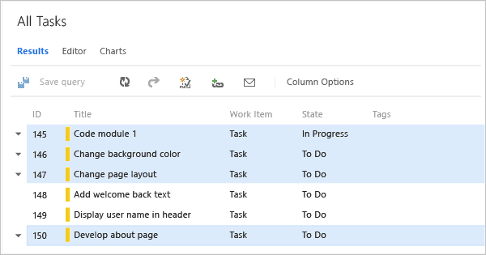
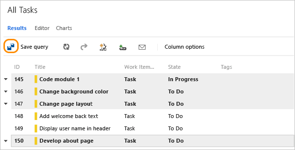
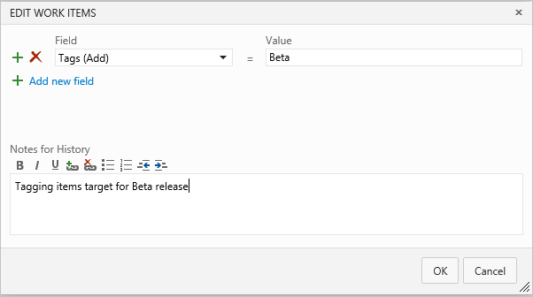

---
title: Bulk modify work items | Team Services & TFS
description: Bulk edit/modify several/multiple work items (mass update), backlog items, tasks, or bugs or linked parent-child items-Visual Studio Team Services (VSTS)| Team Foundation Server    
ms.technology: vs-devops-agile-wit
ms.prod: vs-devops-alm
ms.assetid: 152CAFE0-2360-470A-98AC-F613A67C24D2  
ms.manager: douge
ms.author: kaelli
ms.date: 04/10/2017
--- 

# Bulk modify work items  

**Team Services | TFS 2017 | TFS 2015 | TFS 2013**    

Use bulk modify when you need to quickly make the same change to a number of work items. For example, you might want to change the priority of several bugs or reassign several tasks to the same team member. Use the web portal to quickly modify one or more fields for work items that will contain the same value. Use [Excel](../office/bulk-add-modify-work-items-excel.md) to update multiple fields with different values. 

With bulk modify, you can edit fields, add or remove tags, reassign work, or move work to a specific sprint. You can also use bulk modify to change the work item type or move work items to other team projects. The options available to you depend on the platform you work from and the permissions you've been granted.

>[!NOTE]  
>**Feature availability:**&#160;&#160;The following features are available from Team Services (cloud service) or from the web portal of the listed on-premises TFS version or a later version. Those not annotated are available from all platforms and versions. Visit the [Visual Studio Downloads page](https://www.visualstudio.com/downloads/download-visual-studio-vs) to get the latest TFS update. Additional resources may be required as annotated. To determine your platform or TFS version, see [Provide product and content feedback](../../provide-feedback.md#platform-version).  

All of the following actions can be performed by team members that belong to the Contributors group. Members provided with Stakeholder access can perform multi-select, bulk edit, change type, email, and copy as HTML/copy to clipboard actions. For details, see [Work as a stakeholder](../../quickstart/get-started-stakeholder.md). 

Multi-select work items

- [Multi-select-query results](#multi-select)  
- [Multi-select-backlog](#multi-select) (TFS 2015.1)  
 

Link work items

- [Link to a new item](add-link.md#link)  
- [Link to an existing item](add-link.md#link)  
- [New branch](connect-work-items-to-git-dev-ops.md) (TFS 2017) 1 

Bulk edit/update/delete

- [Edit field(s)](#edit)  
- [Assign to](#assign-to)  
- [Move to iteration](#move-iteration)  
- [Change position](#change-position)  
- [Change parent](organize-backlog.md#reparent)  
- [Add/remove tags](#tags) (TFS 2017)    
- [Update from template](../productivity/work-item-template.md) (Team Services) 1   
- [Delete](remove-delete-work-items.md#delete) 1   

Copy, clone, change type, move, or share work items

- [Clone or copy a single item](copy-clone-work-items.md#copy-clone) 2  
- [Copy as HTML/Copy to clipboard](copy-clone-work-items.md#html)    
- [Email selected item(s)](../track/share-plans.md) 3  
- [Change work item type](remove-delete-work-items.md#change-type) (Team Services) 1    
- [Move items to another team project](remove-delete-work-items.md#move) (Team Services)&#160;1, 4   

  

 

**Notes:**  
1. You can't perform certain functions on work items whose WITs belong to the [Hidden Types Category](#hidden-types). This includes all work items that track tests&mdash;such as test cases, shared steps, and shared parameters&mdash;code review requests and responses, and feedback requests and responses. 
2. You can choose to copy or clone a single work item from a query results list or from the [Actions menu of the work item form](remove-delete-work-items.md). You can only perform a clone or copy action for a single work item. Choose Copy work item when you want to create a copy of a work item and change its work item type. Choose Clone when you want to create another instance of the work item without changes to its work item type. 
3. For on-premises TFS, you must have an [SMTP server configured for your deployment](../../setup-admin/tfs/admin/setup-customize-alerts.md). 
4. You must be a member of the Project Administrators group or be [granted explicit permissions to move work items](remove-delete-work-items.md#move-delete-permissions).  

[!INCLUDE [temp](../_shared/image-differences.md)]  

  

## Multi-select work items   

>[!NOTE]  
><b>Feature availability: </b> Multi-select of work items on the backlog and sprint backlogs is supported from Team Services or TFS 2015 Update 1 or later version. This feature works in the same way as multi-select works within query results.   

You can use bulk modify by selecting work items from the backlog page or query results list. From the backlog page context menu, you can change the backlog priority of several items (Change position or Move to position),  assign them to a team member, move them to a different sprint, or [map them to a feature](organize-backlog.md#mapping).

The menu options available to you change depending on the platform you work from and whether you work from a backlog page or query results list.  

<ul class="nav nav-pills" style="padding-right:15px;padding-left:15px;padding-bottom:5px;vertical-align:top;font-size:18px;">
<li style="float:left;" data-toggle="collapse" data-target="#bulk-edit-options">Bulk edit menu options </li>
<li style="float: right;"><a style="max-width: 374px;min-width: 120px;vertical-align: top;background-color:#AEAEAE;margin: 0px 0px 0px 8px;min-width:90px;color: #fff;border: solid 2px #AEAEAE;border-radius: 0;padding: 2px 6px 0px 6px;outline-style:none;height:32px;font-size:14px;font-weight:400" data-toggle="pill" href="#tfs-2015">TFS 2015</a></li>
<li style="float: right;"><a style="max-width: 374px;min-width: 120px;vertical-align: top;background-color:#AEAEAE;margin: 0px 0px 0px 8px;min-width:90px;color: #fff;border: solid 2px #AEAEAE;border-radius: 0;padding: 2px 6px 0px 6px;outline-style:none;height:32px;font-size:14px;font-weight:400" data-toggle="pill" href="#tfs-2016">TFS 2017</a></li>
<li class="active" style="float: right"><a style="max-width: 374px;min-width: 120px;vertical-align: top;background-color:#007acc;margin: 0px 0px 0px 0px;min-width:90px;color: #fff;border: solid 2px #007acc;border-radius: 0;padding: 2px 6px 0px 6px;outline-style:none;height:32px;font-size:14px;font-weight:400" data-toggle="pill" href="#team-services">Team Services</a></li>
</ul>

<table valign="top">
<tr valign="top">
<td>

Backlog multi-select menu

 
</td>

<td>

Query results multi-select menu

  
</td>
</tr>
</table>

<table valign="top">
<tr valign="top">
<td>

Backlog multi-select menu 

  
</td>

<td>

Query results multi-select menu 

  
</td>
</tr>
</table>

  

 

<table valign="top">
<tr valign="top">
<td>

Backlog menu 

  
</td>

<td>

Query results multi-select menu 

 
</td>
</tr>
</table>

### To multi-select and open the context menu 

To select several items in a sequence, hold down the shift key. To select several non-sequential items, use the Ctrl key. Then, you can either drag the selected items to a new position within the backlog, to a different sprint. 

To open the context menu, click () or (), and then choose the option from the menu. 

Here, we use the context menu to move several non-sequential items to the current sprint.

<ul class="nav nav-pills" style="padding-right:15px;padding-left:15px;padding-bottom:5px;vertical-align:top;font-size:18px;">
<li style="float:left;" data-toggle="collapse" data-target="#multi-select">Multi-select context </li>
<li style="float: right;"><a style="max-width: 374px;min-width: 120px;vertical-align: top;background-color:#AEAEAE;margin: 0px 0px 0px 8px;min-width:90px;color: #fff;border: solid 2px #AEAEAE;border-radius: 0;padding: 2px 6px 0px 6px;outline-style:none;height:32px;font-size:14px;font-weight:400" data-toggle="pill" href="#multi-select-tfs-2015">TFS 2015</a></li>
<li class="active" style="float: right"><a style="max-width: 374px;min-width: 120px;vertical-align: top;background-color:#007acc;margin: 0px 0px 0px 0px;min-width:90px;color: #fff;border: solid 2px #007acc;border-radius: 0;padding: 2px 6px 0px 6px;outline-style:none;height:32px;font-size:14px;font-weight:400" data-toggle="pill" href="#multi-select-team-services">Team Services, TFS 2017</a></li>
</ul>

 

  

>[!TIP]  
>Use the backlog <b>Create Query</b> feature to create a query with the backlog items. You can then open the query within the web portal or [Excel](../office/bulk-add-modify-work-items-excel.md) to perform bulk updates.  

  
## Bulk edit work items   

To start a bulk edit, begin by [multi-selecting](#multi-select) the work items you want to modify, either from the query results or the backlog. You can craft your query using the [query editor or search box](../track/using-queries.md).  

<!---
Select the work items you want to modify. 

-->

 
  
### Reassign work items or edit a field  
With work items selected, open the context menu for any selected item, and reassign all of them. By doing this, you can quickly assign them to a member of your team or to another sprint or iteration. 

  

To learn more about the Assign To and Iteration Path fields, see [Query by assignment, workflow or Kanban board changes](../track/query-by-workflow-changes.md#workflow-fields) and [Schedule sprints](../scrum/define-sprints.md).

  
### Edit fields  

To assign or modify several fields, choose Edit from the context menu of one of the selected work items. Enter a value for each field that you want to update.  

<ul class="nav nav-pills" style="padding-right:15px;padding-left:15px;padding-bottom:5px;vertical-align:top;font-size:18px;">
<li style="float:left;" data-toggle="collapse" data-target="#multi-save">Edit and save bulk modified items </li>
<li style="float: right;"><a style="max-width: 374px;min-width: 120px;vertical-align: top;background-color:#AEAEAE;margin: 0px 0px 0px 8px;min-width:90px;color: #fff;border: solid 2px #AEAEAE;border-radius: 0;padding: 2px 6px 0px 6px;outline-style:none;height:32px;font-size:14px;font-weight:400" data-toggle="pill" href="#multi-save-tfs-2015">TFS 2015</a></li>
<li class="active" style="float: right"><a style="max-width: 374px;min-width: 120px;vertical-align: top;background-color:#007acc;margin: 0px 0px 0px 0px;min-width:90px;color: #fff;border: solid 2px #007acc;border-radius: 0;padding: 2px 6px 0px 6px;outline-style:none;height:32px;font-size:14px;font-weight:400" data-toggle="pill" href="#multi-save-team-services">Team Services, TFS 2017</a></li>
</ul>

<ol>
<li>For audit purposes, you can type a description for your bulk update task. To learn more about each field, see the [Work item field index](../guidance/work-item-field.md).</li> 

<li>Save all work items that you bulk-modified. Work items shown in bold text indicate that local changes have not yet been saved to the data store.</li> 

  
</ol>

  

<ol>
<li>For audit purposes, you can type a description for your bulk update task. To learn more about each field, see the [Work item field index](../guidance/work-item-field.md).</li> 

<li>From the Query results page, you must save all work items that you bulk-modified. When you bulk modify items from the backlog, they are automatically saved. Work items shown in bold text indicate that local changes have not yet been saved to the data store. </li> 

</ol>

## Bulk modify tags 
 
>[!NOTE]  
><b>Feature availability: </b> Bulk update of work items to add or remove tags from the web portal is currently supported only from Team Services or TFS 2015 Update 2 or later version.  To bulk edit work items when connecting to TFS 2015 Update 1 or earlier versions, [use Excel](../office/bulk-add-modify-work-items-excel.md). 

From the Edit work items dialog, select Tags (Add) or Tags (Remove).  

Here we choose to add the Beta tag to the selected work items. 

  

##Related notes

To add fields or customize a work item form, see [Customize your work tracking experience](../customize/customize-work.md). The method you use depends on the process model that supports your team project.  

To learn more about about planning and tracking work, see:  

Add items 

<ul style="padding-left:10px">
<li>[Create your backlog](create-your-backlog.md) </li>
<li>[Add and update work items](add-work-items.md) </li>
<li>[Manage bugs](manage-bugs.md)</li>
<li>[Use Excel to edit multiple fields](../office/bulk-add-modify-work-items-excel.md)</li>
<li>[Pre-populate fields using work item templates](../productivity/work-item-template.md)</li>
<li>[Change the backlog priority](create-your-backlog.md#move-items-priority-order)</li>
<li>[Organize your backlog](organize-backlog.md)</li>
</ul>

Link items

<ul style="padding-left:20px">
<li>[Add link to work items](../track/link-work-items-support-traceability.md)</li>
<li>[Map backlog items to portfolio backlog items](organize-backlog.md)</li>
<li>[Link work items to Git development objects](connect-work-items-to-git-dev-ops.md)</li>
<li>[Use Excel to edit parent-child links](../office/bulk-add-modify-work-items-excel.md) </li>
<li>[Use Project to edit parent-child and predecessor-successor links](../office/create-your-backlog-tasks-using-project.md)</li>
</ul>

Track

<ul style="padding-left:20px">
<li>[Use queries to list work items](../track/using-queries.md)</li>
<li>[Query fields, operators, and macros](../track/query-operators-variables.md)</li>
<li>[Example work item queries](../track/example-queries.md) </li>
<li>[Query based on tags](../track/add-tags-to-work-items.md#query) </li>
<li>[Query based on history](../track/history-and-auditing.md) </li>
<li>[Email work items and share work plans](../track/share-plans.md) </li>
</ul>

 
### Hidden types category  
You can use [TFS Team Project Manager](https://github.com/jelledruyts/TfsTeamProjectManager), an open-source client available from github to quickly determine which WITs belong to the Hidden Types Category. 

To learn more, see [Hidden Types Category](../reference/use-categories-to-group-work-item-types.md#hiddentypes).
 
### Migrate or change a large number of work items 

For large scale, organizational moves, use the REST API calls for [Work item batch operations](https://visualstudio.com/integrate/api/wit/batch.md). 

>[!NOTE]  
>At this time, you can't move work items to a different Team Services account or TFS collection. You can only migrate work item information by exporting and then importing them using [Excel](../office/bulk-add-modify-work-items-excel.md). 

  
### Backlog position or stack rank order 
The sequence of items on the backlog page is determined according to where you have [added the items or moved the items on the page](create-your-backlog.md#move-items-priority-order). As you drag and drop items within the backlog list, a background process updates this field.

You should refrain from using the bulk modify function to change the backlog priority of work items. While you can assign a value to the [Backlog Priority (Scrum)](../track/planning-ranking-priorities.md) or [Stack Rank (Agile and CMMI)](../track/planning-ranking-priorities.md) fields, you'll be assigning the same value to all items you've selected for bulk edit. These fields are used by the system to track the relative ranking of items on the product, feature, or epic backlogs.  

The preferred method for bulk edit is to use multi-select to move items to the top, bottom, or specific position within the page. If you must perform a bulk edit of one of the backlog order fields to get a large number of work items in the priority order you want, use [Excel](../office/bulk-add-modify-work-items-excel.md). You can export a query containing the backlog items, update either the Backlog Priority or Stack Rank fields, and then publish your changes. 

By default, the backlog order fields don't appear on the work item form.   

###Add multiple values to a field (TFS)   
If you have implemented a [custom control that supports multiple values](https://marketplace.visualstudio.com/items?itemName=ms-devlabs.vsts-extensions-multivalue-control), you can use Excel to bulk edit the field, but you can't modify it using the web portal. In the web portal, you can only select a single value for the field.   

[!INCLUDE [temp](../_shared/help-support-shared.md)]  

 